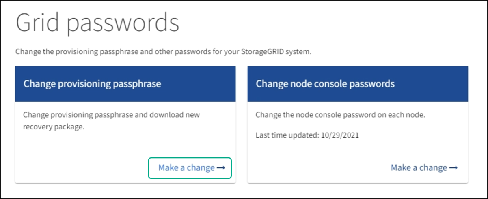
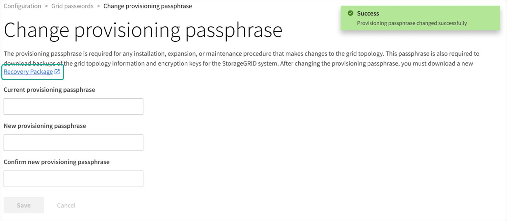

= Altere a frase-passe de aprovisionamento
:allow-uri-read: 
:icons: font
:imagesdir: ../media/

[role="lead"]
Use este procedimento para alterar a senha de provisionamento do StorageGRID. A frase-passe é necessária para procedimentos de recuperação, expansão e manutenção. A senha também é necessária para baixar backups do pacote de recuperação que incluem informações de topologia de grade, senhas de console de nó de grade e chaves de criptografia para o sistema StorageGRID.

.O que você vai precisar
* Você está conetado ao Gerenciador de Grade usando um xref:../admin/web-browser-requirements.adoc[navegador da web suportado].
* Você tem permissões de Manutenção ou Acesso root.
* Você tem a senha de provisionamento atual.

.Sobre esta tarefa
A frase-passe de aprovisionamento é necessária para muitos procedimentos de instalação e manutenção, e para xref:../maintain/downloading-recovery-package.adoc[Transferir o pacote de recuperação]o . A senha de provisionamento não está listada no `Passwords.txt` arquivo. Certifique-se de documentar a senha de provisionamento e mantê-la em um local seguro e seguro.

.Passos
. Selecione *CONFIGURATION* > *access control*> *Grid passwords*.
+

. Selecione *Faça uma alteração* em *Change Provisioning passphrase*.
+
image::../media/grid_password_change_provisioning_passphrase.png[As senhas de grade mudam a senha de provisionamento]

. Introduza a sua frase-passe de aprovisionamento atual.
. Introduza a nova frase-passe. A frase-passe deve conter pelo menos 8 e não mais de 32 carateres. As senhas são sensíveis a maiúsculas e minúsculas.
. Armazene a nova senha de provisionamento em um local seguro. É necessário para procedimentos de instalação, expansão e manutenção.
. Digite novamente a nova senha e selecione *Salvar*.
+
O sistema exibe um banner verde de sucesso quando a alteração da senha de provisionamento estiver concluída.

+

. Selecione *Pacote de recuperação*.
. Insira a nova senha de provisionamento para baixar o novo Pacote de recuperação.
+

CAUTION: Depois de alterar a senha de provisionamento, você deve baixar imediatamente um novo Pacote de recuperação. O arquivo do Pacote de recuperação permite restaurar o sistema se ocorrer uma falha.

