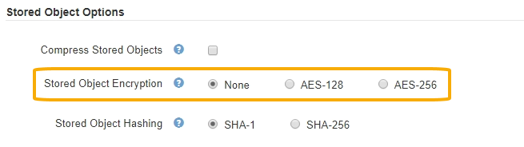

= Configurar a criptografia de objeto armazenado
:allow-uri-read: 
:icons: font
:imagesdir: ../media/

[role="lead"]
Você pode criptografar objetos armazenados se quiser garantir que os dados não possam ser recuperados de forma legível se um armazenamento de objetos for comprometido. Por padrão, os objetos não são criptografados.

.O que você vai precisar
* Você está conetado ao Gerenciador de Grade usando um xref:../admin/web-browser-requirements.adoc[navegador da web suportado].
* Você tem permissões de acesso específicas.

.Sobre esta tarefa
A criptografia de objetos armazenados permite a criptografia de todos os dados de objetos à medida que são ingeridos através do S3 ou Swift. Quando você ativa a configuração, todos os objetos recém-ingeridos são criptografados, mas nenhuma alteração é feita aos objetos armazenados existentes. Se desativar a encriptação, os objetos atualmente encriptados permanecem encriptados, mas os objetos recentemente ingeridos não são encriptados.

NOTE: Se alterar esta definição, demora cerca de um minuto para a nova definição ser aplicada. O valor configurado é armazenado em cache para desempenho e dimensionamento.

Os objetos armazenados podem ser criptografados usando o algoritmo de criptografia AES-128 ou AES-256.

A configuração criptografia de objeto armazenado se aplica somente a objetos S3 que não tenham sido criptografados por criptografia no nível do bucket ou no nível do objeto.

.Passos
. Selecione *CONFIGURATION* > *System* > *Grid options*.
. Na seção Opções de objetos armazenados, altere criptografia de objetos armazenados para *nenhum* (padrão), *AES-128* ou *AES-256*.
+

. Selecione *Guardar*.

