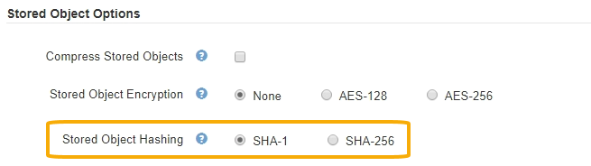

= Configurar hash de objeto armazenado
:allow-uri-read: 
:icons: font
:imagesdir: ../media/

[role="lead"]
A opção hash de objeto armazenado especifica o algoritmo de hash usado para verificar a integridade do objeto.

.O que você vai precisar
* Você está conetado ao Gerenciador de Grade usando um xref:../admin/web-browser-requirements.adoc[navegador da web suportado].
* Você tem permissões de acesso específicas.

.Sobre esta tarefa
Por padrão, os dados do objeto são hash usando o algoritmo SHA-1. O algoritmo SHA-256 requer recursos adicionais de CPU e geralmente não é recomendado para verificação de integridade.

NOTE: Se alterar esta definição, demora cerca de um minuto para a nova definição ser aplicada. O valor configurado é armazenado em cache para desempenho e dimensionamento.

.Passos
. Selecione *CONFIGURATION* > *System* > *Grid options*.
. Na seção Opções de objetos armazenados, altere o hash de objetos armazenados para *SHA-1* (padrão) ou *SHA-256*.
+

. Selecione *Guardar*.

