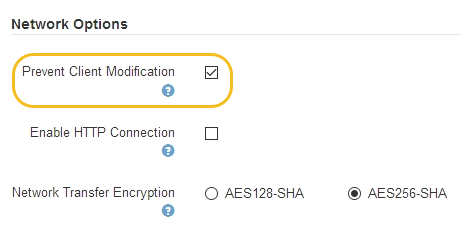

= Controle quais operações do cliente são permitidas
:allow-uri-read: 
:icons: font
:imagesdir: ../media/

[role="lead"]
Você pode selecionar a opção Prevent Client Modification grid (impedir a modificação do cliente) para negar operações específicas do cliente HTTP.

.O que você vai precisar
* Você está conetado ao Gerenciador de Grade usando um xref:../admin/web-browser-requirements.adoc[navegador da web suportado].
* Você tem permissões de acesso específicas.

.Sobre esta tarefa
Impedir Modificação do Cliente é uma configuração de todo o sistema. Quando a opção impedir modificação de cliente é selecionada, as seguintes solicitações são negadas:

* *S3 API REST*
+
** Eliminar pedidos de balde
** Quaisquer solicitações para modificar os dados de um objeto existente, metadados definidos pelo usuário ou marcação de objeto S3
+

NOTE: Esta configuração não se aplica a buckets com controle de versão ativado. O controle de versão já impede modificações nos dados do objeto, metadados definidos pelo usuário e marcação de objetos.

* * Swift REST API*
+
** Eliminar pedidos de contentor
** Solicitações para modificar qualquer objeto existente. Por exemplo, as seguintes operações são negadas: Put Overwrite, Delete, Metadata Update e assim por diante.

.Passos
. Selecione *CONFIGURATION* > *System* > *Grid options*.
. Na seção Opções de rede, marque a caixa de seleção *impedir modificação de cliente*.
+

. Selecione *Guardar*.

