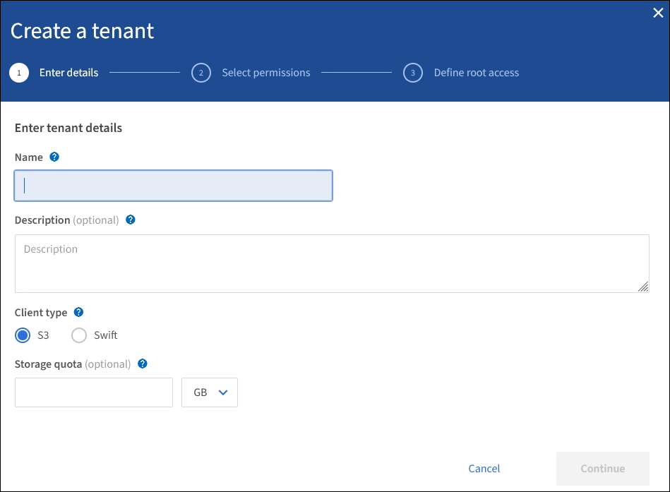

= Crie uma conta de locatário
:allow-uri-read: 
:icons: font
:imagesdir: ../media/

[role="lead"]
Você deve criar pelo menos uma conta de locatário para controlar o acesso ao storage no sistema StorageGRID.

Quando você cria uma conta de locatário, você especifica um nome, um protocolo de cliente e, opcionalmente, uma cota de armazenamento. Se o logon único (SSO) estiver ativado para o StorageGRID, você também especificará qual grupo federado tem permissão de acesso root para configurar a conta de locatário. Se o StorageGRID não estiver usando logon único, você também deve especificar se a conta de locatário usará sua própria origem de identidade e configurar a senha inicial para o usuário raiz local do locatário.

O Gerenciador de Grade fornece um assistente que o leva pelas etapas para criar uma conta de locatário. As etapas variam de acordo com a xref:using-identity-federation.adoc[federação de identidade]configuração e xref:configuring-sso.adoc[logon único]se a conta do Gerenciador de Grade que você usa para criar a conta de locatário pertence a um grupo de administração com a permissão de acesso root.

.O que você vai precisar
* Você está conetado ao Gerenciador de Grade usando um xref:../admin/web-browser-requirements.adoc[navegador da web suportado].
* Você tem permissões de acesso específicas.
* Se a conta de locatário usar a origem de identidade configurada para o Gerenciador de Grade e você quiser conceder permissão de acesso raiz para a conta de locatário a um grupo federado, você importou esse grupo federado para o Gerenciador de Grade. Você não precisa atribuir nenhuma permissão do Gerenciador de Grade a esse grupo de administradores. Consulte xref:managing-admin-groups.adoc[instruções para gerenciar grupos de administradores].

.Passos
. Selecione *TENANTS*.
. Selecione *criar* e insira as seguintes informações para o locatário:
+
.. *Nome*: Insira um nome para a conta do locatário. Os nomes de inquilinos não precisam ser únicos. Quando a conta de locatário é criada, ela recebe um ID de conta numérico único.
.. *Descrição* (opcional): Insira uma descrição que o ajude a identificar o locatário.
.. *Tipo de cliente*: Selecione o tipo de cliente *S3* ou *Swift*.
.. *Cota de armazenamento* (opcional): Se você quiser que esse locatário tenha uma cota de armazenamento, insira um valor numérico para a cota e selecione as unidades corretas (GB, TB ou PB).
+

. Selecione *continuar* e configure o locatário S3 ou Swift.

[role="tabbed-block"]
====
.S3 inquilino
--
Selecione as permissões apropriadas para o locatário. Algumas dessas permissões têm requisitos adicionais. Para obter detalhes, consulte a ajuda on-line para cada permissão.

* Permitir serviços de plataforma
* Usar a própria fonte de identidade (selecionável somente se o SSO não estiver sendo usado)
* Permitir seleção S3D (xref:manage-s3-select-for-tenant-accounts.adoc[Gerenciar S3 Selecione para contas de inquilino]consulte )

--
.Locatário rápido
--
Se o locatário usar sua própria fonte de identidade, selecione *Use own Identity source* (somente selecionável se o SSO não estiver sendo usado).

--
====
. Selecione *continuar* e defina o acesso root para a conta de locatário.

[role="tabbed-block"]
====
.Federação de identidade não configurada
--
. Introduza uma palavra-passe para o utilizador raiz local.
. Selecione *criar inquilino*.

--
.SSO ativado
--
Quando o SSO está habilitado para StorageGRID, o locatário deve usar a origem de identidade que foi configurada para o Gerenciador de Grade. Nenhum usuário local pode entrar. Você especifica qual grupo federado tem permissão de acesso root para configurar a conta de locatário.

. Selecione um grupo federado existente no Gerenciador de Grade para ter a permissão de acesso raiz inicial para o locatário.
+

NOTE: Se você tiver permissões adequadas, os grupos federados existentes do Gerenciador de Grade serão listados quando você selecionar o campo. Caso contrário, introduza o nome exclusivo do grupo.

. Selecione *criar inquilino*.

--
.SSO não ativado
--
. Conclua as etapas descritas na tabela dependendo se o locatário gerenciará seus próprios grupos e usuários ou usará a origem de identidade configurada para o Gerenciador de Grade.
+
[cols="1a,3a"]
|===
| Se o inquilino vai... | Faça isso... 

 a| 
Gerencie seus próprios grupos e usuários
 a| 
.. Selecione *Use own Identity source*.
+
*Nota*: Se esta caixa de verificação estiver selecionada e pretender utilizar a federação de identidade para grupos de inquilinos e utilizadores, o locatário deverá configurar a sua própria origem de identidade. Consulte xref:../tenant/index.adoc[instruções para o uso de contas de inquilino].

.. Especifique uma senha para o usuário raiz local do locatário e selecione *criar locatário*.
.. Selecione *entrar como root* para configurar o locatário ou selecione *concluir* para configurar o locatário mais tarde.

 a| 
Use os grupos e usuários configurados para o Gerenciador de Grade
 a| 
.. Faça um ou ambos os procedimentos a seguir:
+
*** Selecione um grupo federado existente no Gerenciador de Grade que deve ter a permissão de acesso raiz inicial para o locatário.
+
*Nota*: Se você tiver permissões adequadas, os grupos federados existentes do Gerenciador de Grade serão listados quando você selecionar o campo. Caso contrário, introduza o nome exclusivo do grupo.

*** Especifique uma senha para o usuário raiz local do locatário.

.. Selecione *criar inquilino*.

|===

--
====
. Para iniciar sessão no inquilino agora:
+
** Se você estiver acessando o Gerenciador de Grade em uma porta restrita, selecione *restrito* na tabela de locatário para saber mais sobre como acessar essa conta de locatário.
+
O URL do Gerenciador do Locatário tem este formato:

+
`https://_FQDN_or_Admin_Node_IP:port_/?accountId=_20-digit-account-id_/`

+
*** `_FQDN_or_Admin_Node_IP_` É um nome de domínio totalmente qualificado ou o endereço IP de um nó de administrador
*** `_port_` é a porta somente locatário
*** `_20-digit-account-id_` É o ID exclusivo da conta do locatário

** Se você estiver acessando o Gerenciador de Grade na porta 443, mas não tiver definido uma senha para o usuário raiz local, na tabela locatários do Gerenciador de Grade, selecione *entrar* e insira as credenciais de um usuário no grupo federado de acesso raiz.
** Se você estiver acessando o Gerenciador de Grade na porta 443 e definir uma senha para o usuário raiz local:
+
... Selecione *entrar como root* para configurar o locatário agora.
+
Quando você faz login, os links são exibidos para configurar buckets ou contentores, federação de identidade, grupos e usuários.

+
image::../media/configure_tenant_account.png[Configurar conta de locatário]

... Selecione os links para configurar a conta de locatário.
+
Cada link abre a página correspondente no Gerenciador do Locatário. Para concluir a página, consulte xref:../tenant/index.adoc[instruções para o uso de contas de inquilino].

... Caso contrário, selecione *Finish* para acessar o locatário mais tarde.

. Para acessar o locatário mais tarde:
+
[cols="1a,2a"]
|===
| Se você estiver usando... | Faça um destes... 

 a| 
Porta 443
 a| 
** No Gerenciador de Grade, selecione *TENANTS* e *Sign in* à direita do nome do locatário.
** Insira o URL do locatário em um navegador da Web:
+
`https://_FQDN_or_Admin_Node_IP_/?accountId=_20-digit-account-id_/`

+
*** `_FQDN_or_Admin_Node_IP_` É um nome de domínio totalmente qualificado ou o endereço IP de um nó de administrador
*** `_20-digit-account-id_` É o ID exclusivo da conta do locatário

 a| 
Uma porta restrita
 a| 
** No Gerenciador de Grade, selecione *TENANTS* e *restricted*.
** Insira o URL do locatário em um navegador da Web:
+
`https://_FQDN_or_Admin_Node_IP:port_/?accountId=_20-digit-account-id_`

+
*** `_FQDN_or_Admin_Node_IP_` É um nome de domínio totalmente qualificado ou o endereço IP de um nó de administrador
*** `_port_` é a porta restrita somente para locatário
*** `_20-digit-account-id_` É o ID exclusivo da conta do locatário

|===

.Informações relacionadas
* xref:controlling-access-through-firewalls.adoc[Controle o acesso através de firewalls]
* xref:manage-platform-services-for-tenants.adoc[Gerencie os serviços de plataforma para contas de inquilino S3]

