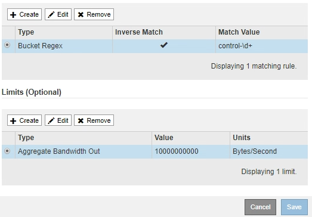

= Crie políticas de classificação de tráfego
:allow-uri-read: 
:icons: font
:imagesdir: ../media/

[role="lead"]
Você cria políticas de classificação de tráfego se quiser monitorar e, opcionalmente, limitar o tráfego de rede por intervalo, locatário, sub-rede IP ou ponto de extremidade do balanceador de carga. Opcionalmente, você pode definir limites para uma política com base na largura de banda, no número de solicitações simultâneas ou na taxa de solicitações.

.O que você vai precisar
* Você está conetado ao Gerenciador de Grade usando um xref:../admin/web-browser-requirements.adoc[navegador da web suportado].
* Você tem a permissão de acesso root.
* Você criou todos os pontos de extremidade do balanceador de carga que deseja corresponder.
* Você criou quaisquer inquilinos que você deseja combinar.

.Passos
. Selecione *CONFIGURATION* > *Network* > *Traffic Classification*.
+
É apresentada a página políticas de classificação de tráfego.

+
image::../media/traffic_classification_policies_main_screen.png[Políticas de classificação de tráfego - Ecrã principal]

. Selecione *criar*.
+
É apresentada a caixa de diálogo criar política de classificação de tráfego.

+
image::../media/traffic_classification_policy_create.png[Política de classificação de tráfego - criar]

. No campo *Nome*, insira um nome para a política.
+
Introduza um nome descritivo para que possa reconhecer a política.

. Opcionalmente, adicione uma descrição para a política no campo *Description*.
+
Por exemplo, descreva ao que esta política de classificação de tráfego se aplica e ao que ela limitará.

. Crie uma ou mais regras correspondentes para a política.
+
Regras de correspondência controlam quais entidades serão afetadas por esta política de classificação de tráfego. Por exemplo, selecione Locatário se desejar que essa diretiva se aplique ao tráfego de rede de um locatário específico. Ou selecione ponto final se pretender que esta política se aplique ao tráfego de rede num ponto de extremidade do balanceador de carga específico.

+
.. Selecione *criar* na seção *regras correspondentes*.
+
A caixa de diálogo criar regra de correspondência é exibida.

+
image::../media/traffic_classification_policy_create_matching_rule.png[Criar regra correspondente]

.. Na lista suspensa *Type*, selecione o tipo de entidade a ser incluída na regra correspondente.
.. No campo *valor de correspondência*, insira um valor de correspondência com base no tipo de entidade que você escolheu.
+
*** Balde: Introduza um nome de intervalo.
*** Bucket Regex: Insira uma expressão regular que será usada para corresponder a um conjunto de nomes de bucket.
+
A expressão regular não está ancorada. Use a âncora "caret" para corresponder ao início do nome do intervalo e use a âncora "doll" para corresponder ao final do nome.

*** CIDR: Insira uma sub-rede IPv4, na notação CIDR, que corresponda à sub-rede desejada.
*** Endpoint: Selecione um endpoint na lista de endpoints existentes. Esses são os pontos finais do balanceador de carga definidos na página pontos finais do balanceador de carga. xref:configuring-load-balancer-endpoints.adoc[Configurar pontos de extremidade do balanceador de carga]Consulte .
*** Locatário: Selecione um locatário na lista de inquilinos existentes. A correspondência de inquilinos baseia-se na propriedade do bucket que está sendo acessado. O acesso anônimo a um bucket corresponde ao locatário que possui o bucket.

.. Se você quiser corresponder todo tráfego de rede _exceto_ tráfego consistente com o valor tipo e correspondência definido, marque a caixa de seleção *Inverse*. Caso contrário, deixe a caixa de seleção desmarcada.
+
Por exemplo, se você quiser que essa política se aplique a todos os pontos finais do balanceador de carga, especifique o ponto final do balanceador de carga a ser excluído e selecione *inverso*.

+

IMPORTANT: Para uma política que contenha vários matchers em que pelo menos um é um matcher inverso, tenha cuidado para não criar uma política que corresponda a todas as solicitações.

.. Selecione *aplicar*.
+
A regra é criada e está listada na tabela regras correspondentes.

+
image::../media/traffic_classification_policy_rules.png[Regras de correspondência de políticas de tráfego]

.. Repita estas etapas para cada regra que você deseja criar para a política.
+

NOTE: O tráfego que corresponde a qualquer regra é Tratado pela política.

. Opcionalmente, crie limites para a política.
+

NOTE: Mesmo que você não crie limites, o StorageGRID coleta métricas para que você possa monitorar o tráfego de rede que corresponde à política.

+
.. Selecione *criar* na seção *limites*.
+
A caixa de diálogo criar limite é exibida.

+
image::../media/traffic_classification_policy_create_limit.png[Criar limite]

.. Na lista suspensa *Type*, selecione o tipo de limite que deseja aplicar à política.
+
Na lista a seguir, *in* refere-se ao tráfego de clientes S3 ou Swift para o balanceador de carga StorageGRID, e *OUT* refere-se ao tráfego do balanceador de carga para clientes S3 ou Swift.

+
*** Agregar largura de banda em
*** Agregar largura de banda para fora
*** Solicitações de leitura simultânea
*** Solicitações de gravação simultânea
*** Largura de banda por solicitação in
*** Saída de largura de banda por solicitação
*** Leia a taxa de solicitação
*** Taxa de solicitações de gravação
+
[NOTE]
====
Você pode criar políticas para limitar a largura de banda agregada ou limitar a largura de banda por solicitação. No entanto, o StorageGRID não pode limitar ambos os tipos de largura de banda ao mesmo tempo. Os limites de largura de banda agregada podem impor um impactos menor no desempenho adicional no tráfego não limitado.

====
+
Para limites de largura de banda, o StorageGRID aplica a política que melhor corresponde ao tipo de limite definido. Por exemplo, se você tem uma política que limita o tráfego em apenas uma direção, então o tráfego na direção oposta será ilimitado, mesmo que haja tráfego que corresponda a políticas adicionais que tenham limites de largura de banda. A StorageGRID implementa as correspondências "melhores" para limites de largura de banda na seguinte ordem:

+
**** Endereço IP exato (/máscara 32)
**** Nome exato do balde
**** Regex do balde
**** Locatário
**** Endpoint
**** Correspondências CIDR não exatas (não /32)
**** Correspondências inversas

.. No campo *value*, insira um valor numérico para o tipo de limite escolhido.
+
As unidades esperadas são mostradas quando você seleciona um limite.

.. Selecione *aplicar*.
+
O limite é criado e é listado na tabela limites.

+

.. Repita estas etapas para cada limite que você deseja adicionar à política.
+
Por exemplo, se você quiser criar um limite de largura de banda de 40 Gbps para um nível SLA, crie uma largura de banda agregada no limite e um limite de largura de banda agregada para fora e defina cada um para 40 Gbps.

+

NOTE: Para converter megabytes por segundo em gigabits por segundo, multiplique por oito. Por exemplo, 125 MB/s é equivalente a 1.000 Mbps ou 1 Gbps.

. Quando terminar de criar regras e limites, selecione *Salvar*.
+
A política é guardada e está listada na tabela políticas de classificação de tráfego.

+
image::../media/traffic_classification_policies_main_screen_w_examples.png[Exemplo de política de tráfego]

+
O tráfego de clientes S3 e Swift agora é Tratado de acordo com as políticas de classificação de tráfego. Você pode visualizar gráficos de tráfego e verificar se as políticas estão aplicando os limites de tráfego esperados. xref:viewing-network-traffic-metrics.adoc[Exibir métricas de tráfego de rede]Consulte .

