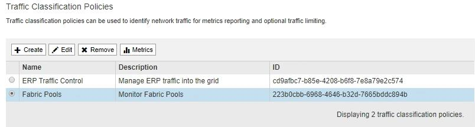

= Edite uma política de classificação de tráfego
:allow-uri-read: 
:icons: font
:imagesdir: ../media/

[role="lead"]
Você pode editar uma política de classificação de tráfego para alterar seu nome ou descrição, ou para criar, editar ou excluir quaisquer regras ou limites para a política.

.O que você vai precisar
* Você está conetado ao Gerenciador de Grade usando um xref:../admin/web-browser-requirements.adoc[navegador da web suportado].
* Você tem a permissão de acesso root.

.Passos
. Selecione *CONFIGURATION* > *Network* > *Traffic Classification*.
+
A página políticas de classificação de tráfego é exibida e as políticas existentes são listadas na tabela.

+

. Selecione o botão de opção à esquerda da política que pretende editar.
. Selecione *Editar*.
+
A caixa de diálogo Editar diretiva de classificação de tráfego é exibida.

+
image::../media/traffic_classification_policy_edit.png[Editar a Política de classificação de tráfego]

. Crie, edite ou remova regras e limites correspondentes conforme necessário.
+
.. Para criar uma regra ou limite correspondente, selecione *criar* e siga as instruções para criar uma regra ou criar um limite.
.. Para editar uma regra ou limite correspondente, selecione o botão de opção para a regra ou limite, selecione *Editar* na seção *regras correspondentes* ou na seção *limites* e siga as instruções para criar uma regra ou criar um limite.
.. Para remover uma regra ou limite correspondente, selecione o botão de opção para a regra ou limite e selecione *Remover*. Em seguida, selecione *OK* para confirmar que deseja remover a regra ou limite.

. Quando terminar de criar ou editar uma regra ou um limite, selecione *aplicar*.
. Quando terminar de editar a política, selecione *Guardar*.
+
As alterações feitas na política são salvas e o tráfego de rede é agora Tratado de acordo com as políticas de classificação de tráfego. Você pode visualizar gráficos de tráfego e verificar se as políticas estão aplicando os limites de tráfego esperados.

