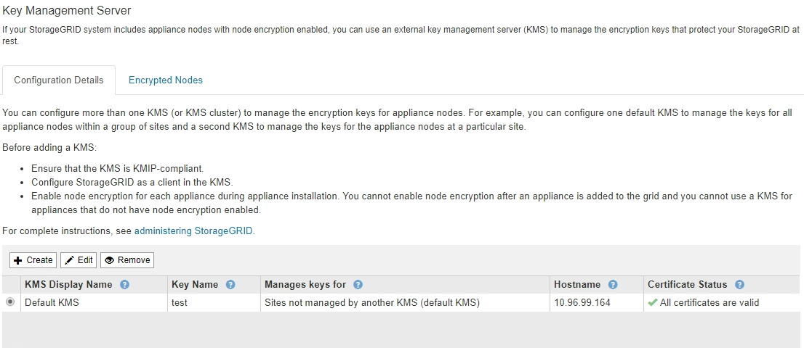

= Remover um servidor de gerenciamento de chaves (KMS)
:allow-uri-read: 
:icons: font
:imagesdir: ../media/

[role="lead"]
Em alguns casos, você pode querer remover um servidor de gerenciamento de chaves. Por exemplo, você pode querer remover um KMS específico do site se você tiver desativado o site.

.O que você vai precisar
* Você revisou o xref:kms-considerations-and-requirements.adoc[considerações e requisitos para usar um servidor de gerenciamento de chaves].
* Você está conetado ao Gerenciador de Grade usando um xref:../admin/web-browser-requirements.adoc[navegador da web suportado].
* Você tem a permissão de acesso root.

.Sobre esta tarefa
Você pode remover um KMS nestes casos:

* Você pode remover um KMS específico do site se o site tiver sido desativado ou se o site não incluir nós de dispositivo com criptografia de nó ativada.
* Você pode remover o KMS padrão se um KMS específico do site já existir para cada site que tenha nós de dispositivo com criptografia de nó ativada.

.Passos
. Selecione *CONFIGURATION* > *Security* > *Key Management Server*.
+
A página Key Management Server (servidor de gerenciamento de chaves) é exibida e mostra todos os servidores de gerenciamento de chaves que foram configurados.

+

. Selecione o botão de opção para o KMS que deseja remover e selecione *Remover*.
. Reveja as considerações na caixa de diálogo de aviso.
+
image::../media/kms_remove_warning.png[Aviso de remoção DE KMS]

. Selecione *OK*.
+
A configuração do KMS é removida.

