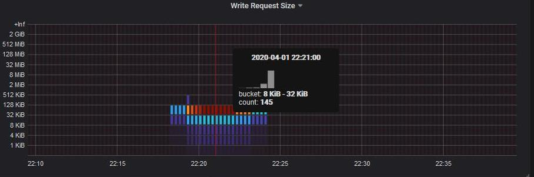

= Exibir métricas de tráfego de rede
:allow-uri-read: 
:icons: font
:imagesdir: ../media/

[role="lead"]
Pode monitorizar o tráfego de rede visualizando os gráficos disponíveis na página políticas de classificação de tráfego.

.O que você vai precisar
* Você está conetado ao Gerenciador de Grade usando um xref:../admin/web-browser-requirements.adoc[navegador da web suportado].
* Você tem a permissão de acesso root ou a permissão Contas do Locatário.

.Sobre esta tarefa
Para qualquer política de classificação de tráfego existente, você pode exibir métricas para o serviço Load Balancer para determinar se a diretiva está limitando com êxito o tráfego na rede. Os dados nos gráficos podem ajudá-lo a determinar se você precisa ajustar a política.

Mesmo que nenhum limite seja definido para uma política de classificação de tráfego, as métricas são coletadas e os gráficos fornecem informações úteis para entender as tendências de tráfego.

.Passos
. Selecione *CONFIGURATION* > *Network* > *Traffic Classification*.
+
A página políticas de classificação de tráfego é exibida e as políticas existentes são listadas na tabela.

+
image::../media/traffic_classification_policies_main_screen_w_examples.png[Política de tráfego para exemplo de gráfico]

+

NOTE: Os botões *criar*, *Editar* e *Remover* serão desativados se você tiver a permissão Contas do locatário, mas não tiver a permissão de acesso root.

. Selecione o botão de opção à esquerda da política para a qual deseja exibir as métricas.
. Selecione *Metrics*.
+
Uma nova janela do navegador é aberta e os gráficos da Política de classificação de tráfego são exibidos. Os gráficos exibem métricas apenas para o tráfego que corresponde à política selecionada.

+
Você pode selecionar outras políticas para exibir usando a lista suspensa *policy*.

+
image::../media/traffic_classification_policy_graph.png[Gráfico de tráfego de rede]

+
Os gráficos a seguir estão incluídos na página da Web.

+
** Tráfego de solicitação do Load Balancer: Este gráfico fornece uma média móvel de 3 minutos da taxa de transferência de dados transmitidos entre os pontos de extremidade do balanceador de carga e os clientes que fazem as solicitações, em bits por segundo.
** Taxa de conclusão da solicitação do Load Balancer: Este gráfico fornece uma média móvel de 3 minutos do número de solicitações concluídas por segundo, discriminada por tipo de solicitação (OBTER, COLOCAR, CABEÇA e EXCLUIR). Este valor é atualizado quando os cabeçalhos de uma nova solicitação tiverem sido validados.
** Taxa de resposta de erro: Este gráfico fornece uma média móvel de 3 minutos do número de respostas de erro retornadas aos clientes por segundo, discriminada pelo código de resposta de erro.
** Duração média da solicitação (não-erro): Este gráfico fornece uma média móvel de 3 minutos de duração da solicitação, discriminada por tipo de solicitação (OBTER, COLOCAR, CABEÇA e EXCLUIR). Cada duração da solicitação começa quando um cabeçalho de solicitação é analisado pelo serviço Load Balancer e termina quando o corpo de resposta completo é retornado ao cliente.
** Taxa de solicitação de gravação por tamanho do objeto: Este mapa de calor fornece uma média móvel de 3 minutos da taxa na qual as solicitações de gravação são concluídas com base no tamanho do objeto. Neste contexto, as solicitações de escrita referem-se apenas a SOLICITAÇÕES PUT.
** Taxa de solicitação de leitura por tamanho do objeto: Este mapa de calor fornece uma média móvel de 3 minutos da taxa na qual as solicitações de leitura são concluídas com base no tamanho do objeto. Neste contexto, as solicitações de leitura referem-se apenas a SOLICITAÇÕES GET. As cores no mapa de calor indicam a frequência relativa de um tamanho de objeto dentro de um gráfico individual. As cores mais frias (por exemplo, roxo e azul) indicam taxas relativas mais baixas, e as cores mais quentes (por exemplo, laranja e vermelho) indicam taxas relativas mais altas.

. Passe o cursor sobre um gráfico de linhas para ver um pop-up de valores em uma parte específica do gráfico.
+
image::../media/traffic_classification_policy_graph_popup_closeup.png[Valores Popup Gráfico linha tráfego]

. Passe o cursor sobre um mapa de calor para ver um pop-up que mostra a data e a hora da amostra, os tamanhos de objetos que são agregados na contagem e o número de solicitações por segundo durante esse período de tempo.
+

. Use a lista suspensa *Policy* (Política*) no canto superior esquerdo para selecionar uma política diferente.
+
São apresentados os gráficos da política selecionada.

. Em alternativa, aceda aos gráficos a partir do menu *SUPPORT*.
+
.. Selecione *SUPPORT* > *Tools* > *Metrics*.
.. Na seção *Grafana* da página, selecione *Política de classificação de tráfego*.
.. Selecione a política na lista suspensa no canto superior esquerdo da página.
+
As políticas de classificação de tráfego são identificadas pelo seu ID. Os IDs de política são listados na página políticas de classificação de tráfego.

. Analise os gráficos para determinar com que frequência a política está limitando o tráfego e se você precisa ajustar a política.

.Informações relacionadas
xref:../monitor/index.adoc[Monitorar e solucionar problemas]
