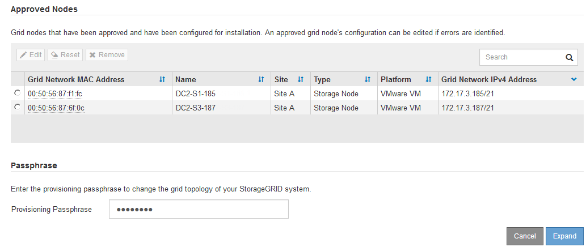

= Execute a expansão
:allow-uri-read: 
:icons: font
:imagesdir: ../media/

[role="lead"]
Quando você executa a expansão, os novos nós de grade são adicionados à implantação existente do StorageGRID.

.O que você vai precisar
* Você está conetado ao Gerenciador de Grade usando um xref:../admin/web-browser-requirements.adoc[navegador da web suportado].
* Você tem a permissão Manutenção ou Acesso root.
* Você tem a senha de provisionamento.
* Você implantou todos os nós de grade que estão sendo adicionados a essa expansão.
* Se você estiver adicionando nós de storage, confirmará que todas as operações de reparo de dados executadas como parte de uma recuperação estão concluídas. xref:../maintain/checking-data-repair-jobs.adoc[Verifique os trabalhos de reparação de dados]Consulte .
* Se você estiver adicionando um novo site, deverá revisar e atualizar as regras do ILM antes de iniciar o procedimento de expansão para garantir que as cópias de objeto não sejam armazenadas no novo site até que a expansão seja concluída. Por exemplo, se uma regra usar o pool de storage padrão (todos os nós de storage), será necessário criar um novo pool de storage que contenha apenas os nós de storage existentes e atualizar a regra ILM para usar o novo pool de storage. Caso contrário, os objetos serão copiados para o novo site assim que o primeiro nó nesse site se tornar ativo. Consulte as instruções para xref:../ilm/index.adoc[Gerenciando objetos com ILM].

.Sobre esta tarefa
A execução da expansão inclui estas fases:

. Configure a expansão especificando se você está adicionando novos nós de grade ou um novo site e aprovando os nós de grade que deseja adicionar.
. Você inicia a expansão.
. Enquanto o processo de expansão estiver em execução, você baixa um novo arquivo do Pacote de recuperação.
. Você monitora o status dos estágios de configuração da grade, que são executados automaticamente. O conjunto de estágios depende de quais tipos de nós de grade estão sendo adicionados e se um novo site está sendo adicionado.
+

IMPORTANT: Alguns estágios podem levar uma quantidade significativa de tempo para serem executados em uma grade grande. Por exemplo, o streaming do Cassandra para um novo nó de armazenamento pode levar apenas alguns minutos se o banco de dados do Cassandra estiver vazio. No entanto, se o banco de dados Cassandra incluir uma grande quantidade de metadados de objetos, essa etapa pode levar várias horas ou mais. Não reinicie nenhum nó de armazenamento durante os estágios "expandindo o cluster Cassandra" ou "iniciando Cassandra e streaming de dados".

.Passos
. Selecione *MAINTENANCE* > *Tasks* > *Expansion*.
+
A página expansão da grade é exibida. A seção Pending Nodes lista todos os nós que estão prontos para serem adicionados.

+
image::../media/grid_expansion_page.png[Captura de tela mostrando a página de expansão da grade]

. Selecione *Configurar expansão*.
+
A caixa de diálogo seleção de local é exibida.

+
image::../media/configure_expansion_dialog.gif[Caixa de diálogo seleção de local]

. Selecione o tipo de expansão que você está iniciando:
+
** Se você estiver adicionando um novo site, selecione *novo* e digite o nome do novo site.
** Se você estiver adicionando nós de grade a um site existente, selecione *existente*.

. Selecione *Guardar*.
. Revise a lista *Pending Nodes* e confirme que ela mostra todos os nós de grade implantados.
+
Conforme necessário, você pode passar o cursor sobre o *Grid Network MAC Address* de um nó para ver detalhes sobre esse nó.

+
image::../media/grid_node_details.gif[Captura de tela dos detalhes do Grid Node]

+

NOTE: Se um nó de grade estiver ausente, confirme que ele foi implantado com sucesso.

. Na lista de nós pendentes, aprove os nós de grade para essa expansão.
+
.. Selecione o botão de opção ao lado do primeiro nó de grade pendente que você deseja aprovar.
.. Selecione *Approve*.
+
O formulário de configuração do nó de grade é exibido.

+
image::../media/grid_node_configuration.gif[Formulário de configuração do nó de grade]

.. Conforme necessário, modifique as definições gerais:
+
*** *Site*: O nome do site ao qual o nó da grade será associado. Se você estiver adicionando vários nós, certifique-se de selecionar o local correto para cada nó. Se você estiver adicionando um novo site, todos os nós serão adicionados ao novo site.
*** *Nome*: O nome do host que será atribuído ao nó e o nome que será exibido no Gerenciador de Grade.
*** *Função NTP*: A função Network Time Protocol (NTP) do nó de grade. As opções são *Automático*, *primário* e *Cliente*. A seleção de *Automático* atribui a função primária a nós de administração, nós de armazenamento com serviços ADC, nós de gateway e quaisquer nós de grade que tenham endereços IP não estáticos. Todos os outros nós de grade recebem a função Cliente.
+

NOTE: Atribua a função NTP primária a pelo menos dois nós em cada local. Isso fornece acesso redundante ao sistema a fontes de temporização externas.

*** *ADC Service* (somente nós de armazenamento): Se este nó de armazenamento executará o serviço controlador de domínio administrativo (ADC). O serviço ADC mantém o controle da localização e disponibilidade dos serviços da grade. Pelo menos três nós de storage em cada local devem incluir o serviço ADC. Você não pode adicionar o serviço ADC a um nó depois que ele é implantado.
+
**** Se você estiver adicionando esse nó para substituir um nó de armazenamento, selecione *Sim* se o nó que você está substituindo incluir o serviço ADC. Como você não pode desativar um nó de armazenamento se houver poucos serviços ADC, isso garante que um novo serviço ADC esteja disponível antes que o serviço antigo seja removido.
**** Caso contrário, selecione *Automático* para permitir que o sistema determine se esse nó requer o serviço ADC. Saiba mais sobre o quórum de ADC xref:../maintain/understanding-adc-service-quorum.adoc[aqui].

.. Conforme necessário, modifique as configurações para rede de Grade, rede de Admin e rede de cliente.
+
*** *Endereço IPv4 (CIDR)*: O endereço de rede CIDR para a interface de rede. Por exemplo: 172.16.10.100/24
*** *Gateway*: O gateway padrão do nó de grade. Por exemplo: 172.16.10.1
*** *Sub-redes (CIDR)*: Uma ou mais sub-redes para a rede Admin.

.. Selecione *Guardar*.
+
O nó de grade aprovado move-se para a lista de nós aprovados.

+

+
*** Para modificar as propriedades de um nó de grade aprovado, selecione seu botão de opção e selecione *Editar*.
*** Para mover um nó de grade aprovado de volta para a lista de nós pendentes, selecione seu botão de opção e selecione *Reset*.
*** Para remover permanentemente um nó de rede aprovado, desligue o nó. Em seguida, selecione o botão de opção e selecione *Remover*.

.. Repita estas etapas para cada nó de grade pendente que você deseja aprovar.
+

NOTE: Se possível, você deve aprovar todas as notas de grade pendentes e executar uma única expansão. Mais tempo será necessário se você executar múltiplas expansões pequenas.

. Quando tiver aprovado todos os nós de grade, digite a *frase-passe de provisionamento* e selecione *expandir*.
+
Após alguns minutos, esta página é atualizada para exibir o status do procedimento de expansão. Quando as tarefas que afetam o nó de grade individual estão em andamento, a seção Status do nó de grade lista o status atual de cada nó de grade.

+

NOTE: Durante esse processo, para os aparelhos, o Instalador do StorageGRID Appliance mostra a instalação passando do Estágio 3 para o Estágio 4, finalize a Instalação. Quando a fase 4 é concluída, o controlador é reinicializado.

+
image::../media/grid_expansion_progress.png[Esta imagem é explicada pelo texto circundante.]

+

NOTE: Uma expansão de site inclui uma tarefa adicional para configurar o Cassandra para o novo site.

. Assim que o link *Download Recovery Package* for exibido, baixe o arquivo Recovery Package.
+
Você deve baixar uma cópia atualizada do arquivo do Pacote de recuperação o mais rápido possível após fazer alterações na topologia da grade no sistema StorageGRID. O arquivo do Pacote de recuperação permite restaurar o sistema se ocorrer uma falha.

+
.. Selecione a ligação de transferência.
.. Digite a senha de provisionamento e selecione *Iniciar download*.
.. Quando o download for concluído, abra o `.zip` arquivo e confirme que ele inclui um `gpt-backup` diretório e um `_SAID.zip` arquivo. Em seguida, extraia o `_SAID.zip` arquivo, vá para `/GID*_REV*` o diretório e confirme que você pode abrir o `passwords.txt` arquivo.
.. Copie o arquivo do Pacote de recuperação baixado (.zip) para dois locais seguros, seguros e separados.
+

IMPORTANT: O arquivo do pacote de recuperação deve ser protegido porque contém chaves de criptografia e senhas que podem ser usadas para obter dados do sistema StorageGRID.

. Siga as instruções para adicionar um nó de armazenamento a um site existente ou adicionar um novo site.

[role="tabbed-block"]
====
.Adicione nó de storage ao site existente
--
Se você estiver adicionando um ou mais nós de storage a um site existente, monitore o progresso da etapa "iniciando Cassandra e streaming de dados", revisando a porcentagem mostrada na mensagem de status.

image::../media/grid_expansion_starting_cassandra.png[Expansão de grade > iniciando Cassandra e streaming de dados]

Essa porcentagem estima o quão completa é a operação de streaming do Cassandra, com base na quantidade total de dados do Cassandra disponíveis e na quantidade que já foi gravada no novo nó.

IMPORTANT: Não reinicie nenhum nó de storage durante os estágios "expandindo o cluster Cassandra" ou "iniciando Cassandra e streaming de dados". Esses estágios podem levar muitas horas para serem concluídos para cada novo nó de storage, especialmente se os nós de storage existentes contiverem uma grande quantidade de metadados de objetos.

--
.Adicionar novo site
--
Se você estiver adicionando um novo site, use `nodetool status` para monitorar o progresso do fluxo do Cassandra e para ver a quantidade de metadados que foram copiados para o novo site durante o estágio "expandindo o cluster do Cassandra". A carga total de dados no novo site deve estar dentro de cerca de 20% do total de um site atual.

IMPORTANT: Não reinicie nenhum nó de storage durante os estágios "expandindo o cluster Cassandra" ou "iniciando Cassandra e streaming de dados". Esses estágios podem levar muitas horas para serem concluídos para cada novo nó de storage, especialmente se os nós de storage existentes contiverem uma grande quantidade de metadados de objetos.

--
====
. Continue monitorando a expansão até que todas as tarefas estejam concluídas e o botão *Configurar expansão* reapareça.

.Depois de terminar
Dependendo dos tipos de nós de grade adicionados, você deve executar etapas adicionais de integração e configuração. xref:configuring-expanded-storagegrid-system.adoc[Etapas de configuração após a expansão]Consulte .
