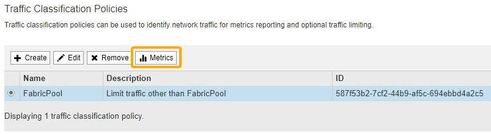

= Crie uma política de classificação de tráfego para o FabricPool
:allow-uri-read: 
:icons: font
:imagesdir: ../media/

[role="lead"]
Você pode, opcionalmente, projetar uma política de classificação de tráfego StorageGRID para otimizar a qualidade do serviço para o workload do FabricPool.

.O que você vai precisar
* Você está conetado ao Gerenciador de Grade usando um xref:../admin/web-browser-requirements.adoc[navegador da web suportado].
* Você tem a permissão de acesso root.

.Sobre esta tarefa
As práticas recomendadas para criar uma política de classificação de tráfego para FabricPool dependem da carga de trabalho, como segue:

* Se você planeja categorizar os dados do workload primário do FabricPool para o StorageGRID, certifique-se de que o workload do FabricPool tenha a maior parte da largura de banda. Você pode criar uma política de classificação de tráfego para limitar todas as outras cargas de trabalho.
+

NOTE: Em geral, as operações de leitura do FabricPool são mais importantes para priorizar do que as operações de gravação.

+
Por exemplo, se outros clientes S3 usarem esse sistema StorageGRID, você deve criar uma política de classificação de tráfego. Você pode limitar o tráfego de rede para outros buckets, locatários, sub-redes IP ou pontos de extremidade do balanceador de carga.

* Como regra geral, você não deve impor limites de qualidade de serviço a qualquer workload do FabricPool; apenas limitar os outros workloads.
* Os limites colocados em outras cargas de trabalho devem levar em conta o comportamento dessas cargas de trabalho. Os limites impostos também variam de acordo com o dimensionamento e as capacidades da sua grade e qual é a quantidade esperada de utilização.

Para saber mais: xref:../admin/managing-traffic-classification-policies.adoc[Gerenciar políticas de classificação de tráfego]

.Passos
. Selecione *CONFIGURATION* > *Network* > *Traffic Classification*.
. Introduza um nome e uma descrição.
. Na seção regras correspondentes, crie pelo menos uma regra.
+
.. Selecione *criar*.
.. Selecione *ponto final* e selecione o ponto final do balanceador de carga que você criou para o FabricPool.
+
Você também pode selecionar a conta de locatário ou o intervalo do FabricPool.

.. Se você quiser que essa política de tráfego limite o tráfego para os outros endpoints, selecione *correspondência inversa*.

. Opcionalmente, crie um ou mais limites.
+

NOTE: Mesmo que nenhum limite seja definido para uma política de classificação de tráfego, as métricas são coletadas para que você possa entender as tendências de tráfego.

+
.. Selecione *criar*.
.. Selecione o tipo de tráfego que pretende limitar e o limite a aplicar.
+
Este exemplo de política de classificação de tráfego FabricPool mostra os tipos de tráfego de rede que você pode limitar e os tipos de valores que você pode selecionar. Os limites para uma política real seriam baseados em seus requisitos específicos.

+
image::../media/traffic_classification_policy_for_fabricpool.png[Política de classificação de tráfego FabricPool]

. Depois de criar a política de classificação de tráfego, selecione a política e, em seguida, selecione *Metrics* para determinar se a política está limitando o tráfego conforme esperado.
+

