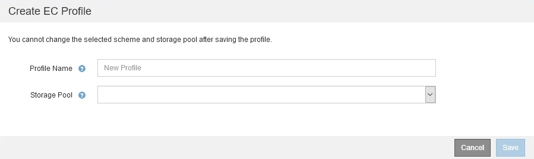
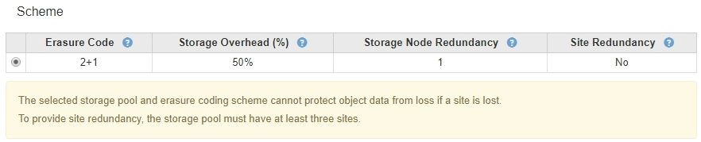
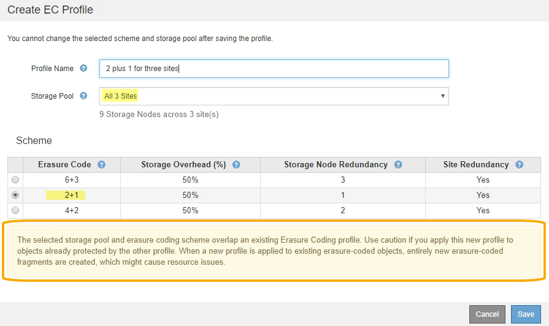

= Criar um perfil de codificação de apagamento
:allow-uri-read: 
:icons: font
:imagesdir: ../media/

[role="lead"]
Para criar um perfil de codificação de apagamento, você associa um pool de storage que contém nós de storage a um esquema de codificação de apagamento. Essa associação determina o número de dados e fragmentos de paridade criados e onde o sistema distribui esses fragmentos.

.O que você vai precisar
* Você está conetado ao Gerenciador de Grade usando um xref:../admin/web-browser-requirements.adoc[navegador da web suportado].
* Você tem permissões de acesso específicas.
* Você criou um pool de storage que inclui exatamente um local ou um pool de storage que inclui três ou mais locais. Não há esquemas de codificação de apagamento disponíveis para um pool de storage que tenha apenas dois locais.

.Sobre esta tarefa
Os pools de storage usados nos perfis de codificação de apagamento devem incluir exatamente um local ou três ou mais locais. Se você quiser fornecer redundância de site, o pool de armazenamento deve ter pelo menos três locais.

NOTE: Você deve selecionar um pool de storage que contenha nós de storage. Você não pode usar nós de arquivamento para dados codificados por apagamento.

.Passos
. Selecione *ILM* > *codificação de apagamento*.
+
A página Perfis de codificação de apagamento é exibida.

+
image::../media/ec_profiles_page.png[Página de perfis de codificação de apagamento]

. Selecione *criar*.
+
A caixa de diálogo criar perfil EC é exibida.

+

. Introduza um nome exclusivo para o perfil de codificação de apagamento.
+
Os nomes de perfis de codificação de apagamento devem ser exclusivos. Um erro de validação ocorre se você usar o nome de um perfil existente, mesmo que esse perfil tenha sido desativado.

+

NOTE: O nome do perfil de codificação de apagamento é anexado ao nome do pool de armazenamento na instrução de colocação de uma regra ILM.

+
image::../media/storage_pool_and_erasure_coding_profile.png[Pool de armazenamento e nome do perfil EC]

. Selecione o pool de armazenamento que você criou para esse perfil de codificação de apagamento.
+

NOTE: Se a grade incluir apenas um local no momento, você será impedido de usar o pool de storage padrão, todos os nós de storage ou qualquer pool de storage que inclua o site padrão, todos os sites. Esse comportamento impede que o perfil de codificação de apagamento se torne inválido se um segundo site for adicionado.

+

NOTE: Se um pool de armazenamento incluir exatamente dois locais, você não poderá usar esse pool de armazenamento para codificação de apagamento. Não há esquemas de codificação de apagamento disponíveis para um pool de storage que tenha dois locais.

+
Quando você seleciona um pool de storage, a lista de esquemas de codificação de apagamento disponíveis é exibida, com base no número de nós de storage e sites no pool.

+
image::../media/create_ec_profile_three_sites.png[Crie o perfil EC três sites]

+
As seguintes informações são listadas para cada esquema de codificação de apagamento disponível:

+
** *Código de apagamento*: O nome do esquema de codificação de apagamento no seguinte formato: Fragmentos de dados e fragmentos de paridade.
** * Sobrecarga de armazenamento (%)*: O armazenamento adicional necessário para fragmentos de paridade em relação ao tamanho de dados do objeto. Sobrecarga de armazenamento: Número total de fragmentos de paridade / número total de fragmentos de dados.
** *Redundância do nó de storage*: O número de nós de storage que podem ser perdidos, mantendo a capacidade de recuperar dados de objeto.
** *Redundância do site*: Se o código de apagamento selecionado permite que os dados do objeto sejam recuperados se um site for perdido.
+
Para dar suporte à redundância de sites, o pool de storage selecionado deve incluir vários locais, cada um com nós de storage suficientes para permitir que qualquer site seja perdido. Por exemplo, para oferecer suporte à redundância de sites usando um 6 esquema de codificação de apagamento de mais de 3 horas por dia, o pool de storage selecionado deve incluir pelo menos três locais com pelo menos três nós de storage em cada local.

+
As mensagens são exibidas nestes casos:

+
** O pool de armazenamento selecionado não fornece redundância de site. A mensagem a seguir é esperada quando o pool de armazenamento selecionado inclui apenas um local. Você pode usar esse perfil de codificação de apagamento nas regras do ILM para proteger contra falhas de nós.
+

** O pool de storage selecionado não atende aos requisitos de qualquer esquema de codificação de apagamento. Por exemplo, a seguinte mensagem é esperada quando o pool de armazenamento selecionado inclui exatamente dois locais. Para usar a codificação de apagamento para proteger os dados de objetos, selecione um pool de storage com exatamente um local ou um pool de storage com três ou mais locais.
+
image::../media/ec_profile_error.png[Erro do perfil de codificação de apagamento]

** Sua grade inclui apenas um local e você selecionou o pool de storage padrão, todos os nós de storage ou qualquer pool de storage que inclua o local padrão, todos os sites.
+
image::../media/ilm_ec_profile_all_storage_nodes_warning.png[Aviso de todos os nós de storage do perfil do ILM EC]

** O esquema de codificação de apagamento e o pool de storage selecionado se sobrepõem a outro perfil de codificação de apagamento.
+

+
Neste exemplo, uma mensagem de aviso aparece porque outro perfil de codificação de apagamento está usando o esquema 2-1 e o conjunto de armazenamento para o outro perfil também usa um dos sites no conjunto de armazenamento de todos os 3 sites.

+
Embora você não seja impedido de criar este novo perfil, você deve ter muito cuidado ao começar a usá-lo na política ILM. Se esse novo perfil for aplicado a objetos codificados de apagamento já protegidos pelo outro perfil, o StorageGRID criará um conjunto totalmente novo de fragmentos de objeto. Ele não reutilizará os 2 fragmentos existentes. 1. Problemas de recursos podem ocorrer quando você migra de um perfil de codificação de apagamento para o outro, mesmo que os esquemas de codificação de apagamento sejam os mesmos.

. Se mais de um esquema de codificação de apagamento estiver listado, selecione o que deseja usar.
+
Ao decidir qual esquema de codificação de apagamento usar, você deve equilibrar a tolerância a falhas (alcançada por ter mais segmentos de paridade) com os requisitos de tráfego de rede para reparos (mais fragmentos equivale a mais tráfego de rede). Por exemplo, ao decidir entre um esquema 4-2 e um esquema 6-3, selecione o esquema 6-3 se forem necessárias paridade adicional e tolerância a falhas. Selecione o esquema 4 mais 2 se os recursos de rede forem restritos para reduzir o uso da rede durante reparos de nó.

. Selecione *Guardar*.

