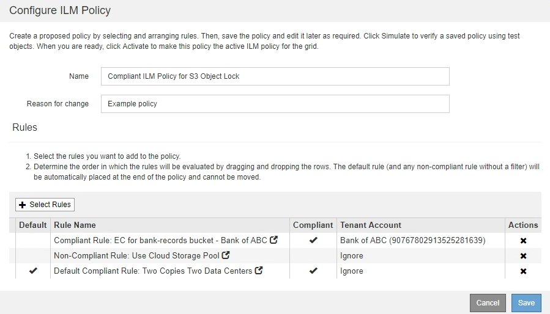

= Crie uma política ILM depois que o bloqueio de objetos S3 estiver ativado
:allow-uri-read: 
:icons: font
:imagesdir: ../media/

[role="lead"]
Se a configuração global S3 Object Lock estiver ativada, as etapas para criar uma política serão ligeiramente diferentes. Você deve garantir que a política ILM esteja em conformidade com os requisitos de buckets que têm o bloqueio de objeto S3 ativado.

.O que você vai precisar
* Você está conetado ao Gerenciador de Grade usando um xref:../admin/web-browser-requirements.adoc[navegador da web suportado].
* Você tem permissões de acesso específicas.
* A configuração global de bloqueio de objetos S3D já está ativada para o sistema StorageGRID.
+

NOTE: Se a configuração global S3 Object Lock não tiver sido ativada, use as instruções gerais para xref:creating-proposed-ilm-policy.adoc[Criando uma política proposta de ILM].

* Você criou as regras ILM compatíveis e não compatíveis que deseja adicionar à política proposta. Conforme necessário, você pode salvar uma política proposta, criar regras adicionais e editar a política proposta para adicionar as novas regras. xref:example-7-compliant-ilm-policy-for-s3-object-lock.adoc[Exemplo 7: Política de ILM compatível para bloqueio de objetos S3]Consulte .
* Você tem xref:creating-default-ilm-rule.adoc[Criou uma regra ILM padrão] para a política que é compatível.
* Opcionalmente, você assistiu ao vídeo: https://netapp.hosted.panopto.com/Panopto/Pages/Viewer.aspx?id=c929e94e-353a-4375-b112-acc5013c81c7["Vídeo: Políticas do StorageGRID ILM"^]
+
[link=https://netapp.hosted.panopto.com/Panopto/Pages/Viewer.aspx?id=c929e94e-353a-4375-b112-acc5013c81c7]
image::../media/video-screenshot-ilm-policies.png[Vídeo: Políticas do StorageGRID ILM]

.Passos
. Selecione *ILM* > *políticas*.
+
É apresentada a página ILM Policies (políticas ILM). Se a configuração Global S3 Object Lock estiver ativada, a página ILM Policies (políticas ILM) indica quais regras ILM são compatíveis.

+
image::../media/ilm_policies_page_compliant.png[Políticas ILM em conformidade com a página]

. Digite um nome exclusivo para a política proposta no campo *Nome*.
+
Você deve inserir pelo menos 1 e não mais de 64 carateres.

. Insira o motivo pelo qual você está criando uma nova política proposta no campo *motivo da mudança*.
+
Você deve inserir pelo menos 1 e não mais de 128 carateres.

. Para adicionar regras à política, selecione *Selecionar regras*.
+
A caixa de diálogo Selecionar regras para política é exibida, com todas as regras definidas listadas.

+
** A seção Selecionar regra padrão lista as regras que podem ser o padrão para uma política compatível. Ele inclui regras compatíveis que não usam filtros ou o tempo de referência não atual.
** A seção Selecionar outras regras lista as outras regras compatíveis e não compatíveis que podem ser selecionadas para esta política.
+
image::../media/ilm_policy_select_rules_for_compliant_policy.png[Política ILM Selecione regras para Política compatível]

. Selecione um nome de regra ou o ícone mais detalhes image:../media/icon_nms_more_details.gif["ícone mais detalhes"]para exibir as configurações dessa regra.
. Na seção *Selecionar regra padrão*, selecione uma regra padrão para a política proposta.
+
A tabela nesta seção lista apenas as regras que são compatíveis e não usam filtros.

+

NOTE: Se nenhuma regra estiver listada na seção Selecionar regra padrão, você deverá sair da página de política ILM xref:creating-default-ilm-rule.adoc[Crie uma regra ILM padrão]e que seja compatível.

+

IMPORTANT: Não use a regra fazer 2 cópias de estoque como a regra padrão para uma política. A regra fazer 2 cópias usa um único pool de storage, todos os nós de storage, que contém todos os locais. Se você usar essa regra, várias cópias de um objeto podem ser colocadas no mesmo site.

. Na seção *Selecionar outras regras*, selecione quaisquer outras regras que você deseja incluir na política.
+
.. Se você precisar de uma regra diferente de "falha" para objetos em buckets S3 não compatíveis, opcionalmente, selecione uma regra não compatível que não use um filtro.
+
Por exemplo, você pode querer usar um pool de armazenamento em nuvem ou um nó de arquivamento para armazenar objetos em buckets que não têm o bloqueio de objeto S3 ativado.

+

NOTE: Você só pode selecionar uma regra não compatível que não use um filtro. Assim que você selecionar uma regra, a coluna *é selecionável* mostra *não* para quaisquer outras regras não compatíveis sem filtros.

.. Selecione quaisquer outras regras compatíveis ou não compatíveis que você deseja usar na política.
+
As outras regras devem usar pelo menos um filtro (conta de locatário, nome do bucket ou um filtro avançado, como tamanho do objeto).

. Quando terminar de selecionar as regras, selecione *aplicar*.
+
As regras selecionadas são listadas. A regra padrão está no final, com as outras regras acima dela. Se você também selecionou uma regra "falha" não compatível, essa regra será adicionada como regra segunda a última na política.

+
Neste exemplo, a última regra, 2 cópias 2 Data Centers, é a regra padrão: Ela é compatível e não tem filtros. A regra segunda a última, Cloud Storage Pool, também não tem filtros, mas não é compatível.

+

. Arraste e solte as linhas para as regras não padrão para determinar a ordem em que essas regras serão avaliadas.
+
Você não pode mover a regra padrão ou a regra "falha" não compatível.

+

IMPORTANT: Você deve confirmar se as regras ILM estão na ordem correta. Quando a política é ativada, objetos novos e existentes são avaliados pelas regras na ordem listada, começando na parte superior.

. Conforme necessário, selecione o ícone de exclusão image:../media/icon_nms_delete_new.gif["eliminar ícone"]para excluir quaisquer regras que você não deseja na política ou *Selecione regras* para adicionar mais regras.
. Quando terminar, selecione *Guardar*.
+
A página de políticas ILM é atualizada:

+
** A política que você salvou é mostrada como proposta. As políticas propostas não têm datas de início e fim.
** Os botões *Simulate* e *Activate* estão ativados.
+
image::../media/ilm_policy_proposed_policy_s3_object_lock.png[Política de ILM proposta Política S3 bloqueio de objetos]

. Vá para xref:simulating-ilm-policy.adoc[Simule uma política de ILM].

