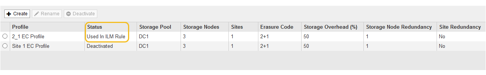
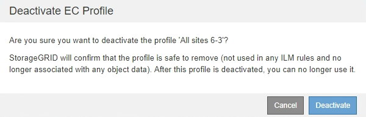

= Desativar um perfil de codificação de apagamento
:allow-uri-read: 
:icons: font
:imagesdir: ../media/

[role="lead"]
Você pode desativar um perfil de codificação de apagamento se você não planeja mais usá-lo e se o perfil não for usado atualmente em nenhuma regra de ILM.

.O que você vai precisar
* Você está conetado ao Gerenciador de Grade usando um xref:../admin/web-browser-requirements.adoc[navegador da web suportado].
* Você tem permissões de acesso específicas.
* Você confirmou que nenhuma operação de reparo de dados codificados de apagamento ou procedimentos de desativação estão em andamento. Uma mensagem de erro é retornada se você tentar desativar um perfil de codificação de apagamento enquanto qualquer uma dessas operações estiver em andamento.

.Sobre esta tarefa
Quando você desativa um perfil de codificação de apagamento, o perfil ainda aparece na página Perfis de codificação de apagamento, mas seu status é *desativado*.

image::../media/deactivated_ec_profile.png[Perfil EC desativado]

Já não pode utilizar um perfil de codificação de apagamento que tenha sido desativado. Um perfil desativado não é exibido quando você cria as instruções de colocação para uma regra ILM. Não é possível reativar um perfil desativado.

O StorageGRID impede que você desative um perfil de codificação de apagamento se uma das seguintes opções for verdadeira:

* O perfil de codificação de apagamento é usado atualmente em uma regra ILM.
* O perfil de codificação de apagamento não é mais usado em nenhuma regra ILM, mas os dados de objeto e fragmentos de paridade para o perfil ainda existem.

.Passos
. Selecione *ILM* > *Codificação de apagamento*.
+
A página Perfis de codificação de apagamento é exibida. Os botões *Renomear* e *Desativar* estão desativados.

. Revise a coluna *Status* para confirmar que o perfil de codificação de apagamento que você deseja desativar não é usado em nenhuma regra ILM.
+
Você não pode desativar um perfil de codificação de apagamento se ele for usado em qualquer regra ILM. No exemplo, o *2_1 EC Profile* é usado em pelo menos uma regra ILM.

+

. Se o perfil for usado em uma regra ILM, siga estas etapas:
+
.. Selecione *ILM* > *regras*.
.. Para cada regra listada, selecione o botão de opção e revise o diagrama de retenção para determinar se a regra usa o perfil de codificação de apagamento que você deseja desativar.
+
No exemplo, a regra *Three site EC para objetos maiores* usa um pool de armazenamento chamado *All 3 Sites* e o perfil *All Sites 6-3* Erasure Coding. Os perfis de codificação de apagamento são representados por este ícone: image:../media/icon_nms_erasure_coded.gif["Ícone de perfis EC"]

+
image::../media/ilm_rule_ec_profile_used.png[Perfil EC regra ILM usado]

.. Se a regra ILM usar o perfil de codificação de apagamento que você deseja desativar, determine se a regra é usada na política ILM ativa ou em uma política proposta.
+
No exemplo, a regra *Three site EC para objetos maiores* é usada na política ILM ativa.

.. Conclua as etapas adicionais na tabela, com base em onde o perfil de codificação de apagamento é usado.
+
[cols="2a,3a,1a"]
|===
| Onde o perfil foi usado? | Etapas adicionais a serem executadas antes de desativar o perfil | Consulte estas instruções adicionais 

 a| 
Nunca usado em nenhuma regra ILM
 a| 
Não são necessários passos adicionais. Continue com este procedimento.
 a| 
_Nenhum_

 a| 
Em uma regra ILM que nunca foi usada em nenhuma política ILM
 a| 
... Edite ou exclua todas as regras ILM afetadas. Se você editar a regra, remova todos os canais que usam o perfil de codificação de apagamento.
... Continue com este procedimento.

 a| 
xref:working-with-ilm-rules-and-ilm-policies.adoc[Trabalhe com regras ILM e políticas ILM]

 a| 
Em uma regra ILM que está atualmente na política ILM ativa
 a| 
... Clonar a política ativa.
... Remova a regra ILM que usa o perfil de codificação de apagamento.
... Adicione uma ou mais novas regras ILM para garantir que os objetos estejam protegidos.
... Salve, simule e ative a nova política.
... Aguarde que a nova política seja aplicada e que os objetos existentes sejam movidos para novos locais com base nas novas regras adicionadas.
+
*Observação:* dependendo do número de objetos e do tamanho do seu sistema StorageGRID, pode levar semanas ou até meses para que as operações do ILM movam os objetos para novos locais, com base nas novas regras do ILM.

+
Embora você possa tentar desativar com segurança um perfil de codificação de apagamento enquanto ele ainda estiver associado a dados, a operação de desativação falhará. Uma mensagem de erro irá informá-lo se o perfil ainda não está pronto para ser desativado.

... Edite ou exclua a regra que você removeu da política. Se você editar a regra, remova todos os canais que usam o perfil de codificação de apagamento.
... Continue com este procedimento.

 a| 
*** xref:creating-ilm-policy.adoc[Crie uma política ILM]
*** xref:working-with-ilm-rules-and-ilm-policies.adoc[Trabalhe com regras ILM e políticas ILM]

 a| 
Em uma regra ILM que está atualmente em uma política de ILM proposta
 a| 
... Edite a política proposta.
... Remova a regra ILM que usa o perfil de codificação de apagamento.
... Adicione uma ou mais novas regras ILM para garantir que todos os objetos estejam protegidos.
... Salve a política proposta.
... Edite ou exclua a regra que você removeu da política. Se você editar a regra, remova todos os canais que usam o perfil de codificação de apagamento.
... Continue com este procedimento.

 a| 
*** xref:creating-ilm-policy.adoc[Crie uma política ILM]
*** xref:working-with-ilm-rules-and-ilm-policies.adoc[Trabalhe com regras ILM e políticas ILM]

 a| 
Em uma regra ILM que está em uma política ILM histórica
 a| 
... Edite ou exclua a regra. Se você editar a regra, remova todos os canais que usam o perfil de codificação de apagamento. (A regra agora aparecerá como uma regra histórica na política histórica.)
... Continue com este procedimento.

 a| 
xref:working-with-ilm-rules-and-ilm-policies.adoc[Trabalhe com regras ILM e políticas ILM]

|===
.. Atualize a página Perfis de codificação de apagamento para garantir que o perfil não seja usado em uma regra ILM.

. Se o perfil não for usado em uma regra ILM, selecione o botão de opção e selecione *Deactivate*.
+
A caixa de diálogo Desativar perfil EC é exibida.

+

. Se tiver a certeza de que pretende desativar o perfil, selecione *Desativar*.
+
** Se o StorageGRID for capaz de desativar o perfil de codificação de apagamento, seu status será *desativado*. Você não pode mais selecionar este perfil para qualquer regra ILM.
** Se o StorageGRID não conseguir desativar o perfil, é apresentada uma mensagem de erro. Por exemplo, uma mensagem de erro será exibida se os dados do objeto ainda estiverem associados a esse perfil. Talvez seja necessário esperar várias semanas antes de tentar novamente o processo de desativação.

