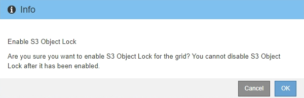

= Ative o bloqueio de objetos S3 globalmente
:allow-uri-read: 
:icons: font
:imagesdir: ../media/

[role="lead"]
Se uma conta de locatário do S3 precisar atender aos requisitos regulatórios ao salvar dados de objeto, você deverá ativar o bloqueio de objeto do S3 para todo o seu sistema StorageGRID. Ativar a configuração global S3 Object Lock permite que qualquer usuário do locatário do S3 crie e gerencie buckets e objetos com o S3 Object Lock.

.O que você vai precisar
* Você tem a permissão de acesso root.
* Você está conetado ao Gerenciador de Grade usando um xref:../admin/web-browser-requirements.adoc[navegador da web suportado].
* Você revisou o fluxo de trabalho do S3 Object Lock e deve entender as considerações.
* A regra padrão na política ILM ativa é compatível.
+
** xref:creating-default-ilm-rule.adoc[Crie uma regra ILM padrão]
** xref:creating-ilm-policy.adoc[Crie uma política ILM]

.Sobre esta tarefa
Um administrador de grade deve habilitar a configuração global S3 Object Lock para permitir que os usuários do locatário criem novos buckets com o S3 Object Lock ativado. Depois que esta definição estiver ativada, não poderá ser desativada.

NOTE: Se você ativou a configuração de conformidade global usando uma versão anterior do StorageGRID, a configuração bloqueio de objeto S3 será ativada no StorageGRID 11,6. Você pode continuar usando o StorageGRID para gerenciar as configurações dos buckets em conformidade existentes. No entanto, não é possível criar novos buckets em conformidade.  https://kb.netapp.com/Advice_and_Troubleshooting/Hybrid_Cloud_Infrastructure/StorageGRID/How_to_manage_legacy_Compliant_buckets_in_StorageGRID_11.5["Base de Conhecimento da NetApp: Como gerenciar buckets em conformidade com o legado no StorageGRID 11,5"^]Consulte .

.Passos
. Selecione *CONFIGURATION* > *System* > *S3 Object Lock*.
+
A página Configurações de bloqueio de objetos S3 é exibida.

+
image::../media/s3_object_lock_global_setting.png[S3 Definição Global de bloqueio de objetos]

+
Se você ativou a configuração de conformidade global usando uma versão anterior do StorageGRID, a página inclui a seguinte nota:

+
image::../media/s3_object_lock_global_setting_compliant_note.png[S3 Observação compatível com a configuração global de bloqueio de objetos]

. Selecione *Ativar bloqueio de objetos S3*.
. Selecione *aplicar*.
+
Uma caixa de diálogo de confirmação é exibida e lembra que você não pode desativar o bloqueio de objeto S3 depois que ele estiver ativado.

+

. Se tiver a certeza de que pretende ativar permanentemente o bloqueio de objetos S3D para todo o seu sistema, selecione *OK*.
+
Quando você seleciona *OK*:

+
** Se a regra padrão na política ILM ativa for compatível, o bloqueio de objetos S3 agora está ativado para toda a grade e não pode ser desativado.
** Se a regra padrão não for compatível, um erro será exibido, indicando que você deve criar e ativar uma nova política ILM que inclua uma regra compatível como regra padrão. Selecione *OK* e crie uma nova política proposta, simule-a e ative-a.
+
image::../media/s3_object_lock_global_setting_error.gif[S3 erro de configuração global do bloqueio de objetos]

.Depois de terminar
Depois de ativar a configuração global S3 Object Lock, talvez seja necessário que xref:../ilm/creating-default-ilm-rule.adoc[crie uma regra padrão] ela seja compatível e xref:creating-ilm-policy-after-s3-object-lock-is-enabled.adoc[Crie uma política ILM] que seja compatível. Depois que a configuração estiver ativada, a política ILM pode incluir opcionalmente uma regra padrão compatível e uma regra padrão não compatível. Por exemplo, você pode querer usar uma regra não compatível que não tenha filtros para objetos em buckets que não tenham o bloqueio de objeto S3 ativado.

.Informações relacionadas
* xref:managing-objects-with-s3-object-lock.adoc#comparing-s3-object-lock-to-legacy-compliance[Compare o S3 Object Lock com a conformidade legada]

