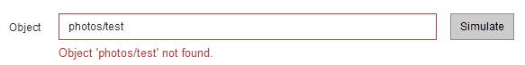

= Simule uma política de ILM
:allow-uri-read: 
:icons: font
:imagesdir: ../media/

[role="lead"]
Você deve simular uma política proposta em objetos de teste antes de ativar a política e aplicá-la aos dados de produção. A janela de simulação fornece um ambiente autônomo que é seguro para políticas de teste antes de serem ativadas e aplicadas aos dados no ambiente de produção.

.O que você vai precisar
* Você está conetado ao Gerenciador de Grade usando um xref:../admin/web-browser-requirements.adoc[navegador da web suportado].
* Você tem permissões de acesso específicas.
* Você conhece o bucket/object-key do S3 ou o container/object-name do Swift para cada objeto que deseja testar e já ingeriu esses objetos.

.Sobre esta tarefa
Você deve selecionar cuidadosamente os objetos que deseja que a política proposta teste. Para simular uma política completamente, você deve testar pelo menos um objeto para cada filtro em cada regra.

Por exemplo, se uma política incluir uma regra para combinar objetos no bucket A e outra regra para corresponder objetos no bucket B, você deve selecionar pelo menos um objeto do bucket A e um objeto do bucket B para testar a política completamente. Você também deve selecionar pelo menos um objeto de outro intervalo para testar a regra padrão.

Ao simular uma política, aplicam-se as seguintes considerações:

* Depois de fazer alterações em uma política, salve a política proposta. Em seguida, simule o comportamento da política proposta salva.
* Ao simular uma política, as regras ILM na política filtram os objetos de teste, para que você possa ver qual regra foi aplicada a cada objeto. No entanto, nenhuma cópia de objeto é feita e nenhum objeto é colocado. Executar uma simulação não modifica seus dados, regras ou política de forma alguma.
* A página Simulação mantém os objetos testados até que você feche, navegue para longe ou atualize a página de políticas ILM.
* Simulação retorna o nome da regra correspondente. Para determinar qual pool de armazenamento ou perfil de codificação de apagamento estão em vigor, você pode exibir o Diagrama de retenção selecionando o nome da regra ou o ícone mais detalhes image:../media/icon_nms_more_details.gif["ícone mais detalhes"].
* Se o Controle de versão S3 estiver ativado, a política só será simulada em relação à versão atual do objeto.

.Passos
. Selecione e organize as regras e salve a política proposta.
+
A política neste exemplo tem três regras:

+
[cols="1a,1a,1a,1a"]
|===
| Nome da regra | Filtro | Tipo de cópias | Retenção 

 a| 
X-men
 a| 
** Inquilino A
** Metadados do usuário (série x-man)

 a| 
2 cópias em dois data centers
 a| 
2 anos

 a| 
PNGs
 a| 
A chave termina com .png
 a| 
2 cópias em dois data centers
 a| 
5 anos

 a| 
Duas cópias de dois data centers
 a| 
_Nenhum_
 a| 
2 cópias em dois data centers
 a| 
Para sempre

|===
+
image::../media/ilm_policies_viewing_proposed.png[Políticas de ILM que visualizam propostas]

. Usando um cliente S3 ou Swift ou o xref:../tenant/use-s3-console.adoc[Console experimental S3], que está disponível no Gerenciador de inquilinos para cada locatário, ingira os objetos necessários para testar cada regra.
. Selecione *simular*.
+
É apresentada a caixa de diálogo Simulation ILM Policy (Política ILM de simulação).

. No campo *Object*, insira o bucket/object-key S3 ou o container/object-name Swift para um objeto de teste e selecione *Simulate*.
+
[NOTE]
====
Uma mensagem será exibida se você especificar um objeto que não foi ingerido.

====
. Em *resultados da simulação*, confirme se cada objeto foi correspondido pela regra correta.
+
No exemplo, os `Havok.png` objetos e `Warpath.jpg` foram corretamente combinados pela regra X-meN. O `Fullsteam.png` objeto, que não inclui `series=x-men` metadados do usuário, não foi correspondido pela regra X-meN, mas foi corretamente correspondido pela regra PNGs. A regra padrão não foi usada porque todos os três objetos foram correspondidos por outras regras.

+
image::../media/ilm_policy_simulation_results.gif[Resultados da simulação]

== Exemplo 1: Verificar regras ao simular uma política de ILM proposta

Este exemplo mostra como verificar regras ao simular uma política proposta.

Neste exemplo, a política *exemplo de ILM* está sendo simulada contra os objetos ingeridos em dois buckets. A política inclui três regras, como segue:

* A primeira regra, *duas cópias, dois anos para bucket-a*, aplica-se apenas a objetos em bucket-a.
* A segunda regra, *objetos EC > 1 MB*, aplica-se a todos os intervalos, mas filtros em objetos com mais de 1 MB.
* A terceira regra, *duas cópias, dois data centers*, é a regra padrão. Ele não inclui nenhum filtro e não usa o tempo de referência não atual.

image::../media/saved_policy_for_simulation.png[Política guardada para Simulação]

.Passos
. Depois de adicionar as regras e salvar a política, selecione *simular*.
+
A caixa de diálogo simular política de ILM é exibida.

. No campo *Object*, insira o bucket/object-key S3 ou o container/object-name Swift para um objeto de teste e selecione *Simulate*.
+
Os resultados da simulação são exibidos, mostrando qual regra na política corresponde a cada objeto testado.

+
image::../media/simulate_policy_screen.png[Ecrã Simulate Policy (simular política)]

. Confirme se cada objeto foi correspondido pela regra correta.
+
Neste exemplo:

+
.. `bucket-a/bucket-a object.pdf` corresponde corretamente à primeira regra, que filtra os objetos no `bucket-a`.
.. `bucket-b/test object greater than 1 MB.pdf` está em `bucket-b`, por isso não corresponde à primeira regra. Em vez disso, foi corretamente correspondido pela segunda regra, que filtra em objetos com mais de 1 MB.
.. `bucket-b/test object less than 1 MB.pdf` não corresponde aos filtros nas duas primeiras regras, por isso será colocado pela regra padrão, que não inclui filtros.

== Exemplo 2: Reordenar regras ao simular uma política de ILM proposta

Este exemplo mostra como você pode reordenar regras para alterar os resultados ao simular uma política.

Neste exemplo, a política *Demo* está sendo simulada. Esta política, que se destina a encontrar objetos que tenham metadados de usuário de série X-men, inclui três regras, como segue:

* A primeira regra, *PNGs*, filtra os nomes das chaves que terminam em `.png`.
* A segunda regra, *X-meN*, aplica-se apenas a objetos para o locatário A e filtra os metadados `series=x-men` do usuário.
* A última regra, *duas cópias dois data centers*, é a regra padrão, que corresponde a quaisquer objetos que não correspondam às duas primeiras regras.

image::../media/simulate_reorder_rules_pngs_rule.png[Exemplo 2: Reordenando regras ao simular uma política de ILM proposta]

.Passos
. Depois de adicionar as regras e salvar a política, selecione *simular*.
. No campo *Object*, insira o bucket/object-key S3 ou o container/object-name Swift para um objeto de teste e selecione *Simulate*.
+
Os resultados da simulação aparecem, mostrando que o `Havok.png` objeto foi correspondido pela regra *PNGs*.

+
image::../media/simulate_reorder_rules_pngs_result.gif[Exemplo 2: Reordenando regras ao simular uma política de ILM proposta]

+
No entanto, a regra que o `Havok.png` objeto foi destinado a testar foi a regra *X-men*.

. Para resolver o problema, reordene as regras.
+
.. Selecione *Finish* para fechar a página Simulate ILM Policy.
.. Selecione *Editar* para editar a política.
.. Arraste a regra *X-man* para o topo da lista.
+
image::../media/simulate_reorder_rules_correct_rule.png[Simular - Reordenar regras - regra correta]

.. Selecione *Guardar*.

. Selecione *simular*.
+
Os objetos que você testou anteriormente são reavaliados em relação à política atualizada e os novos resultados da simulação são mostrados. No exemplo, a coluna Rule Matched mostra que o `Havok.png` objeto agora corresponde à regra de metadados X-men, conforme esperado. A coluna correspondência anterior mostra que a regra PNGs correspondia ao objeto na simulação anterior.

+
image::../media/simulate_reorder_rules_correct_result.gif[Exemplo 2: Reordenando regras ao simular uma política de ILM proposta]

+

NOTE: Se você permanecer na página Configurar políticas, poderá simular novamente uma política depois de fazer alterações sem precisar digitar novamente os nomes dos objetos de teste.

== Exemplo 3: Corrija uma regra ao simular uma política de ILM proposta

Este exemplo mostra como simular uma política, corrigir uma regra na política e continuar a simulação.

Neste exemplo, a política *Demo* está sendo simulada. Esta política destina-se a localizar objetos que tenham `series=x-men` metadados de usuário. No entanto, resultados inesperados ocorreram ao simular essa política contra o `Beast.jpg` objeto. Em vez de corresponder à regra de metadados X-men, o objeto correspondia à regra padrão, duas cópias de dois data centers.

image::../media/simulate_results_for_object_wrong_metadata.png[Exemplo 3: Corrigindo uma regra ao simular uma política de ILM proposta]

Quando um objeto de teste não é correspondido pela regra esperada na política, você deve examinar cada regra na política e corrigir quaisquer erros.

.Passos
. Para cada regra na política, exiba as configurações da regra selecionando o nome da regra ou o ícone mais detalhes image:../media/icon_nms_more_details.gif["ícone mais detalhes"]em qualquer caixa de diálogo em que a regra seja exibida.
. Revise a conta de locatário da regra, o tempo de referência e os critérios de filtragem.
+
Neste exemplo, os metadados da regra X-meN incluem um erro. O valor dos metadados foi inserido como "'x-men1" em vez de "'x-men."

+
image::../media/simulate_rules_select_rule_popup_with_wrong_metadata.png[Exemplo 3: Corrigindo uma regra ao simular uma política de ILM proposta]

. Para resolver o erro, corrija a regra da seguinte forma:
+
** Se a regra fizer parte da política proposta, você pode clonar a regra ou remover a regra da política e editá-la.
** Se a regra fizer parte da política ativa, você deverá clonar a regra. Não é possível editar ou remover uma regra da política ativa.
+
[cols="1a,3a"]
|===
| Opção | Descrição 

 a| 
Clone a regra
 a| 
... Selecione *ILM* > *regras*.
... Selecione a regra incorreta e selecione *Clone*.
... Altere as informações incorretas e selecione *Salvar*.
... Selecione *ILM* > *políticas*.
... Selecione a política proposta e selecione *Editar*.
... Selecione *Selecionar regras*.
... Marque a caixa de seleção da nova regra, desmarque a caixa de seleção da regra original e selecione *aplicar*.
... Selecione *Guardar*.

 a| 
Edite a regra
 a| 
... Selecione a política proposta e selecione *Editar*.
... Selecione o ícone de exclusão image:../media/icon_nms_delete_new.gif["eliminar ícone"]para remover a regra incorreta e selecione *Salvar*.
... Selecione *ILM* > *regras*.
... Selecione a regra incorreta e selecione *Editar*.
... Altere as informações incorretas e selecione *Salvar*.
... Selecione *ILM* > *políticas*.
... Selecione a política proposta e selecione *Editar*.
... Selecione a regra corrigida, selecione *aplicar* e *Salvar*.

|===

. Execute a simulação novamente.
+

NOTE: Como você navegou para fora da página de políticas ILM para editar a regra, os objetos que você inseriu anteriormente para simulação não são mais exibidos. Você deve digitar novamente os nomes dos objetos.

+
Neste exemplo, a regra X-meN corrigida agora corresponde ao `Beast.jpg` objeto com base nos `series=x-men` metadados do usuário, conforme esperado.

+
image::../media/simulate_results_for_object_corrected_metadata.gif[Exemplo 3: Corrigindo uma regra ao simular uma política de ILM proposta]

