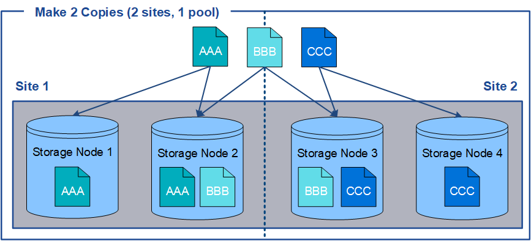

= Use vários pools de storage para replicação entre locais
:allow-uri-read: 
:icons: font
:imagesdir: ../media/

[role="lead"]
Se a implantação do StorageGRID incluir mais de um local, você poderá habilitar a proteção contra perda de site criando um pool de armazenamento para cada local e especificando ambos os pools de armazenamento nas instruções de posicionamento da regra. Por exemplo, se você configurar uma regra ILM para fazer duas cópias replicadas e especificar pools de armazenamento em dois locais, uma cópia de cada objeto será colocada em cada local. Se você configurar uma regra para fazer duas cópias e especificar três pools de storage, as cópias serão distribuídas para equilibrar o uso do disco entre os pools de storage, ao mesmo tempo em que garante que as duas cópias sejam armazenadas em locais diferentes.

O exemplo a seguir ilustra o que pode acontecer se uma regra ILM colocar cópias de objetos replicadas em um único pool de storage que contém nós de storage de dois locais. Como o sistema usa todos os nós disponíveis no pool de storage quando ele coloca as cópias replicadas, ele pode colocar todas as cópias de alguns objetos em apenas um dos sites. Neste exemplo, o sistema armazenou duas cópias do objeto AAA em nós de armazenamento no local 1 e duas cópias do objeto CCC em nós de armazenamento no local 2. Somente o objeto BBB é protegido se um dos sites falhar ou se tornar inacessível.

Em contraste, este exemplo ilustra como os objetos são armazenados quando você usa vários pools de armazenamento. No exemplo, a regra ILM especifica que duas cópias replicadas de cada objeto serão criadas e que as cópias serão distribuídas em dois pools de storage. Cada pool de storage contém todos os nós de storage em um local. Como uma cópia de cada objeto é armazenada em cada site, os dados do objeto são protegidos contra falha ou inacessibilidade do site.

image::../media/ilm_replication_make_2_copies_2_pools_2_sites.png[Regra de fazer 2 cópias em dois locais e dois pools de storage]

Ao usar vários pools de armazenamento, tenha em mente as seguintes regras:

* Se você estiver criando n cópias, será necessário adicionar n ou mais pools de armazenamento. Por exemplo, se uma regra estiver configurada para fazer três cópias, especifique três ou mais pools de storage.
* Se o número de cópias for igual ao número de pools de storage, uma cópia do objeto será armazenada em cada pool de storage.
* Se o número de cópias for menor que o número de pools de storage, o sistema distribui as cópias para manter o uso do disco entre os pools balanceado e garantir que duas ou mais cópias não sejam armazenadas no mesmo pool de storage.
* Se os pools de storage se sobreporem (contiverem os mesmos nós de storage), todas as cópias do objeto poderão ser salvas em apenas um local. Você deve garantir que os pools de storage selecionados não contenham os mesmos nós de storage.

