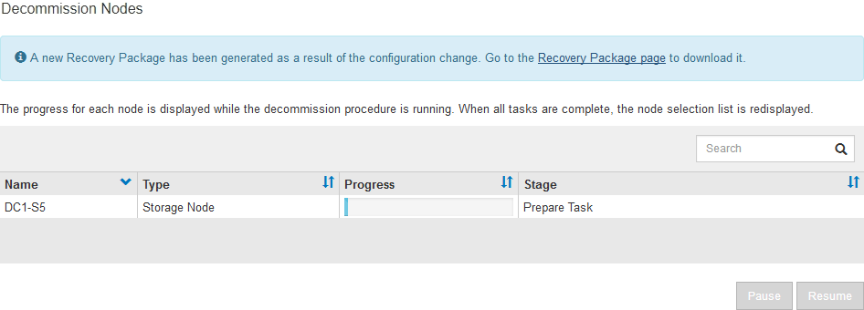
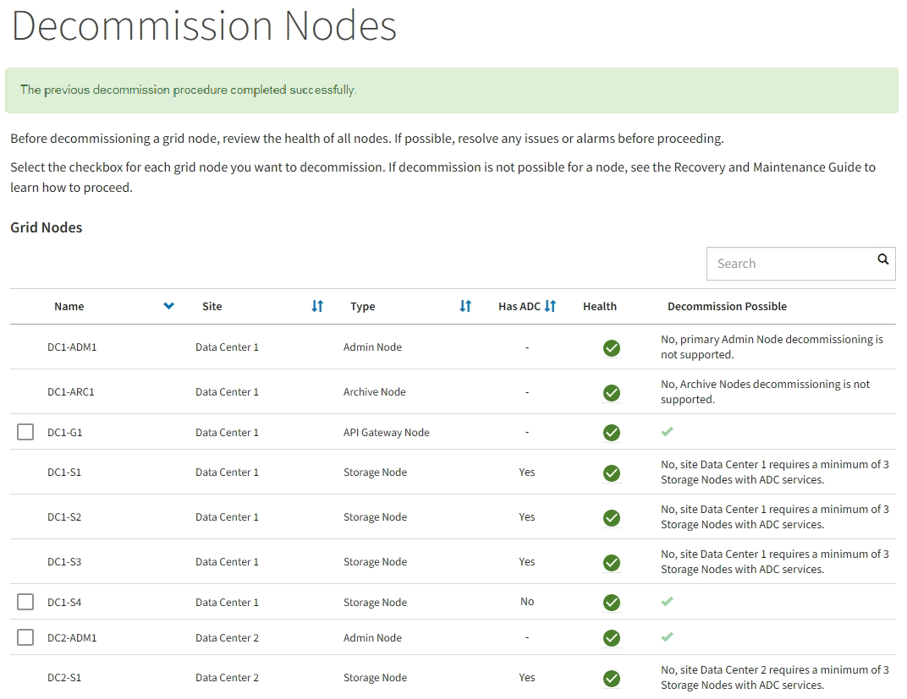

= Desativar os nós de grade conetados
:allow-uri-read: 
:icons: font
:imagesdir: ../media/

[role="lead"]
Você pode desativar e remover permanentemente nós que estão conetados à grade.

* Você deve entender os requisitos e xref:considerations-for-decommissioning-grid-nodes.adoc[considerações para a desativação de nós de grade].
* Você deve ter reunido todos os materiais necessários.
* Tem de ter assegurado que não estão ativos trabalhos de reparação de dados.
* Você deve ter confirmado que a recuperação do nó de storage não está em andamento em nenhum lugar da grade. Se estiver, você deve esperar até que qualquer reconstrução do Cassandra executada como parte da recuperação esteja concluída. Você pode então prosseguir com a desativação.
* Você deve ter garantido que outros procedimentos de manutenção não serão executados enquanto o procedimento de desativação do nó estiver em execução, a menos que o procedimento de desativação do nó esteja pausado.
* Você deve ter a senha de provisionamento.
* Os nós de grade estão conetados.
* A coluna *Decmmission possible* para o nó ou nós que você deseja desativar deve incluir uma marca de seleção verde.
* Todos os nós da grade devem ter a saúde normal (verde) image:../media/icon_alert_green_checkmark.png["ícone de marca de verificação verde"]. Se você vir um desses ícones na coluna *Saúde*, tente resolver o problema:
+
|===

| Ícone | Cor | Gravidade 

 a| 
image:../media/icon_alarm_yellow_notice.gif["ícone quadrado amarelo"]
 a| 
Amarelo
 a| 
Aviso

 a| 
image:../media/icon_alert_yellow_minor.png["ícone de diamante laranja claro"]
 a| 
Laranja claro
 a| 
Menor

 a| 
image:../media/icon_alert_orange_major.png["ícone de diamante laranja escuro"]
 a| 
Laranja escuro
 a| 
Maior

 a| 
image:../media/icon_alert_red_critical.png["ícone vermelho x"]
 a| 
Vermelho
 a| 
Crítico

|===
* Se você desativou anteriormente um nó de storage desconetado, todos os trabalhos de reparo de dados foram concluídos com êxito. xref:checking-data-repair-jobs.adoc[Verifique os trabalhos de reparação de dados]Consulte .

IMPORTANT: Não remova a máquina virtual de um nó de grade ou outros recursos até que seja instruído a fazê-lo neste procedimento.

. Na página Decommission Nodes, marque a caixa de seleção para cada nó de grade que deseja desativar.
. Introduza a frase-passe de aprovisionamento.
+
O botão *Start Decommission* está ativado.

. Clique em *Start Decommission*.
+
É apresentada uma caixa de diálogo de confirmação.

+
image::../media/decommission_confirmation.gif[captura de tela da caixa de diálogo de confirmação de desativação]

. Revise a lista de nós selecionados e clique em *OK*.
+
O procedimento de desativação do nó é iniciado e o progresso é exibido para cada nó. Durante o procedimento, um novo pacote de recuperação é gerado para mostrar a alteração da configuração da grade.

+

+

IMPORTANT: Não coloque um nó de armazenamento offline após o início do procedimento de desativação. Alterar o estado pode resultar em algum conteúdo não ser copiado para outros locais.

. Assim que o novo Pacote de recuperação estiver disponível, clique no link ou selecione *MANUTENÇÃO* *sistema* *Pacote de recuperação* para acessar a página Pacote de recuperação. Em seguida, baixe o `.zip` arquivo.
+
Consulte as instruções para xref:downloading-recovery-package.adoc[Transferir o pacote de recuperação].

+

NOTE: Baixe o pacote de recuperação o mais rápido possível para garantir que você possa recuperar sua grade se algo der errado durante o procedimento de desativação.

. Monitore periodicamente a página Decommission Nodes para garantir que todos os nós selecionados sejam desativados com êxito.
+
Os nós de storage podem levar dias ou semanas para serem desativados. Quando todas as tarefas estiverem concluídas, a lista de seleção de nós é reexibida com uma mensagem de sucesso.

+

. Siga o passo apropriado para a sua plataforma. Por exemplo:
+
** * Linux*: Você pode querer desanexar os volumes e excluir os arquivos de configuração de nó criados durante a instalação.
** *VMware*: Você pode querer usar a opção "Excluir do disco" do vCenter para excluir a máquina virtual. Você também pode precisar excluir quaisquer discos de dados que sejam independentes da máquina virtual.
** *StorageGRID Appliance*: O nó appliance reverte automaticamente para um estado não implantado, onde você pode acessar o Instalador de dispositivos StorageGRID. Pode desligar o aparelho ou adicioná-lo a outro sistema StorageGRID.

Siga estas etapas depois de concluir o procedimento de desativação do nó:

* Certifique-se de que as unidades do nó de grade desativado estão limpas. Utilize uma ferramenta ou serviço de limpeza de dados disponíveis no mercado para remover dados das unidades de forma permanente e segura.
* Se você desativou um nó de dispositivo e os dados no dispositivo foram protegidos usando criptografia de nó, use o Instalador de dispositivos StorageGRID para limpar a configuração do servidor de gerenciamento de chaves (limpar KMS). Você deve limpar a configuração do KMS se quiser usar o dispositivo em outra grade.
+
xref:../sg100-1000/index.adoc[Aparelhos de serviços SG100 e SG1000]

+
xref:../sg5600/index.adoc[SG5600 dispositivos de armazenamento]

+
xref:../sg5700/index.adoc[SG5700 dispositivos de armazenamento]

+
xref:../sg6000/index.adoc[SG6000 dispositivos de armazenamento]

.Informações relacionadas
xref:../rhel/index.adoc[Instale o Red Hat Enterprise Linux ou CentOS]
