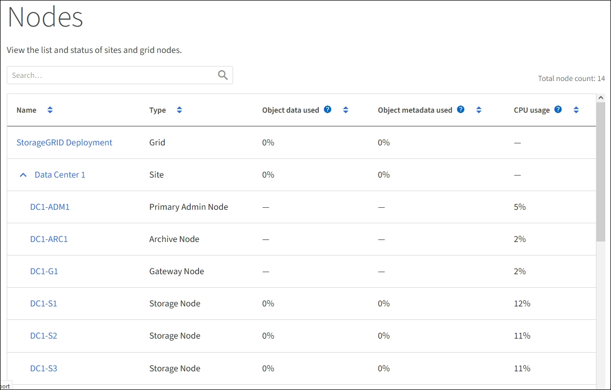

= Inicie os nós de grade
:allow-uri-read: 
:icons: font
:imagesdir: ../media/

[role="lead"]
Siga esta sequência para iniciar os nós da grelha após um encerramento completo.

.O que você precisa 8217

CAUTION: Se toda a grade tiver sido desligada por mais de 15 dias, entre em Contato com o suporte técnico antes de iniciar qualquer nó de grade. Não tente os procedimentos de recuperação que reconstroem dados do Cassandra. Isso pode resultar em perda de dados.

.Sobre esta tarefa
Se possível, você deve ligar os nós da grade nesta ordem:

* Aplique o poder aos nós de administração primeiro.
* Aplique energia aos nós do Gateway por último.

NOTE: Se um host incluir vários nós de grade, os nós retornarão online automaticamente quando você ligar o host.

.Passos
. Ligue os hosts para o nó de administração principal e quaisquer nós de administração não primários.
+

NOTE: Você não poderá fazer login nos nós de administração até que os nós de storage tenham sido reiniciados.

. Ligue os hosts para todos os nós de arquivamento e nós de storage.
+
Você pode ativar esses nós em qualquer ordem.

. Ligue os hosts para todos os nós do Gateway.
. Faça login no Gerenciador de Grade.
. Selecione *NÓS* e monitore o status dos nós da grade. Verifique se não há ícones de alerta ao lado dos nomes dos nós.
+

