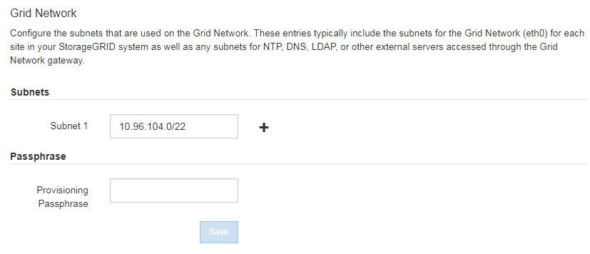

= Atualizar sub-redes para rede de Grade
:allow-uri-read: 
:icons: font
:imagesdir: ../media/

[role="lead"]
O StorageGRID mantém uma lista das sub-redes de rede usadas para se comunicar entre nós de grade na rede de grade (eth0). Essas entradas incluem as sub-redes usadas para a rede de Grade por cada site em seu sistema StorageGRID, bem como quaisquer sub-redes usadas para NTP, DNS, LDAP ou outros servidores externos acessados através do gateway rede de Grade. Quando você adiciona nós de grade ou um novo site em uma expansão, talvez seja necessário atualizar ou adicionar sub-redes à rede de Grade.

.O que você vai precisar
* Você deve estar conetado ao Gerenciador de Grade usando um xref:../admin/web-browser-requirements.adoc[navegador da web suportado].
* Tem de ter a permissão Manutenção ou Acesso root.
* Você deve ter a senha de provisionamento.
* Você deve ter os endereços de rede, na notação CIDR, das sub-redes que deseja configurar.

.Sobre esta tarefa
Se você estiver executando uma atividade de expansão que inclua a adição de uma nova sub-rede, será necessário adicionar a nova sub-rede da grade antes de iniciar o procedimento de expansão.

.Passos
. Selecione *MAINTENANCE* > *Network* > *Grid Network*.
+

. Na lista de sub-redes, clique no sinal de mais para adicionar uma nova sub-rede na notação CIDR.
+
Por exemplo, introduza `10.96.104.0/22`.

. Digite a senha de provisionamento e clique em *Salvar*.
+
As sub-redes especificadas são configuradas automaticamente para o sistema StorageGRID.

. Faça o download de um novo Pacote de recuperação do Gerenciador de Grade.
+
.. Selecione *MAINTENANCE* > *System* > *Recovery package*.
.. Introduza a frase-passe de aprovisionamento.

