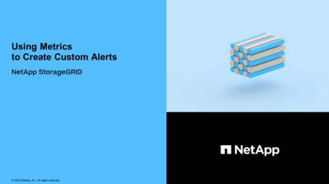

= Gerenciar alertas: Visão geral
:allow-uri-read: 
:icons: font
:imagesdir: ../media/

[role="lead"]
Os alertas permitem-lhe monitorizar vários eventos e condições no seu sistema StorageGRID. Você pode gerenciar alertas criando alertas personalizados, editando ou desativando os alertas padrão, configurando notificações de e-mail para alertas e silenciando notificações de alerta.

== Sobre os alertas do StorageGRID

O sistema de alerta fornece uma interface fácil de usar para detetar, avaliar e resolver os problemas que podem ocorrer durante a operação do StorageGRID.

* O sistema de alerta se concentra em problemas acionáveis no sistema. Os alertas são acionados para eventos que exigem sua atenção imediata, não para eventos que podem ser ignorados com segurança.
* A página Alertas atuais fornece uma interface amigável para visualizar problemas atuais. Você pode classificar a lista por alertas individuais e grupos de alertas. Por exemplo, talvez você queira classificar todos os alertas por nó/site para ver quais alertas estão afetando um nó específico. Ou, talvez você queira classificar os alertas em um grupo por tempo acionado para encontrar a instância mais recente de um alerta específico.
* A página Alertas resolvidos fornece informações semelhantes às da página Alertas atuais, mas permite pesquisar e visualizar um histórico dos alertas que foram resolvidos, incluindo quando o alerta foi acionado e quando foi resolvido.
* Vários alertas do mesmo tipo são agrupados em um e-mail para reduzir o número de notificações. Além disso, vários alertas do mesmo tipo são exibidos como um grupo na página Alertas. Você pode expandir e recolher grupos de alerta para mostrar ou ocultar os alertas individuais. Por exemplo, se vários nós relatarem o alerta *não é possível se comunicar com o nó* aproximadamente ao mesmo tempo, somente um email é enviado e o alerta é mostrado como um grupo na página Alertas.
* Os alertas usam nomes e descrições intuitivas para ajudá-lo a entender rapidamente o problema. As notificações de alerta incluem detalhes sobre o nó e o site afetado, a gravidade do alerta, o tempo em que a regra de alerta foi acionada e o valor atual das métricas relacionadas ao alerta.
* As notificações de e-mails de alerta e as listagens de alerta nas páginas Alertas atuais e alertas resolvidos fornecem ações recomendadas para resolver um alerta. Essas ações recomendadas geralmente incluem links diretos para o centro de documentação do StorageGRID para facilitar a localização e o acesso a procedimentos de solução de problemas mais detalhados.
* Se você precisar suprimir temporariamente as notificações de um alerta em um ou mais níveis de gravidade, poderá silenciar facilmente uma regra de alerta específica por uma duração especificada e para toda a grade, um único local ou um único nó. Você também pode silenciar todas as regras de alerta, por exemplo, durante um procedimento de manutenção planejado, como uma atualização de software.
* Você pode editar as regras de alerta padrão conforme necessário. Você pode desativar completamente uma regra de alerta ou alterar suas condições de ativação e duração.
* Você pode criar regras de alerta personalizadas para direcionar as condições específicas que são relevantes para a sua situação e para fornecer suas próprias ações recomendadas. Para definir as condições para um alerta personalizado, você cria expressões usando as métricas Prometheus disponíveis na seção métricas da API de Gerenciamento de Grade.

== Saiba mais

Para saber mais, reveja estes vídeos:

* https://netapp.hosted.panopto.com/Panopto/Pages/Viewer.aspx?id=2680a74f-070c-41c2-bcd3-acc5013c9cdd["Vídeo: Visão geral dos alertas"^]
+
[link=https://netapp.hosted.panopto.com/Panopto/Pages/Viewer.aspx?id=2680a74f-070c-41c2-bcd3-acc5013c9cdd]
image::../media/video-screenshot-alert-overview.png[Vídeo: Visão geral dos alertas]

* https://netapp.hosted.panopto.com/Panopto/Pages/Viewer.aspx?id=b35ac3f2-957b-4e79-b82b-acc5013c98d0["Vídeo: Usando métricas para criar alertas personalizados"^]
+
Vídeo: Usando métricas para criar alertas personalizados]

