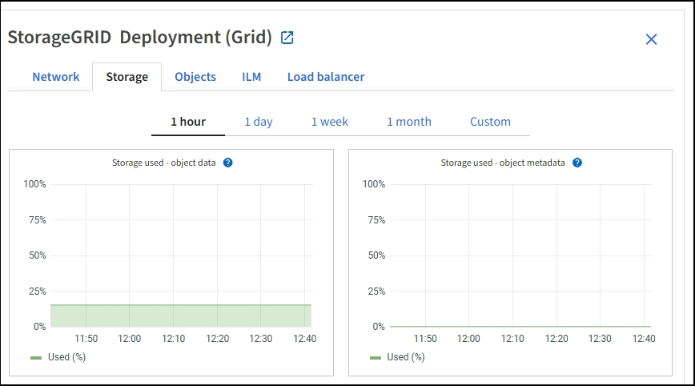

= Monitorar a capacidade de armazenamento
:allow-uri-read: 
:icons: font
:imagesdir: ../media/

[role="lead"]
Monitore o espaço utilizável total disponível para garantir que o sistema StorageGRID não fique sem espaço de storage para objetos ou metadados de objetos.

O StorageGRID armazena os dados de objeto e os metadados de objeto separadamente e reserva uma quantidade específica de espaço para um banco de dados Cassandra distribuído que contém metadados de objeto. Monitore a quantidade total de espaço consumida para objetos e metadados de objetos, bem como tendências na quantidade de espaço consumida para cada um. Isso permitirá que você se Planeje com antecedência para a adição de nós e evite interrupções de serviço.

Você pode xref:viewing-storage-tab.adoc[ver informações sobre a capacidade de armazenamento] fazer toda a grade, para cada local e para cada nó de storage em seu sistema StorageGRID.

== Monitore a capacidade de armazenamento de toda a grade

Você precisa monitorar a capacidade geral de storage da grade para garantir que haja espaço livre adequado para os dados de objetos e metadados de objetos. Entender como a capacidade de storage muda ao longo do tempo pode ajudar você a Planejar adicionar nós de storage ou volumes de storage antes que a capacidade de storage utilizável da grade seja consumida.

.O que você vai precisar
Você está conetado ao Gerenciador de Grade usando um xref:../admin/web-browser-requirements.adoc[navegador da web suportado].

.Sobre esta tarefa
O Painel no Gerenciador de Grade permite que você avalie rapidamente quanto armazenamento está disponível para toda a grade e para cada data center. A página nós fornece valores mais detalhados para dados de objetos e metadados de objetos.

.Passos
. Avalie a quantidade de storage disponível para toda a grade e para cada data center.
+
.. Selecione *Painel*.
.. No painel armazenamento disponível, anote o resumo geral da capacidade de armazenamento livre e usada.
+

NOTE: O resumo não inclui Mídia de arquivamento.

+
image::../media/dashboard_available_storage_panel.png[Painel de armazenamento disponível]

.. Coloque o cursor sobre as seções de capacidade livre ou usada do gráfico para ver exatamente quanto espaço é livre ou usado.
+
image::../media/storage_capacity_used.gif[Tabela de capacidade livre ou usada do painel]

.. Para grades de vários locais, revise o gráfico de cada data center.
.. Clique no ícone do gráfico image:../media/icon_chart_new_for_11_5.png["Ícone de carta"]para o gráfico geral ou para um data center individual para exibir um gráfico que mostra o uso da capacidade ao longo do tempo.
+
Aparece um gráfico que mostra a percentagem de capacidade de armazenamento utilizada (%) em comparação com o tempo.

. Determine quanto storage foi usado e quanto storage permanece disponível para dados de objetos e metadados de objetos.
+
.. Selecione *NODES*.
.. Selecione *_grid_* *Storage*.
+

.. Passe o cursor sobre os gráficos *Storage Used - Object data* e *Storage Used - Object metadata* para ver quanto armazenamento de objetos e metadados de objetos está disponível para toda a grade e quanto foi usado ao longo do tempo.
+

NOTE: Os valores totais de um site ou da grade não incluem nós que não tenham métricas relatadas por pelo menos cinco minutos, como nós off-line.

. Planeje realizar uma expansão para adicionar nós de storage ou volumes de storage antes que a capacidade de storage utilizável da grade seja consumida.
+
Ao Planejar o momento de uma expansão, considere quanto tempo levará para adquirir e instalar armazenamento adicional.

+

NOTE: Se sua política de ILM usa codificação de apagamento, talvez você prefira expandir quando os nós de storage existentes estiverem aproximadamente 70% cheios para reduzir o número de nós que precisam ser adicionados.

+
Para obter mais informações sobre como Planejar uma expansão de armazenamento, consulte o xref:../expand/index.adoc[Instruções para expandir StorageGRID].

== Monitore a capacidade de storage para cada nó de storage

Monitore o espaço utilizável total para cada nó de storage para garantir que o nó tenha espaço suficiente para novos dados de objeto.

.O que você vai precisar
* Você está conetado ao Gerenciador de Grade usando um xref:../admin/web-browser-requirements.adoc[navegador da web suportado].

.Sobre esta tarefa
Espaço utilizável é a quantidade de espaço de armazenamento disponível para armazenar objetos. O espaço utilizável total para um nó de storage é calculado adicionando o espaço disponível em todos os armazenamentos de objetos dentro do nó.

image::../media/calculating_watermarks.gif[Desenho conceitual para espaço total utilizável]

.Passos
. Selecione *NÓS* *_Storage Node_* *Storage*.
+
Os gráficos e tabelas para o nó aparecem.

. Passe o cursor sobre o gráfico armazenamento usado - dados do objeto.
+
São apresentados os seguintes valores:

+
** *Usado (%)*: A porcentagem do espaço utilizável total que foi usado para dados do objeto.
** *Usado*: A quantidade de espaço utilizável total que foi usado para dados de objeto.
** *Dados replicados*: Uma estimativa da quantidade de dados de objetos replicados neste nó, site ou grade.
** *Dados codificados por apagamento*: Uma estimativa da quantidade de dados de objetos codificados por apagamento neste nó, site ou grade.
** *Total*: A quantidade total de espaço utilizável neste nó, site ou grade. O valor usado é a `storagegrid_storage_utilization_data_bytes` métrica.

+
image::../media/nodes_page_storage_used_object_data.png[Dados de objetos usados no storage de páginas de nós]

. Reveja os valores disponíveis nas tabelas volumes e objetos armazenados, abaixo dos gráficos.
+

NOTE: Para visualizar gráficos destes valores, clique nos ícones de gráfico image:../media/icon_chart_new_for_11_5.png["Ícone de carta"]nas colunas disponíveis.

+
image::../media/nodes_page_storage_tables.png[Objeto armazena tabelas]

. Monitore os valores ao longo do tempo para estimar a taxa na qual o espaço de armazenamento utilizável está sendo consumido.
. Para manter as operações normais do sistema, adicione nós de storage, adicione volumes de storage ou arquive dados de objetos antes que o espaço utilizável seja consumido.
+
Ao Planejar o momento de uma expansão, considere quanto tempo levará para adquirir e instalar armazenamento adicional.

+

NOTE: Se sua política de ILM usa codificação de apagamento, talvez você prefira expandir quando os nós de storage existentes estiverem aproximadamente 70% cheios para reduzir o número de nós que precisam ser adicionados.

+
Para obter mais informações sobre como Planejar uma expansão de armazenamento, consulte o xref:../expand/index.adoc[Instruções para expandir StorageGRID].

+
xref:troubleshooting-storagegrid-system.adoc[*Armazenamento de dados de objetos baixo*]O alerta é acionado quando o espaço insuficiente permanece para armazenar dados de objetos em um nó de armazenamento.

== Monitore a capacidade dos metadados de objetos para cada nó de storage

Monitore o uso de metadados para cada nó de storage para garantir que o espaço adequado permaneça disponível para operações essenciais do banco de dados. É necessário adicionar novos nós de storage em cada local antes que os metadados do objeto excedam 100% do espaço permitido dos metadados.

.O que você vai precisar
* Você está conetado ao Gerenciador de Grade usando um xref:../admin/web-browser-requirements.adoc[navegador da web suportado].

.Sobre esta tarefa
O StorageGRID mantém três cópias de metadados de objetos em cada local para fornecer redundância e proteger os metadados de objetos da perda. As três cópias são distribuídas uniformemente por todos os nós de storage em cada local, usando o espaço reservado para metadados no volume de storage 0 de cada nó de storage.

Em alguns casos, a capacidade de metadados de objetos da grade pode ser consumida mais rápido do que sua capacidade de armazenamento de objetos. Por exemplo, se você costuma ingerir um grande número de objetos pequenos, talvez seja necessário adicionar nós de storage para aumentar a capacidade dos metadados, mesmo que haja capacidade suficiente de storage de objetos.

Alguns dos fatores que podem aumentar o uso de metadados incluem o tamanho e a quantidade de metadados e tags do usuário, o número total de peças em um upload de várias partes e a frequência de alterações nos locais de armazenamento de ILM.

.Passos
. Selecione *NÓS* *_Storage Node_* *Storage*.
. Passe o cursor sobre o gráfico armazenamento usado - metadados de objetos para ver os valores de um tempo específico.
+
image::../media/storage_used_object_metadata.png[Armazenamento usado - metadados Objeto]

+
[cols="1a,3a,2a"]
|===
| Valor | Descrição | Métrica Prometheus 

 a| 
Usado (%)
 a| 
A porcentagem do espaço de metadados permitido que foi usado neste nó de storage.
 a| 
`storagegrid_storage_utilization_metadata_bytes/ storagegrid_storage_utilization_metadata_allowed_bytes`

 a| 
Usado
 a| 
Os bytes do espaço de metadados permitido que foram usados neste nó de armazenamento.
 a| 
`storagegrid_storage_utilization_metadata_bytes`

 a| 
Permitido
 a| 
O espaço permitido para metadados de objetos neste nó de storage. Para saber como esse valor é determinado para cada nó de armazenamento, consulte xref:../admin/index.adoc[Instruções para administrar o StorageGRID].
 a| 
`storagegrid_storage_utilization_metadata_allowed_bytes`

 a| 
Real reservado
 a| 
O espaço real reservado para metadados neste nó de storage. Inclui o espaço permitido e o espaço necessário para operações essenciais de metadados. Para saber como esse valor é calculado para cada nó de armazenamento, consulte xref:../admin/index.adoc[Instruções para administrar o StorageGRID].
 a| 
_Metric será adicionado em uma versão futura._

|===
+

NOTE: Os valores totais de um site ou da grade não incluem nós que não relataram métricas por pelo menos cinco minutos, como nós off-line.

. Se o valor *usado (%)* for 70% ou mais, expanda o sistema StorageGRID adicionando nós de storage a cada local.
+

IMPORTANT: O alerta *armazenamento de metadados baixo* é acionado quando o valor *usado (%)* atinge determinados limites. Resultados indesejáveis podem ocorrer se os metadados de objetos usarem mais de 100% do espaço permitido.

+
Quando você adiciona os novos nós, o sistema reequilibra automaticamente os metadados de objetos em todos os nós de storage no local. Consulte xref:../expand/index.adoc[Instruções para expandir um sistema StorageGRID].

