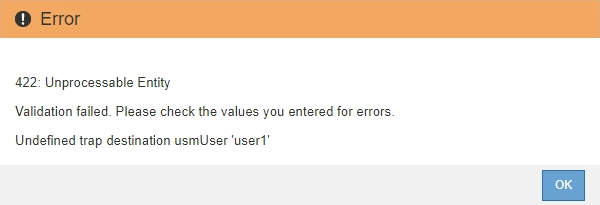
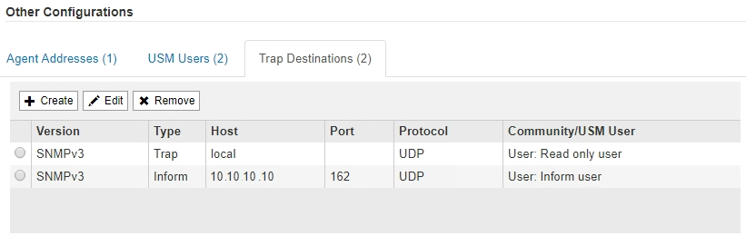

= Atualize o agente SNMP
:allow-uri-read: 
:icons: font
:imagesdir: ../media/

[role="lead"]
Você pode querer desativar notificações SNMP, atualizar strings da comunidade ou adicionar ou remover endereços de agentes, usuários USM e destinos de intercetação.

.O que você vai precisar
* Você deve estar conetado ao Gerenciador de Grade usando um xref:../admin/web-browser-requirements.adoc[navegador da web suportado].
* Você deve ter a permissão de acesso root.

.Sobre esta tarefa
Sempre que atualizar o xref:configuring-snmp-agent.adoc[Configuração do agente SNMP], tenha em atenção que tem de clicar em *Guardar* na parte inferior da página Agente SNMP para confirmar quaisquer alterações efetuadas em cada separador.

.Passos
. Selecione *CONFIGURATION* *Monitoring* *SNMP Agent*.
+
A página Agente SNMP é exibida.

. Se quiser desativar o agente SNMP em todos os nós de grade, desmarque a caixa de seleção *Ativar SNMP* e clique em *Salvar*.
+
O agente SNMP está desativado para todos os nós de grade. Se você reativar o agente posteriormente, quaisquer configurações SNMP anteriores serão mantidas.

. Opcionalmente, atualize os valores inseridos para *Contato do sistema* e *localização do sistema*.
. Opcionalmente, desmarque a caixa de seleção *Ativar notificações de agentes SNMP* se você não quiser mais que o agente SNMP do StorageGRID envie trap e informe notificações.
+
Quando esta caixa de verificação não está selecionada, o agente SNMP suporta acesso MIB somente leitura, mas não envia notificações SNMP.

. Opcionalmente, desmarque a caixa de seleção *Ativar traps de autenticação* se você não quiser mais que o agente SNMP do StorageGRID envie uma armadilha de autenticação quando receber uma mensagem de protocolo autenticada incorretamente.
. Se você usar SNMPv1 ou SNMPv2c, atualize opcionalmente a seção cadeias de Comunidade.
+
Os campos nesta seção são usados para autenticação baseada na comunidade em SNMPv1 ou SNMPv2c. Esses campos não se aplicam ao SNMPv3.

+

NOTE: Se você quiser remover a cadeia de carateres padrão da comunidade, primeiro você deve garantir que todos os destinos de intercetação usem uma cadeia de carateres personalizada da comunidade.

. Se quiser atualizar endereços de agentes, selecione a guia endereços de agentes na seção outras configurações .
+
image::../media/snmp_other_configurations_agent_addresses_table.png[Tabela de endereços de agentes de outras configurações SNMP]

+
Use esta guia para especificar um ou mais ""endereços de escuta". Esses são os endereços StorageGRID nos quais o agente SNMP pode receber consultas. Cada endereço de agente inclui um protocolo de Internet, um protocolo de transporte, uma rede StorageGRID e uma porta.

+
.. Para adicionar um endereço de agente, clique em *criar*. Em seguida, consulte a etapa para obter endereços de agentes nas instruções para configurar o agente SNMP.
.. Para editar um endereço de agente, selecione o botão de opção para o endereço e clique em *Editar*. Em seguida, consulte a etapa para obter endereços de agentes nas instruções para configurar o agente SNMP.
.. Para remover um endereço de agente, selecione o botão de opção para o endereço e clique em *Remover*. Em seguida, clique em *OK* para confirmar que deseja remover esse endereço.
.. Para confirmar suas alterações, clique em *Salvar* na parte inferior da página Agente SNMP.

. Se pretender atualizar utilizadores USM, selecione o separador utilizadores USM na secção outras configurações.
+
image::../media/snmp_other_config_usm_users_table.png[Tabela de utilizador SNMP Other Config USM]

+
Utilize este separador para definir os utilizadores USM que estão autorizados a consultar a MIB ou a receber traps e informações.

+
.. Para adicionar um utilizador USM, clique em *criar*. Em seguida, consulte a etapa para usuários USM nas instruções para configurar o agente SNMP.
.. Para editar um utilizador USM, selecione o botão de opção do utilizador e clique em *Edit*. Em seguida, consulte a etapa para usuários USM nas instruções para configurar o agente SNMP.
+
O nome de utilizador de um utilizador USM existente não pode ser alterado. Se você precisar alterar um nome de usuário, você deve remover o usuário e criar um novo.

+

NOTE: Se você adicionar ou remover um ID de mecanismo autoritário de um usuário e esse usuário estiver selecionado atualmente para um destino, edite ou remova o destino, conforme descrito na etapa <<SNMP_TRAP_DESTINATION,Destino de trap SNMP>>. Caso contrário, ocorre um erro de validação quando você salva a configuração do agente SNMP.

.. Para remover um utilizador USM, selecione o botão de opção do utilizador e clique em *Remove*. Em seguida, clique em *OK* para confirmar que deseja remover esse usuário.
+

NOTE: Se o usuário removido estiver selecionado atualmente para um destino de armadilha, você deverá editar ou remover o destino, conforme descrito na etapa <<SNMP_TRAP_DESTINATION,Destino de trap SNMP>>. Caso contrário, ocorre um erro de validação quando você salva a configuração do agente SNMP.

+

.. Para confirmar suas alterações, clique em *Salvar* na parte inferior da página Agente SNMP.

. [[SNMP_TRAP_DESTINATION, start 9]]se você quiser atualizar destinos de intercetação, selecione a guia Destinos de intercetação na seção outras configurações.
+

+
A guia Destinos de armadilha permite definir um ou mais destinos para notificações de intercetação StorageGRID ou informar. Quando você ativa o agente SNMP e clica em *Salvar*, o StorageGRID começa a enviar notificações para cada destino definido. As notificações são enviadas quando alertas e alarmes são acionados. As notificações padrão também são enviadas para as entidades MIB-II suportadas (por exemplo, ifdown e coldstart).

+
.. Para adicionar um destino de armadilha, clique em *criar*. Em seguida, consulte a etapa para destinos de intercetação nas instruções para configurar o agente SNMP.
.. Para editar um destino de armadilha, selecione o botão de opção do usuário e clique em *Editar*. Em seguida, consulte a etapa para destinos de intercetação nas instruções para configurar o agente SNMP.
.. Para remover um destino de armadilha, selecione o botão de opção para o destino e clique em *Remover*. Em seguida, clique em *OK* para confirmar que deseja remover este destino.
.. Para confirmar suas alterações, clique em *Salvar* na parte inferior da página Agente SNMP.

. Quando tiver atualizado a configuração do agente SNMP, clique em *Save*.

