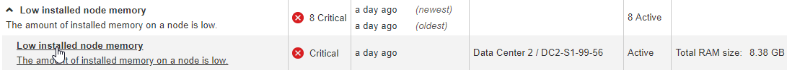

= Veja um alerta específico
:allow-uri-read: 
:icons: font
:imagesdir: ../media/

[role="lead"]
Você pode exibir informações detalhadas sobre um alerta que está afetando seu sistema StorageGRID ou um alerta que foi resolvido. Os detalhes incluem ações corretivas recomendadas, a hora em que o alerta foi acionado e o valor atual das métricas relacionadas a esse alerta.

Opcionalmente, você pode xref:silencing-alert-notifications.adoc[silenciar um alerta atual] ou xref:editing-alert-rules.adoc[atualize a regra de alerta].

.O que você vai precisar
* Você está conetado ao Gerenciador de Grade usando um xref:../admin/web-browser-requirements.adoc[navegador da web suportado].

.Passos
. Siga um destes procedimentos, com base se você deseja exibir um alerta atual ou resolvido:
+
[cols="1a,2a"]
|===
| Cabeçalho da coluna | Descrição 

 a| 
Alerta atual
 a| 
** No painel Saúde no Painel, clique no link *alertas atuais*. Este link aparece somente se pelo menos um alerta estiver ativo no momento. Este link fica oculto se não houver alertas atuais ou se todos os alertas atuais tiverem sido silenciados.
** Selecione *ALERTAS* *current*.
** Na página *NÓS*, selecione a guia *Visão geral* para um nó que tenha um ícone de alerta. Em seguida, na seção Alertas, clique no nome do alerta.

 a| 
Alerta resolvido
 a| 
** No painel Saúde do Painel, clique no link *alertas resolvidos recentemente*. (Este link aparece somente se um ou mais alertas foram acionados na semana passada e agora estão resolvidos. Este link fica oculto se nenhum alerta foi acionado e resolvido na última semana.)
** Selecione *ALERTAS* *resolvidos*.

|===
. Conforme necessário, expanda um grupo de alertas e selecione o alerta que deseja exibir.
+

NOTE: Selecione o alerta e não o cabeçalho de um grupo de alertas.

+

+
Uma caixa de diálogo é exibida e fornece detalhes para o alerta selecionado.

+
image::../media/alerts_page_details_modal.png[Detalhes da Página de alertas Modal]

. Reveja os detalhes do alerta.
+
[cols="1a,2a"]
|===
| Informações | Descrição 

 a| 
_title_
 a| 
O nome do alerta.

 a| 
_primeiro parágrafo_
 a| 
A descrição do alerta.

 a| 
Ações recomendadas
 a| 
As ações recomendadas para este alerta.

 a| 
Tempo acionado
 a| 
A data e a hora em que o alerta foi acionado na sua hora local e em UTC.

 a| 
Tempo resolvido
 a| 
Apenas para alertas resolvidos, a data e a hora em que o alerta foi resolvido na sua hora local e na UTC.

 a| 
Estado
 a| 
O estado do alerta: Ativo, silenciado ou resolvido.

 a| 
Local/nó
 a| 
O nome do site e do nó afetados pelo alerta.

 a| 
Gravidade
 a| 
A gravidade do alerta.

** *Crítico* image:../media/icon_alert_red_critical.png["Ícone Alerta Vermelho crítico"]: existe uma condição anormal que interrompeu as operações normais de um nó ou serviço StorageGRID. Você deve abordar o problema subjacente imediatamente. A interrupção do serviço e a perda de dados podem resultar se o problema não for resolvido.
** *Major* image:../media/icon_alert_orange_major.png["Ícone Alerta Laranja maior"]: existe uma condição anormal que está afetando as operações atuais ou se aproximando do limite para um alerta crítico. Você deve investigar os principais alertas e resolver quaisquer problemas subjacentes para garantir que a condição anormal não pare a operação normal de um nó ou serviço StorageGRID.
** *Minor* image:../media/icon_alert_yellow_minor.png["Ícone Alerta Amarelo menor"]: o sistema está operando normalmente, mas existe uma condição anormal que pode afetar a capacidade do sistema de operar se ele continuar. Você deve monitorar e resolver alertas menores que não sejam claros por conta própria para garantir que eles não resultem em um problema mais sério.

 a| 
_valores de dados_
 a| 
O valor atual da métrica para este alerta. Para alguns alertas, são apresentados valores adicionais para o ajudar a compreender e investigar o alerta. Por exemplo, os valores mostrados para um alerta *armazenamento de metadados baixo* incluem a porcentagem de espaço em disco usado, a quantidade total de espaço em disco e a quantidade de espaço em disco usado.

|===
. Opcionalmente, clique em *Silenciar este alerta* para silenciar a regra de alerta que fez com que esse alerta fosse acionado.
+
Você deve ter a permissão Gerenciar Alertas ou acesso root para silenciar uma regra de alerta.

+

IMPORTANT: Tenha cuidado ao decidir silenciar uma regra de alerta. Se uma regra de alerta for silenciada, talvez você não detete um problema subjacente até que ela impeça que uma operação crítica seja concluída.

. Para visualizar as condições atuais da regra de alerta:
+
.. A partir dos detalhes do alerta, clique em *Ver condições*.
+
Uma janela pop-up é exibida, listando a expressão Prometheus para cada gravidade definida.

+
image::../media/alerts_page_details_modal_view_condition.png[Condição de visualização Modal]

.. Para fechar o pop-up, clique em qualquer lugar fora do pop-up.

. Opcionalmente, clique em *Editar regra* para editar a regra de alerta que fez com que esse alerta fosse acionado:
+
Você deve ter a permissão Gerenciar Alertas ou acesso root para editar uma regra de alerta.

+

IMPORTANT: Tenha cuidado ao decidir editar uma regra de alerta. Se você alterar os valores do gatilho, talvez não detete um problema subjacente até que ele impeça que uma operação crítica seja concluída.

. Para fechar os detalhes do alerta, clique em *Fechar*.

