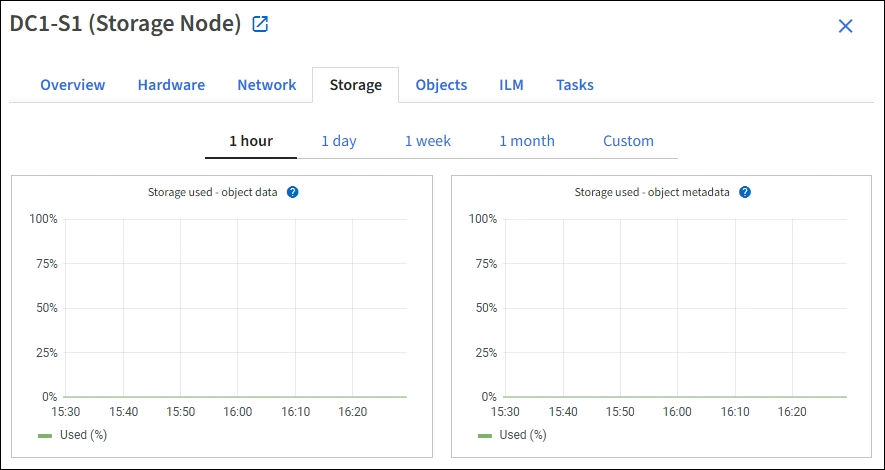

= Exibir a guia armazenamento
:allow-uri-read: 
:icons: font
:imagesdir: ../media/

[role="lead"]
A guia armazenamento resume a disponibilidade de armazenamento e outras métricas de armazenamento.

A guia Storage (armazenamento) é exibida para todos os nós, cada local e toda a grade.

== Armazenamento de gráficos usados

Para nós de storage, cada local e toda a grade, a guia Storage inclui gráficos mostrando quanto de storage foi usado pelos dados de objeto e metadados de objeto ao longo do tempo.

NOTE: Os valores totais de um site ou da grade não incluem nós que não tenham métricas relatadas por pelo menos cinco minutos, como nós off-line.

== Dispositivos de disco, volumes e objetos armazenam tabelas

Para todos os nós, a guia armazenamento contém detalhes dos dispositivos de disco e volumes no nó. Para nós de storage, a tabela Object Stores fornece informações sobre cada volume de storage.

image::../media/nodes_page_storage_tables.png[Tabelas de storage de páginas de nós]

.Informações relacionadas
xref:monitoring-storage-capacity.adoc[Monitorar a capacidade de armazenamento]
