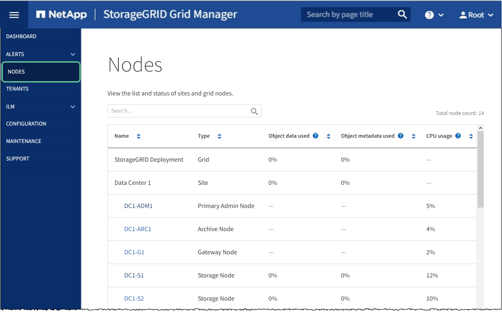

= Explore o Gerenciador de Grade
:allow-uri-read: 
:icons: font
:imagesdir: ../media/

[role="lead"]
O Gerenciador de Grade é a interface gráfica baseada em navegador que permite configurar, gerenciar e monitorar seu sistema StorageGRID.

Quando você entra no Gerenciador de Grade, você está se conetando a um nó Admin. Cada sistema StorageGRID inclui um nó de administração principal e qualquer número de nós de administração não primários. Você pode se conetar a qualquer nó de administrador e cada nó de administrador exibe uma exibição semelhante do sistema StorageGRID.

Você pode acessar o Gerenciador de Grade usando um xref:../admin/web-browser-requirements.adoc[navegador da web suportado].

== Painel do Grid Manager

Ao iniciar sessão pela primeira vez no Gestor de grelha, pode utilizar o Painel para monitorizar rapidamente as atividades do sistema.

O Dashboard inclui informações resumidas sobre a integridade do sistema, o uso do storage, os processos ILM e as operações S3 e Swift.

image::../media/grid_manager_dashboard.png[Painel no Gerenciador de Grade]

Para obter uma explicação das informações em cada painel, clique no ícone de ajuda image:../media/icon_nms_question.png["ícone de ponto de interrogação"]desse painel.

.Saiba mais
* xref:../monitor/index.adoc[Monitorar e solucionar problemas]

== Campo de pesquisa

O campo *Search* na barra de cabeçalho permite que você navegue rapidamente para uma página específica dentro do Gerenciador de Grade. Por exemplo, você pode digitar *km* para acessar a página do Key Management Server (KMS). Você pode usar *Search* para encontrar entradas na barra lateral do Gerenciador de Grade e nos menus Configuração, Manutenção e suporte.

== Menu de alertas

O menu Alertas fornece uma interface fácil de usar para detetar, avaliar e resolver problemas que possam ocorrer durante a operação do StorageGRID.

image::../media/alerts_menu.png[Menu de alertas]

No menu Alertas, você pode fazer o seguinte:

* Reveja os alertas atuais
* Reveja os alertas resolvidos
* Configure silêncios para suprimir notificações de alerta
* Defina regras de alerta para condições que acionam alertas
* Configure o servidor de e-mail para receber notificações de alerta

.Saiba mais
* xref:monitoring-and-managing-alerts.adoc[Monitorar e gerenciar alertas]
* xref:../monitor/index.adoc[Monitorar e solucionar problemas]

== Página de nós

A página nós exibe informações sobre toda a grade, cada local na grade e cada nó em um local.

A home page dos nós exibe métricas combinadas para toda a grade. Para exibir informações de um site ou nó específico, selecione o site ou nó.

.Saiba mais
* xref:viewing-nodes-page.adoc[Exibir a página nós]
* xref:../monitor/index.adoc[Monitorar e solucionar problemas]

== Página de inquilinos

A página locatários permite criar e monitorar as contas de locatários de storage do seu sistema StorageGRID. Você deve criar pelo menos uma conta de locatário para especificar quem pode armazenar e recuperar objetos e qual funcionalidade está disponível para eles.

A página locatários também fornece detalhes de uso para cada locatário, incluindo a quantidade de storage usada e o número de objetos. Se você definir uma cota quando criou o locatário, poderá ver quanto dessa cota foi usada.

image::../media/tenants_menu_and_page.png[Menu e Página de inquilinos]

.Saiba mais
* xref:managing-tenants-and-client-connections.adoc[Gerenciar locatários e conexões de clientes]
* xref:../admin/index.adoc[Administrar o StorageGRID]
* xref:../tenant/index.adoc[Use uma conta de locatário]

== Menu ILM

O menu ILM permite configurar as regras e políticas de gerenciamento do ciclo de vida das informações (ILM) que regem a durabilidade e a disponibilidade dos dados. Você também pode inserir um identificador de objeto para exibir os metadados desse objeto.

image::../media/ilm_menu_and_page.png[Menu e Página ILM]

.Saiba mais
* xref:using-information-lifecycle-management.adoc[Use o gerenciamento do ciclo de vida das informações]
* xref:../ilm/index.adoc[Gerenciar objetos com ILM]

== Menu de configuração

O menu Configuração permite especificar as definições de rede, as definições de segurança, as definições do sistema, as opções de monitorização e as opções de controlo de acesso.

image::../media/configuration_menu.png[Menu de configuração]

.Saiba mais
* xref:configuring-network-settings.adoc[Configure as definições de rede]
* xref:managing-tenants-and-client-connections.adoc[Gerenciar locatários e conexões de clientes]
* xref:reviewing-audit-messages.adoc[Rever mensagens de auditoria]
* xref:controlling-storagegrid-access.adoc[Controle o acesso à StorageGRID]
* xref:../admin/index.adoc[Administrar o StorageGRID]
* xref:../monitor/index.adoc[Monitorar e solucionar problemas]
* xref:../audit/index.adoc[Rever registos de auditoria]

== Menu de manutenção

O menu Manutenção permite executar tarefas de manutenção, manutenção do sistema e manutenção da rede.

image::../media/maintenance_menu.png[Menu e Página de Manutenção]

=== Tarefas

As tarefas de manutenção incluem:

* Desativar operações para remover locais e nós de grade não utilizados.
* Operações de expansão para adicionar novos nós de grade e locais.
* Operações de recuperação para substituir um nó com falha e restaurar dados.
* Verificação de existência de objeto para verificar a existência (embora não a correção) de dados de objeto.

=== Sistema

As tarefas de manutenção do sistema que você pode executar incluem:

* Rever detalhes da licença atual do StorageGRID ou carregar uma nova licença.
* Gerando um pacote de recuperação.
* Executar atualizações de software do StorageGRID, incluindo atualizações de software, hotfixes e atualizações do software SANtricity os em dispositivos selecionados.

=== Rede

As tarefas de manutenção de rede que você pode executar incluem:

* Editando informações sobre servidores DNS.
* Configurando as sub-redes que são usadas na rede de Grade.
* Editando informações sobre servidores NTP.

.Saiba mais
* xref:performing-maintenance-procedures.adoc[Efectue a manutenção]
* xref:downloading-recovery-package.adoc[Faça o download do pacote de recuperação]
* xref:../expand/index.adoc[Expanda sua grade]
* xref:../upgrade/index.adoc[Atualizar o software]
* xref:../maintain/index.adoc[Recuperar e manter]
* xref:../sg6000/index.adoc[SG6000 dispositivos de armazenamento]
* xref:../sg5700/index.adoc[SG5700 dispositivos de armazenamento]
* xref:../sg5600/index.adoc[SG5600 dispositivos de armazenamento]

== Menu de suporte

O menu suporte fornece opções que ajudam o suporte técnico a analisar e solucionar problemas do seu sistema. Existem duas partes no menu suporte: Ferramentas e Alarmes (legado).

image::../media/support_menu.png[Menu de suporte]

=== Ferramentas

Na seção Ferramentas do menu suporte, você pode:

* Ative o AutoSupport.
* Execute um conjunto de verificações de diagnóstico no estado atual da grelha.
* Acesse a árvore de topologia de grade para exibir informações detalhadas sobre nós, serviços e atributos de grade.
* Recuperar arquivos de log e dados do sistema.
* Analise métricas e gráficos detalhados.
+

IMPORTANT: As ferramentas disponíveis na opção *Metrics* destinam-se a ser utilizadas pelo suporte técnico. Alguns recursos e itens de menu dentro dessas ferramentas são intencionalmente não funcionais.

=== Alarmes (legado)

Na seção Alarmes (legado) do menu suporte, você pode revisar alarmes atuais, históricos e globais, configurar eventos personalizados e configurar notificações por e-mail para alarmes legados e AutoSupport.

NOTE: Embora o sistema de alarme antigo continue a ser suportado, o sistema de alerta oferece benefícios significativos e é mais fácil de usar.

.Saiba mais
* xref:storagegrid-architecture-and-network-topology.adoc[Topologia de rede e arquitetura StorageGRID]
* xref:viewing-nodes-page.adoc[Atributos do StorageGRID]
* xref:using-storagegrid-support-options.adoc[Use as opções de suporte do StorageGRID]
* xref:../admin/index.adoc[Administrar o StorageGRID]
* xref:../monitor/index.adoc[Monitorar e solucionar problemas]

== Menu Ajuda

A opção Ajuda fornece acesso ao Centro de Documentação do StorageGRID para a versão atual e para a documentação da API. Você também pode determinar qual versão do StorageGRID está instalada atualmente.

image::../media/help_menu.png[Menu Ajuda]

.Saiba mais
* xref:../admin/index.adoc[Administrar o StorageGRID]

