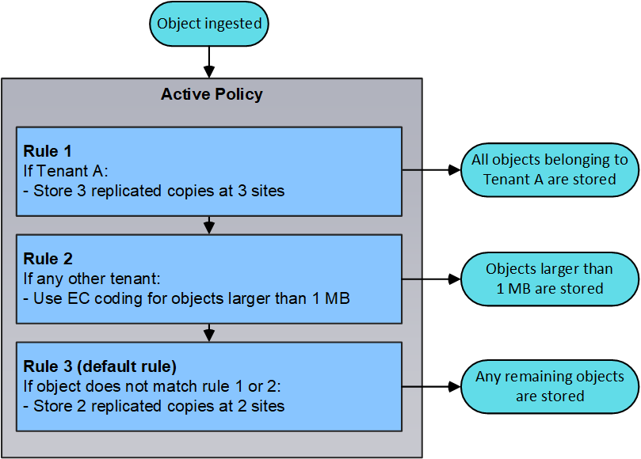

= Use o gerenciamento do ciclo de vida das informações
:allow-uri-read: 
:icons: font
:imagesdir: ../media/

[role="lead"]
Use o gerenciamento do ciclo de vida das informações (ILM) para controlar o posicionamento, a duração e a proteção de dados de todos os objetos no sistema StorageGRID. As regras do ILM determinam como o StorageGRID armazena objetos ao longo do tempo. Você configura uma ou mais regras ILM e as adiciona a uma política ILM.

As regras do ILM definem:

* Quais objetos devem ser armazenados. Uma regra pode ser aplicada a todos os objetos ou você pode especificar filtros para identificar quais objetos uma regra se aplica. Por exemplo, uma regra só pode se aplicar a objetos associados a determinadas contas de locatário, buckets específicos do S3 ou contentores Swift ou valores específicos de metadados.
* O tipo de armazenamento e a localização. Os objetos podem ser armazenados em nós de storage, em pools de storage de nuvem ou em nós de arquivamento.
* O tipo de cópias de objeto feitas. As cópias podem ser replicadas ou codificadas para apagamento.
* Para cópias replicadas, o número de cópias feitas.
* Para cópias codificadas de apagamento, o esquema de codificação de apagamento usado.
* As alterações ao longo do tempo para o local de armazenamento de um objeto e tipo de cópias.
* Como os dados do objeto são protegidos à medida que os objetos são ingeridos na grade (colocação síncrona ou commit duplo).

Observe que os metadados de objetos não são gerenciados pelas regras do ILM. Em vez disso, os metadados de objetos são armazenados em um banco de dados Cassandra no que é conhecido como armazenamento de metadados. Três cópias dos metadados de objetos são mantidas automaticamente em cada local para proteger os dados da perda. As cópias são distribuídas uniformemente por todos os nós de storage.

== Exemplo de regra ILM

Este exemplo de regra ILM aplica-se aos objetos pertencentes ao locatário A. Ele faz duas cópias replicadas desses objetos e armazena cada cópia em um local diferente. As duas cópias são retidas para sempre, o que significa que o StorageGRID não as apagará automaticamente. Em vez disso, o StorageGRID manterá esses objetos até que sejam excluídos por uma solicitação de exclusão de cliente ou pela expiração de um ciclo de vida de bucket.

Esta regra usa a opção equilibrada para o comportamento de ingestão: A instrução de colocação de dois locais é aplicada assim que o locatário A salva um objeto no StorageGRID, a menos que não seja possível fazer imediatamente ambas as cópias necessárias. Por exemplo, se o local 2 estiver inacessível quando o locatário A salva um objeto, o StorageGRID fará duas cópias provisórias nos nós de storage no local 1. Assim que o Site 2 estiver disponível, a StorageGRID fará a cópia necessária nesse site.

image::../media/ilm_example_rule_2_copies_tenant_a.png[Exemplo de regra ILM 2 cópias Tenant A]

== Como uma política ILM avalia objetos

A política de ILM ativa do seu sistema StorageGRID controla o posicionamento, a duração e a proteção de dados de todos os objetos.

Quando os clientes salvam objetos no StorageGRID, os objetos são avaliados em relação ao conjunto ordenado de regras ILM na política ativa, da seguinte forma:

. Se os filtros da primeira regra na política corresponderem a um objeto, o objeto será ingerido de acordo com o comportamento de ingestão dessa regra e armazenado de acordo com as instruções de colocação dessa regra.
. Se os filtros da primeira regra não corresponderem ao objeto, o objeto será avaliado em relação a cada regra subsequente na política até que uma correspondência seja feita.
. Se nenhuma regra corresponder a um objeto, as instruções de comportamento de ingestão e posicionamento da regra padrão na política serão aplicadas. A regra padrão é a última regra de uma política e não pode usar nenhum filtro. Ele deve se aplicar a todos os locatários, todos os buckets e todas as versões de objetos.

== Exemplo de política ILM

Este exemplo de política ILM usa três regras ILM.

image::../media/policy_for_two_tenants.png[Exemplo de política para dois inquilinos]

Neste exemplo, a regra 1 corresponde a todos os objetos pertencentes ao locatário A. esses objetos são armazenados como três cópias replicadas em três locais. Os objetos pertencentes a outros inquilinos não são correspondidos pela regra 1, por isso são avaliados em relação à regra 2.

A regra 2 corresponde a todos os objetos de outros inquilinos, mas somente se eles forem maiores que 1 MB. Esses objetos maiores são armazenados usando codificação de apagamento 6-3 em três locais. A regra 2 não corresponde a objetos de 1 MB ou menores, portanto, esses objetos são avaliados em relação à regra 3.

A regra 3 é a última regra padrão da política e não usa filtros. A regra 3 faz duas cópias replicadas de todos os objetos não correspondidos pela regra 1 ou pela regra 2 (objetos que não pertencem ao locatário A com 1 MB ou menos).

*Informações relacionadas*

* xref:../ilm/index.adoc[Gerenciar objetos com ILM]

