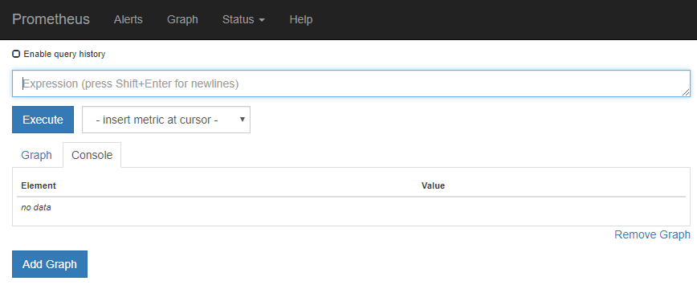

= Use as opções de suporte do StorageGRID
:allow-uri-read: 
:icons: font
:imagesdir: ../media/

[role="lead"]
O Gerenciador de Grade fornece opções para ajudá-lo a trabalhar com suporte técnico se surgir um problema com o seu sistema StorageGRID.

== Configurar o AutoSupport

O recurso AutoSupport permite que o sistema StorageGRID envie mensagens de status e integridade para o suporte técnico. O uso do AutoSupport pode acelerar significativamente a determinação e resolução de problemas. O suporte técnico também pode monitorar as necessidades de storage do seu sistema e ajudá-lo a determinar se precisa adicionar novos nós ou sites. Opcionalmente, você pode configurar as mensagens do AutoSupport para serem enviadas para um destino adicional.

Você configura o AutoSupport usando o Gerenciador de Grade (*SUPPORT* *Tools* *AutoSupport*). A página *AutoSupport* tem duas guias: *Configurações* e *resultados*.

image::../media/autosupport_accessing_settings.png[Página AutoSupport no Gerenciador de Grade]

=== Informações incluídas nas mensagens do AutoSupport

As mensagens do AutoSupport incluem informações como as seguintes:

* Versão do software StorageGRID
* Versão do sistema operativo
* Informações sobre atributos no nível do sistema e no nível da localização
* Alertas e alarmes recentes (sistema legado)
* Status atual de todas as tarefas de grade, incluindo dados históricos
* Utilização da base de dados do Admin Node
* Número de objetos perdidos ou perdidos
* Definições de configuração da grelha
* Entidades NMS
* Política ILM ativa
* Arquivo de especificação de grade provisionada
* Métricas de diagnóstico

Você pode ativar o recurso AutoSupport e as opções individuais do AutoSupport quando instalar o StorageGRID pela primeira vez, ou ativá-los posteriormente. Se o AutoSupport não estiver habilitado, uma mensagem será exibida no Painel do Gerenciador de Grade. A mensagem inclui um link para a página de configuração do AutoSupport.

image::../media/autosupport_disabled_message.png[Mensagem AutoSupport desativada]

Se você fechar a mensagem, ela não aparecerá novamente até que o cache do navegador seja limpo, mesmo que o AutoSupport permaneça desativado.

=== Use o Digital Advisor

O consultor digital do Active IQ é baseado na nuvem e aproveita as análises preditivas e o conhecimento da comunidade fornecidos pela base instalada da NetApp. Suas avaliações de risco contínuas, alertas preditivos, orientações prescritivas e ações automatizadas ajudam a evitar problemas antes que eles ocorram, levando a uma melhor integridade do sistema e maior disponibilidade do sistema.

Você deve habilitar o AutoSupport se quiser usar os painéis e a funcionalidade do consultor digital no site de suporte da NetApp.

https://docs.netapp.com/us-en/active-iq/index.html["Documentação do Digital Advisor"^]

== Colete logs do StorageGRID

Para ajudar a solucionar um problema, talvez seja necessário coletar arquivos de log e encaminhá-los para o suporte técnico.

O StorageGRID usa arquivos de log para capturar eventos, mensagens de diagnóstico e condições de erro. O arquivo bycast.log é mantido para cada nó de grade e é o principal arquivo de solução de problemas. O StorageGRID também cria arquivos de log para serviços StorageGRID individuais, arquivos de log relacionados a atividades de implantação e manutenção e arquivos de log relacionados a aplicativos de terceiros.

Os usuários que têm as permissões apropriadas e que conhecem a senha de provisionamento para seu sistema StorageGRID podem usar a página Logs no Gerenciador de Grade para coletar arquivos de log, dados do sistema e dados de configuração. Ao coletar logs, você seleciona um nó ou nós e especifica um período de tempo. Os dados são coletados e arquivados em um `.tar.gz` arquivo, que você pode baixar para um computador local. Dentro deste arquivo, há um arquivo de log para cada nó de grade.

image::../media/support_logs_select_nodes.png[Captura de tela da IU da coleção de logs]

== Use métricas e execute diagnósticos

Ao solucionar um problema, você pode trabalhar com suporte técnico para analisar métricas e gráficos detalhados do seu sistema StorageGRID. Você também pode executar consultas de diagnóstico pré-construídas para avaliar proativamente os principais valores do seu sistema StorageGRID.

=== Página de métricas

A página Metrics fornece acesso às interfaces de usuário Prometheus e Grafana. Prometheus é um software de código aberto para coletar métricas. Grafana é um software de código aberto para visualização de métricas.

IMPORTANT: As ferramentas disponíveis na página Metrics destinam-se a ser utilizadas pelo suporte técnico. Alguns recursos e itens de menu dentro dessas ferramentas são intencionalmente não funcionais e estão sujeitos a alterações.

image::../media/metrics_page.png[Página de métricas]

O link na seção Prometheus da página Metrics permite consultar os valores atuais das métricas do StorageGRID e visualizar gráficos dos valores ao longo do tempo.

NOTE: As métricas que incluem _private_ em seus nomes são destinadas apenas para uso interno e estão sujeitas a alterações entre as versões do StorageGRID sem aviso prévio.

Os links na seção Grafana da página métricas permitem acessar painéis pré-construídos contendo gráficos de métricas do StorageGRID ao longo do tempo.

image::../media/metrics_page_grafana.png[Página de métricas Grafana]

=== Página de diagnóstico

A página Diagnósticos executa um conjunto de verificações de diagnóstico pré-construídas no estado atual da grade. No exemplo, todos os diagnósticos têm um status normal.

image::../media/support_diagnostics_page.png[Página de Diagnóstico de suporte]

Clicar em um diagnóstico específico permite que você veja detalhes sobre o diagnóstico e seus resultados atuais.

Neste exemplo, a utilização atual da CPU para cada nó em um sistema StorageGRID é mostrada. Todos os valores de nós estão abaixo dos limites de atenção e cuidado, portanto, o status geral do diagnóstico é normal.

image::../media/support_diagnostics_cpu_utilization.png[Suporte Diagnóstico utilização da CPU]

.Informações relacionadas
* xref:../admin/index.adoc[Administrar o StorageGRID]
* xref:configuring-network-settings.adoc[Configure as definições de rede]

