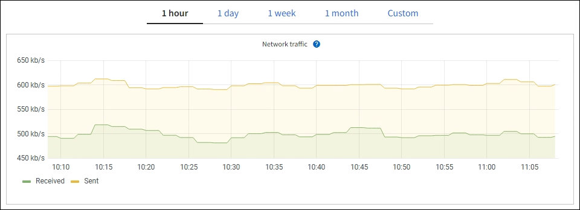

= Exibir a página nós
:allow-uri-read: 
:icons: font
:imagesdir: ../media/

[role="lead"]
Quando você precisar de informações mais detalhadas sobre seu sistema StorageGRID do que o Painel fornece, você pode usar a página nós para exibir as métricas de toda a grade, cada local na grade e cada nó em um local.

image::../media/nodes_table.png[Menu de nós]

A tabela nós lista todos os sites e nós no seu sistema StorageGRID. As informações de resumo são exibidas para cada nó. Se um nó tiver um alerta ativo, um ícone será exibido ao lado do nome do nó. Se o nó estiver conetado e não tiver alertas ativos, nenhum ícone será exibido.

== Ícones de estado da ligação

* *Não conetado - desconhecido* image:../media/icon_alarm_blue_unknown.png["ícone de ponto de interrogação azul"]: o nó não está conetado à grade por um motivo desconhecido. Por exemplo, a conexão de rede entre nós foi perdida ou a energia está inativa. O alerta *não é possível se comunicar com o nó* também pode ser acionado. Outros alertas também podem estar ativos. Esta situação requer atenção imediata.
+

NOTE: Um nó pode aparecer como desconhecido durante operações de desligamento gerenciado. Nesses casos, você pode ignorar o estado desconhecido.

* *Não conetado - administrativamente para baixo* image:../media/icon_alarm_gray_administratively_down.png["ícone de marca de interrogação cinzenta"]: o nó não está conetado à grade por um motivo esperado. Por exemplo, o nó, ou serviços no nó, foi desligado graciosamente, o nó está reiniciando ou o software está sendo atualizado. Um ou mais alertas também podem estar ativos.

Se um nó for desconetado da grade, ele pode ter um alerta subjacente, mas somente o ícone "não conetado" será exibido. Para ver os alertas ativos de um nó, selecione o nó.

== Ícones de alerta

Se houver um alerta ativo para um nó, um dos seguintes ícones será exibido ao lado do nome do nó:

* *Crítico* image:../media/icon_alert_red_critical.png["Ícone Alerta Vermelho crítico"]: existe uma condição anormal que interrompeu as operações normais de um nó ou serviço StorageGRID. Você deve abordar o problema subjacente imediatamente. A interrupção do serviço e a perda de dados podem resultar se o problema não for resolvido.
* *Major* image:../media/icon_alert_orange_major.png["Ícone Alerta Laranja maior"]: existe uma condição anormal que está afetando as operações atuais ou se aproximando do limite para um alerta crítico. Você deve investigar os principais alertas e resolver quaisquer problemas subjacentes para garantir que a condição anormal não pare a operação normal de um nó ou serviço StorageGRID.
* *Minor* image:../media/icon_alert_yellow_minor.png["Ícone Alerta Amarelo menor"]: o sistema está operando normalmente, mas existe uma condição anormal que pode afetar a capacidade do sistema de operar se ele continuar. Você deve monitorar e resolver alertas menores que não sejam claros por conta própria para garantir que eles não resultem em um problema mais sério.

== Detalhes de um sistema, local ou nó

Para exibir as informações disponíveis, selecione o nome da grade, do site ou do nó da seguinte forma:

* Selecione o nome da grade para ver um resumo agregado das estatísticas de todo o seu sistema StorageGRID. (A captura de tela mostra um sistema chamado implantação do StorageGRID.)
* Selecione um local específico do data center para ver um resumo agregado das estatísticas de todos os nós nesse local.
* Selecione um nó específico para exibir informações detalhadas para esse nó.

== Guias para a página nós

As guias na parte superior da página nós são baseadas no que você seleciona na árvore à esquerda.

[cols="1a,2a,1a"]
|===
| Nome do separador | Descrição | Incluído para 

 a| 
Visão geral
 a| 
* Fornece informações básicas sobre cada nó.
* Mostra todos os alertas ativos que afetam o nó.

 a| 
Todos os nós

 a| 
Hardware
 a| 
* Exibe a utilização da CPU e o uso da memória para cada nó
* Para nós do dispositivo, fornece informações adicionais de hardware.

 a| 
Todos os nós

 a| 
Rede
 a| 
Exibe um gráfico mostrando o tráfego de rede recebido e enviado através das interfaces de rede. A exibição de um único nó mostra informações adicionais para o nó.
 a| 
Todos os nós, cada local e toda a grade

 a| 
Armazenamento
 a| 
* Fornece detalhes para os dispositivos de disco e volumes em cada nó.
* Para nós de storage, cada local e toda a grade incluem gráficos que mostram o storage de dados de objetos e o storage de metadados usados ao longo do tempo.

 a| 
Todos os nós, cada local e toda a grade

 a| 
Objetos
 a| 
* Fornece informações sobre as taxas de ingestão e recuperação S3 e Swift.
* Para nós de storage, fornece contagens de objetos e informações sobre consultas de armazenamento de metadados e verificação em segundo plano.

 a| 
Nós de storage, cada local e toda a grade

 a| 
ILM
 a| 
Fornece informações sobre as operações do Information Lifecycle Management (ILM).

* Para nós de storage, fornece detalhes sobre a avaliação do ILM e a verificação em segundo plano para objetos codificados de apagamento.
* Para cada local e toda a grade, mostra um gráfico da fila ILM ao longo do tempo.
* Para toda a grade, fornece o tempo estimado para concluir uma varredura ILM completa de todos os objetos.

 a| 
Nós de storage, cada local e toda a grade

 a| 
Balanceador de carga
 a| 
Inclui gráficos de desempenho e diagnóstico relacionados com o serviço Load Balancer.

* Para cada site, fornece um resumo agregado das estatísticas de todos os nós nesse site.
* Para toda a grade, fornece um resumo agregado das estatísticas para todos os sites.

 a| 
Nós de administração e nós de gateway, cada local e toda a grade

 a| 
Serviços de plataforma
 a| 
Fornece informações sobre qualquer operação de serviço da plataforma S3 em um site.
 a| 
Cada local

 a| 
Gerente do sistema da SANtricity
 a| 
Fornece acesso ao Gerenciador do sistema do SANtricity. No SANtricity System Manager, você pode revisar as informações ambientais e de diagnóstico de hardware para o controlador de armazenamento, bem como os problemas relacionados às unidades.
 a| 
Nós de dispositivos de storage

*Nota*: A guia Gerenciador de sistema do SANtricity não aparecerá se o firmware do controlador no dispositivo de armazenamento for anterior a 8,70 (11,70).

|===

== Métricas Prometheus

O serviço Prometheus nos Admin Nodes coleta métricas de séries temporais dos serviços em todos os nós.

As métricas coletadas por Prometheus são usadas em vários locais no Gerenciador de Grade:

* *Página de nós*: Os gráficos e gráficos nas guias disponíveis na página de nós usam a ferramenta de visualização Grafana para exibir as métricas de séries temporais coletadas por Prometheus. Grafana exibe dados de séries temporais em formatos gráficos e gráficos, enquanto Prometheus serve como fonte de dados de back-end.
+

* *Alertas*: Os alertas são acionados em níveis específicos de gravidade quando as condições de regra de alerta que usam métricas Prometheus avaliam como verdadeiras.
* * API de gerenciamento de grade*: Você pode usar métricas Prometheus em regras de alerta personalizadas ou com ferramentas de automação externas para monitorar seu sistema StorageGRID. Uma lista completa de métricas do Prometheus está disponível na API Grid Management. (Na parte superior do Gerenciador de Grade, selecione o ícone de ajuda e selecione *Documentação da API* *métricas*.) Embora mais de mil métricas estejam disponíveis, apenas um número relativamente pequeno é necessário para monitorar as operações mais críticas do StorageGRID.
+

NOTE: As métricas que incluem _private_ em seus nomes são destinadas apenas para uso interno e estão sujeitas a alterações entre as versões do StorageGRID sem aviso prévio.

* A página *SUPPORT* *Tools* *Diagnostics* e a página *SUPPORT* *Tools* *Metrics*: Essas páginas, que são destinadas principalmente ao uso pelo suporte técnico, fornecem uma série de ferramentas e gráficos que usam os valores das métricas Prometheus.
+

NOTE: Alguns recursos e itens de menu dentro da página Metrics são intencionalmente não funcionais e estão sujeitos a alterações.

== Atributos do StorageGRID

Atributos reportam valores e status para muitas das funções do sistema StorageGRID. Os valores de atributo estão disponíveis para cada nó de grade, cada local e toda a grade.

Os atributos do StorageGRID são usados em vários locais no Gerenciador de Grade:

* *Página de nós*: Muitos dos valores mostrados na página de nós são atributos StorageGRID. (As métricas Prometheus também são mostradas nas páginas de nós.)
* *Alarmes*: Quando os atributos atingem valores de limite definidos, os alarmes StorageGRID (sistema legado) são acionados em níveis de gravidade específicos.
* *Grid Topology tree*: Os valores de atributo são mostrados na árvore Grid Topology (*SUPPORT* *Tools* *Grid topology*).
* *Eventos*: Os eventos do sistema ocorrem quando certos atributos Registram uma condição de erro ou falha para um nó, incluindo erros como erros de rede.

=== Valores de atributo

Os atributos são reportados com o melhor esforço e estão aproximadamente corretos. As atualizações de atributos podem ser perdidas em algumas circunstâncias, como a falha de um serviço ou a falha e reconstrução de um nó de grade.

Além disso, os atrasos de propagação podem retardar o relatório de atributos. Os valores atualizados para a maioria dos atributos são enviados para o sistema StorageGRID em intervalos fixos. Pode demorar vários minutos até que uma atualização seja visível no sistema, e dois atributos que mudam mais ou menos simultaneamente podem ser reportados em momentos ligeiramente diferentes.

.Informações relacionadas
* xref:../monitor/index.adoc[Monitorar e solucionar problemas]
* xref:monitoring-and-managing-alerts.adoc[Monitorar e gerenciar alertas]
* xref:using-storagegrid-support-options.adoc[Use as opções de suporte do StorageGRID]

