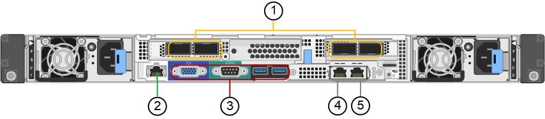

= Visão geral dos aparelhos SG100 e SG1000
:allow-uri-read: 
:icons: font
:imagesdir: ../media/

[role="lead"]
O dispositivo de serviços StorageGRID SG100 e o dispositivo de serviços SG1000 podem operar como um nó de gateway e como um nó de administrador para fornecer serviços de balanceamento de carga de alta disponibilidade em um sistema StorageGRID. Ambos os dispositivos podem operar como nós de gateway e nós de administração (primários ou não primários) ao mesmo tempo.

== Caraterísticas do aparelho

Ambos os modelos do dispositivo de serviços fornecem os seguintes recursos:

* Funções de nó de gateway ou nó de administrador para um sistema StorageGRID.
* O instalador do dispositivo StorageGRID para simplificar a implantação e a configuração de nós.
* Quando implantado, pode acessar o software StorageGRID de um nó de administrador existente ou de software baixado para uma unidade local. Para simplificar ainda mais o processo de implementação, uma versão recente do software é pré-carregada no dispositivo durante o fabrico.
* Um controlador de gerenciamento de placa base (BMC) para monitorar e diagnosticar alguns dos hardwares do dispositivo.
* A capacidade de se conetar a todas as três redes StorageGRID, incluindo a rede de Grade, a rede de Administração e a rede de Cliente:
+
** O SG100 suporta até quatro conexões de 10 ou 25 GbE à rede de Grade e à rede do cliente.
** O SG1000 suporta até quatro conexões de 10, 25, 40 ou 100 GbE à rede de Grade e à rede de Cliente.

== Diagramas SG100D e SG1000D.

Esta figura mostra a parte frontal do SG100 e do SG1000 com a moldura removida.

NOTE: Pela frente, os dois aparelhos são idênticos, exceto o nome do produto na moldura.

As duas unidades de estado sólido (SSDs), indicadas pelo contorno laranja, são usadas para armazenar o sistema operacional StorageGRID e são espelhadas usando RAID1 para redundância. Quando o dispositivo de serviços SG100 ou SG1000 é configurado como um nó Admin, essas unidades são usadas para armazenar logs de auditoria, métricas e tabelas de banco de dados.

Os restantes slots de unidade estão em branco.

image::../media/sg1000_front_with_ssds.png[Frente com SSDs SG100 e SG1000]

== Conetores na parte traseira do SG100

Esta figura mostra os conetores na parte de trás do SG100.

image::../media/sg100_rear_connectors.png[Conetores traseiros SG100]

|===
|  | Porta | Tipo | Utilização 

 a| 
1
 a| 
Portas de rede 1-4
 a| 
10/25-GbE, com base no tipo de transcetor de cabo ou SFP (os módulos SFP28 e SFP mais são suportados), velocidade do switch e velocidade do link configurada
 a| 
Conete-se à rede de grade e à rede de cliente para StorageGRID.

 a| 
2
 a| 
Porta de gerenciamento de BMC
 a| 
1 GbE (RJ-45)
 a| 
Ligue ao controlador de gestão da placa de base do aparelho.

 a| 
3
 a| 
Portas de diagnóstico e suporte
 a| 
* VGA
* Série, 115200 8-N-1
* USB

 a| 
Reservado para uso de suporte técnico.

 a| 
4
 a| 
Admin Network port 1
 a| 
1 GbE (RJ-45)
 a| 
Ligue o dispositivo à rede de administração para StorageGRID.

 a| 
5
 a| 
Admin Network port 2
 a| 
1 GbE (RJ-45)
 a| 
Opções:

* Vincular com a porta de gerenciamento 1 para uma conexão redundante com a rede de administração para StorageGRID.
* Deixe desconetado e disponível para acesso local temporário (IP 169.254.0.1).
* Durante a instalação, utilize a porta 2 para a configuração IP se os endereços IP atribuídos pelo DHCP não estiverem disponíveis.

|===

== Conetores na parte traseira do SG1000

Esta figura mostra os conetores na parte de trás do SG1000.

|===
|  | Porta | Tipo | Utilização 

 a| 
1
 a| 
Portas de rede 1-4
 a| 
10/25/40/100-GbE, com base no tipo de cabo ou transcetor, velocidade do switch e velocidade do link configurada. Os transcetores QSFP28 e QSFP (40/100GbE) são suportados nativamente e os transcetores SFP28/SFP podem ser usados com um QSA (vendido separadamente) para usar velocidades 10/25GbE.
 a| 
Conete-se à rede de grade e à rede de cliente para StorageGRID.

 a| 
2
 a| 
Porta de gerenciamento de BMC
 a| 
1 GbE (RJ-45)
 a| 
Ligue ao controlador de gestão da placa de base do aparelho.

 a| 
3
 a| 
Portas de diagnóstico e suporte
 a| 
* VGA
* Série, 115200 8-N-1
* USB

 a| 
Reservado para uso de suporte técnico.

 a| 
4
 a| 
Admin Network port 1
 a| 
1 GbE (RJ-45)
 a| 
Ligue o dispositivo à rede de administração para StorageGRID.

 a| 
5
 a| 
Admin Network port 2
 a| 
1 GbE (RJ-45)
 a| 
Opções:

* Vincular com a porta de gerenciamento 1 para uma conexão redundante com a rede de administração para StorageGRID.
* Deixe desconetado e disponível para acesso local temporário (IP 169.254.0.1).
* Durante a instalação, utilize a porta 2 para a configuração IP se os endereços IP atribuídos pelo DHCP não estiverem disponíveis.

|===