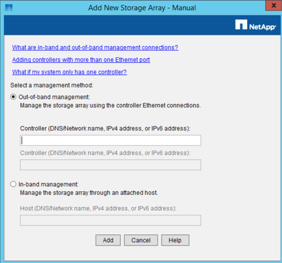

= Adicione o dispositivo ao SANtricity Storage Manager
:allow-uri-read: 
:icons: font
:imagesdir: ../media/

[role="lead"]
Ligue o controlador E2700 do dispositivo ao SANtricity Storage Manager e, em seguida, adicione o dispositivo como uma matriz de armazenamento.

.O que você vai precisar
Você está usando um xref:../admin/web-browser-requirements.adoc[navegador da web suportado].

.Sobre esta tarefa
Para obter instruções detalhadas, consulte a documentação do SANtricity Storage Manager.

.Passos
. Abra um navegador da Web e insira o endereço IP como o URL do SANtricity Storage Manager
`*https://_E2700_Controller_IP_*`
+
É apresentada a página de início de sessão do SANtricity Storage Manager.

. Na página *Selecionar método de adição*, selecione *Manual* e clique em *OK*.
. Selecione *Editar* *Adicionar matriz de armazenamento*.
+
A página Adicionar nova matriz de armazenamento - manual é exibida.

+

. Na caixa *Gerenciamento fora da banda*, insira um dos seguintes valores:
+
** *Usando DHCP:* o endereço IP atribuído pelo servidor DHCP à porta de gerenciamento 1 no controlador E2700
** *Não utilizar DHCP:* `192.168.128.101`
+

NOTE: Apenas um dos controladores do dispositivo está ligado ao SANtricity Storage Manager, pelo que só precisa de introduzir um endereço IP.

. Clique em *Add*.

.Informações relacionadas
http://mysupport.netapp.com/documentation/productlibrary/index.html?productID=61197["Documentação do NetApp: SANtricity Storage Manager"^]
