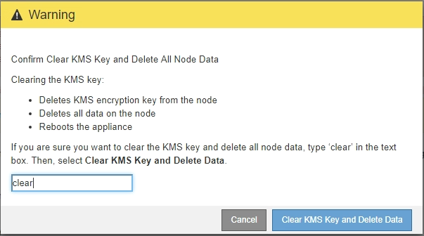

= Limpar a configuração do servidor de gerenciamento de chaves
:allow-uri-read: 
:icons: font
:imagesdir: ../media/

[role="lead"]
Limpar a configuração do servidor de gerenciamento de chaves (KMS) desativa a criptografia de nó no seu dispositivo. Depois de limpar a configuração do KMS, os dados do seu aparelho são excluídos permanentemente e não são mais acessíveis. Estes dados não são recuperáveis.

.O que você vai precisar
Se precisar preservar dados no dispositivo, execute um procedimento de desativação de nós ou clone o nó antes de limpar a configuração do KMS.

IMPORTANT: Quando o KMS é eliminado, os dados no aparelho serão eliminados permanentemente e deixarão de estar acessíveis. Estes dados não são recuperáveis.

xref:../maintain/grid-node-decommissioning.adoc[Desativar o nó] Para mover quaisquer dados que ele contenha para outros nós no StorageGRID.

.Sobre esta tarefa
A limpeza da configuração do KMS do appliance desativa a criptografia do nó, removendo a associação entre o nó do appliance e a configuração do KMS para o site do StorageGRID. Os dados no dispositivo são então excluídos e o dispositivo é deixado em um estado de pré-instalação. Este processo não pode ser revertido.

Você deve limpar a configuração do KMS:

* Antes de instalar o aparelho em outro sistema StorageGRID, isso não usa um KMS ou que usa um KMS diferente.
+

IMPORTANT: Não limpe a configuração do KMS se você planeja reinstalar um nó de dispositivo em um sistema StorageGRID que usa a mesma chave KMS.

* Antes de poder recuperar e reinstalar um nó onde a configuração do KMS foi perdida e a chave KMS não é recuperável.
* Antes de devolver qualquer aparelho que estava anteriormente em uso em seu site.
* Após a desativação de um dispositivo que tinha a criptografia de nó ativada.

IMPORTANT: Desative o dispositivo antes de limpar o KMS para mover seus dados para outros nós em seu sistema StorageGRID. Limpar o KMS antes de desativar o aparelho resultará em perda de dados e pode tornar o aparelho inoperável.

.Passos
. Abra um navegador e insira um dos endereços IP do controlador de computação do dispositivo. E
`*https://_Controller_IP_:8443*`
+
`_Controller_IP_` É o endereço IP do controlador de computação (não o controlador de storage) em qualquer uma das três redes StorageGRID.

+
A página inicial do instalador do dispositivo StorageGRID é exibida.

. Selecione *Configure hardware* *Node Encryption*.
+
image::../media/clear_kms.png[KMS limpar configuração]

+

IMPORTANT: Se a configuração do KMS for limpa, os dados no dispositivo serão excluídos permanentemente. Estes dados não são recuperáveis.

. Na parte inferior da janela, selecione *Limpar chave KMS e Excluir dados*.
. Se você tem certeza de que deseja limpar a configuração do KMS, digite
`*clear*` e selecione *Limpar chave KMS e Excluir dados*.
+

+
A chave de criptografia KMS e todos os dados são excluídos do nó e o dispositivo é reinicializado. Isso pode levar até 20 minutos.

. Abra um navegador e insira um dos endereços IP do controlador de computação do dispositivo. E
`*https://_Controller_IP_:8443*`
+
`_Controller_IP_` É o endereço IP do controlador de computação (não o controlador de storage) em qualquer uma das três redes StorageGRID.

+
A página inicial do instalador do dispositivo StorageGRID é exibida.

. Selecione *Configure hardware* *Node Encryption*.
. Verifique se a criptografia do nó está desativada e se as informações de chave e certificado em *Key Management Server Details* e *Clear KMS Key e Delete Data* control são removidas da janela.
+
A criptografia do nó não pode ser reativada no dispositivo até que seja reinstalada em uma grade.

.Depois de terminar
Depois de o aparelho reiniciar e verificar se o KMS foi limpo e se o aparelho está num estado de pré-instalação, pode remover fisicamente o aparelho do sistema StorageGRID. Consulte as instruções de recuperação e manutenção para obter informações xref:../maintain/preparing-appliance-for-reinstallation-platform-replacement-only.adoc[Prepare o aparelho para a reinstalação]sobre o .

.Informações relacionadas
xref:../admin/index.adoc[Administrar o StorageGRID]
