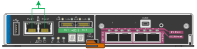

= Configurar ligações de rede (SG5600)
:allow-uri-read: 
:icons: font
:imagesdir: ../media/

[role="lead"]
Você pode configurar links de rede para as portas usadas para conetar o dispositivo à rede de Grade, à rede de cliente e à rede de administração. Você pode definir a velocidade do link, bem como os modos de ligação de porta e rede.

.O que você vai precisar
Se você planeja usar o modo de ligação de porta agregada, o modo de ligação de rede LACP ou a marcação de VLAN:

* Você conetou as portas de 10 GbE no dispositivo a switches que podem suportar VLAN e LACP.
* Se vários switches estiverem participando da ligação LACP, os switches suportam grupos de agregação de links de vários gabinetes (MLAG) ou equivalente.
* Você entende como configurar os switches para usar VLAN, LACP e MLAG ou equivalente.
* Você conhece a tag VLAN exclusiva a ser usada para cada rede. Essa tag VLAN será adicionada a cada pacote de rede para garantir que o tráfego de rede seja roteado para a rede correta.

.Sobre esta tarefa
Esta figura mostra como as quatro portas de 10 GbE são ligadas no modo de ligação de porta fixa (configuração padrão).

image::../media/e5600sg_fixed_port.gif[Imagem que mostra como as portas de 10 GbE no controlador E5600SG são coladas no modo fixo]

|===
| Legenda | Quais portas estão coladas 

 a| 
C
 a| 
As portas 1 e 3 são Unidas para a rede do cliente, se esta rede for utilizada.

 a| 
G
 a| 
As portas 2 e 4 são Unidas para a rede de Grade.

|===
Esta figura mostra como as quatro portas de 10 GbE são ligadas no modo de ligação de porta agregada.

image::../media/e5600sg_aggregate_port.gif[Imagem que mostra como as portas de 10 GbE no controlador E5600SG são coladas no modo agregado]

|===
| Legenda | Quais portas estão coladas 

 a| 
1
 a| 
Todas as quatro portas são agrupadas em uma única ligação LACP, permitindo que todas as portas sejam usadas para o tráfego de rede de Grade e rede de Cliente.

|===
A tabela resume as opções de configuração das quatro portas de 10 GbE. Só é necessário configurar as definições na página Configuração de ligação se pretender utilizar uma definição não predefinida.

* *Modo de ligação de porta fixo (padrão)*
+
|===
| Modo de ligação de rede | Rede cliente desativada (predefinição) | Rede cliente ativada 

 a| 
Ative-Backup (padrão)
 a| 
** As portas 2 e 4 usam uma ligação de backup ativo para a rede de Grade.
** As portas 1 e 3 não são usadas.
** Uma etiqueta VLAN é opcional.

 a| 
** As portas 2 e 4 usam uma ligação de backup ativo para a rede de Grade.
** As portas 1 e 3 usam uma ligação de backup ativo para a rede do cliente.
** As etiquetas VLAN podem ser especificadas para ambas as redes.

 a| 
Bola de Futsal (802,3ad)
 a| 
** As portas 2 e 4 usam uma ligação LACP para a rede de Grade.
** As portas 1 e 3 não são usadas.
** Uma etiqueta VLAN é opcional.

 a| 
** As portas 2 e 4 usam uma ligação LACP para a rede de Grade.
** As portas 1 e 3 usam uma ligação LACP para a rede de clientes.
** As etiquetas VLAN podem ser especificadas para ambas as redes.

|===
* *Modo de ligação de porta agregada*
+
|===
| Modo de ligação de rede | Rede cliente desativada (predefinição) | Rede cliente ativada 

 a| 
Apenas LACP (802,3ad)
 a| 
** As portas 1-4 usam uma única ligação LACP para a rede de Grade.
** Uma única etiqueta VLAN identifica pacotes de rede de Grade.

 a| 
** As portas 1-4 usam uma única ligação LACP para a rede de Grade e a rede do Cliente.
** Duas etiquetas VLAN permitem que os pacotes de rede de Grade sejam segregados dos pacotes de rede de Cliente.

|===

Consulte ""conexões de porta de 10 GbE para o controlador E5600SG" para obter mais informações sobre os modos de ligação de porta e ligação de rede.

Esta figura mostra como as duas portas de gerenciamento de 1 GbE na controladora E5600SG são ligadas no modo de ligação de rede ative-Backup para a rede Admin.

.Passos
. Na barra de menus do Instalador de dispositivos StorageGRID, clique em *Configurar rede* *Configuração de ligação*.
+
A página Network Link Configuration (Configuração da ligação de rede) apresenta um diagrama do seu dispositivo com as portas de rede e de gestão numeradas.

+
image::../media/sg5612_configuring_network_ports.png[SG5612 portas de rede e gerenciamento]

+
A tabela Status da ligação lista o estado da ligação (para cima/para baixo) e a velocidade (1/10/25/40/100 Gbps) das portas numeradas.

+
image::../media/sg5612_configuring_network_linkstatus.png[5612 Estado da ligação]

+
A primeira vez que aceder a esta página:

+
** *Link Speed* está definido para *10GbE*. Esta é a única velocidade de ligação disponível para o controlador E5600SG.
** *Port bond mode* está definido como *Fixed*.
** *O modo de ligação de rede* para a rede de Grade está definido como *ative-Backup*.
** A *Admin Network* está ativada e o modo de ligação de rede está definido como *Independent*.
** A *rede do cliente* está desativada.
+
image::../media/network_link_configuration_fixed.png[Configuração da ligação de rede fixa]

. Ative ou desative as redes StorageGRID que pretende utilizar.
+
A rede de Grade é necessária. Não é possível desativar esta rede.

+
.. Se o dispositivo não estiver conetado à rede Admin, desmarque a caixa de seleção *Ativar rede* para a rede Admin.
+
image::../media/admin_network_disabled.gif[Captura de tela mostrando a caixa de seleção para ativar ou desativar a rede Admin]

.. Se o dispositivo estiver conetado à rede do cliente, marque a caixa de seleção *Ativar rede* para a rede do cliente.
+
As configurações de rede do cliente para as portas de 10 GbE são agora mostradas.

. Consulte a tabela e configure o modo de ligação de porta e o modo de ligação de rede.
+
O exemplo mostra:

+
** *Aggregate* e *LACP* selecionados para as redes Grid e Client. Você deve especificar uma tag VLAN exclusiva para cada rede. Pode selecionar valores entre 0 e 4095.
** *Ative-Backup* selecionado para a rede Admin.
+
image::../media/network_link_configuration_aggregate.gif[Captura de tela mostrando as configurações de Link para o modo agregado]

. Quando estiver satisfeito com suas seleções, clique em *Salvar*.
+

NOTE: Poderá perder a ligação se tiver efetuado alterações à rede ou à ligação através da qual está ligado. Se você não estiver conetado novamente dentro de 1 minuto, insira novamente o URL do Instalador de appliance StorageGRID usando um dos outros endereços IP atribuídos ao appliance
`*https://_E5600SG_Controller_IP_:8443*`

.Informações relacionadas
xref:port-bond-modes-for-e5600sg-controller-ports.adoc[Modos de ligação de porta para as portas do controlador E5600SG]
