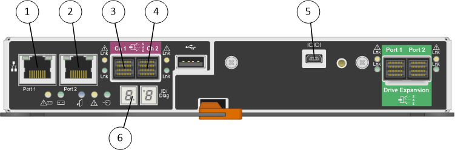

= Diagramas de hardware
:allow-uri-read: 
:icons: font
:imagesdir: ../media/

[role="lead"]
Os modelos SG5612 e SG5660 do dispositivo StorageGRID incluem um controlador E2700 e um controlador E5600SG. Você deve rever os diagramas para aprender as diferenças entre os modelos e os controladores.

== Modelo SG5612 2U: Vista traseira do controlador E2700 e do controlador E5600SG

image::../media/sg5612_2u_rear_view.gif[Vista traseira do SG5612 com dois controladores]

|===
| Legenda | Descrição 

 a| 
1
 a| 
Controlador E2700

 a| 
2
 a| 
Controlador E5600SG

|===

== Modelo SG5660 4U: Vista traseira do controlador E2700 e do controlador E5600SG

O controlador E2700 está acima do controlador E5600SG.

image::../media/sg5660_4u_rear_view.gif[Vista traseira do SG5660 com dois controladores]

|===
| Legenda | Descrição 

 a| 
1
 a| 
Controlador E2700

 a| 
2
 a| 
Controlador E5600SG

|===

== Vista traseira do controlador E2700

|===
| Legenda | Descrição 

 a| 
1
 a| 
Porta de gerenciamento 1 (Conete-se à rede onde o SANtricity Storage Manager está instalado.)

 a| 
2
 a| 
Porta de gerenciamento 2 (use durante a instalação para conetar a um laptop.)

 a| 
3
 a| 
Porta de interconexão SAS 1

 a| 
4
 a| 
Porta de interconexão SAS 2

 a| 
5
 a| 
Porta de conexão serial

 a| 
6
 a| 
Visor de sete segmentos

|===

NOTE: As duas portas SAS com o rótulo Drive Expansion (verde) na parte traseira do controlador E2700 não são usadas. O dispositivo StorageGRID não é compatível com compartimentos de unidades de expansão.

== Vista traseira do controlador E5600SG

image::../media/sga_controller_5600_diagram_callouts.gif[Diagrama E5600D.]

|===
| Legenda | Descrição 

 a| 
1
 a| 
Porta de gerenciamento 1Connect para a rede de administração do StorageGRID.

 a| 
2
 a| 
Opções da porta de gerenciamento 2:

* Vincular com a porta de gerenciamento 1 para uma conexão redundante com a rede de administração para StorageGRID.
* Deixe desconetado e disponível para acesso local temporário (IP 169.254.0.1).
* Durante a instalação, use para configuração IP se os endereços IP atribuídos pelo DHCP não estiverem disponíveis.

 a| 
3
 a| 
Porta de interconexão SAS 1

 a| 
4
 a| 
Porta de interconexão SAS 2

 a| 
5
 a| 
LEDs de falha e ativos para a porta de rede 1 de 10 GbE

 a| 
6
 a| 
LEDs de falha e ativos para a porta de rede 2 de 10 GbE

 a| 
7
 a| 
LEDs de falha e ativos para a porta de rede 3 de 10 GbE

 a| 
8
 a| 
LEDs de falha e ativos para a porta de rede 4 de 10 GbE

 a| 
9
 a| 
Precisa de atenção LED

 a| 
10
 a| 
Visor de sete segmentos

 a| 
11
 a| 
Porta de rede de 10 GbE 1

 a| 
12
 a| 
Porta de rede de 10 GbE 2

 a| 
13
 a| 
Porta de rede de 10 GbE 3

 a| 
14
 a| 
Porta de rede de 10 GbE 4

|===

NOTE: A placa de interface do host (HIC) no controlador StorageGRID Appliance E5600SG suporta apenas conexões Ethernet de 10 GB. Não pode ser utilizado para ligações iSCSI.
