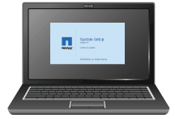

= Obter equipamentos e ferramentas adicionais (SG5600)
:allow-uri-read: 
:icons: font
:imagesdir: ../media/

[role="lead"]
Antes de instalar o aparelho SG5600, confirme se tem todo o equipamento e ferramentas adicionais de que necessita.

* *Chaves de fenda*
+
image::../media/appliance_screwdrivers.gif[Chaves de parafusos]

+
Chave de fendas Phillips n.o 2

+
Aparafusadoras de lâmina plana médias

* * Pulseira antiestática*
+
image::../media/appliance_wriststrap.gif[Pulseira antiestática]

* *Cabos Ethernet*
+
image::../media/appliance_ethernet_cables.gif[Cabos Ethernet]

* *Comutador Ethernet*
+
image::../media/appliance_ethernet_switch_network_hub.gif[Hub Ethernet]

* * Serviço de laptop* xref:../admin/web-browser-requirements.adoc[Navegador da Web suportado]
+

