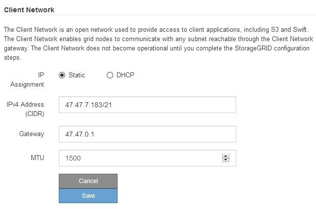

= Defina a configuração IP
:allow-uri-read: 
:icons: font
:imagesdir: ../media/

[role="lead"]
Você usa o Instalador de dispositivos StorageGRID para configurar os endereços IP e as informações de roteamento usados para o nó de armazenamento de dispositivos nas redes StorageGRID, Admin e cliente.

.Sobre esta tarefa
Você deve atribuir um IP estático para o dispositivo em cada rede conetada ou atribuir uma concessão permanente para o endereço no servidor DHCP.

Se você quiser alterar a configuração do link, consulte as instruções para alterar a configuração do link do controlador E5600SG.

.Passos
. No Instalador do StorageGRID Appliance, selecione *Configurar rede* *Configuração IP*.
+
É apresentada a página Configuração IP.

. Para configurar a rede de Grade, selecione *Static* ou *DHCP* na seção *Grid Network* da página.
+
image::../media/grid_network_static.png[Rede de rede IP]

. Se você selecionou *Static*, siga estas etapas para configurar a rede de Grade:
+
.. Insira o endereço IPv4 estático, usando a notação CIDR.
.. Entre no gateway.
+
Se a rede não tiver um gateway, insira novamente o mesmo endereço IPv4 estático.

.. Se você quiser usar quadros jumbo, altere o campo MTU para um valor adequado para quadros jumbo, como 9000. Caso contrário, mantenha o valor padrão de 1500.
+

IMPORTANT: O valor MTU da rede deve corresponder ao valor configurado na porta do switch à qual o nó está conetado. Caso contrário, problemas de desempenho da rede ou perda de pacotes podem ocorrer.

+

IMPORTANT: Para obter o melhor desempenho de rede, todos os nós devem ser configurados com valores MTU semelhantes em suas interfaces de rede de Grade. O alerta *incompatibilidade de MTU da rede de Grade* é acionado se houver uma diferença significativa nas configurações de MTU para a rede de Grade em nós individuais. Os valores de MTU não precisam ser os mesmos para todos os tipos de rede.

.. Clique em *Salvar*.
+
Quando você altera o endereço IP, o gateway e a lista de sub-redes também podem mudar.

+
Se você perder a conexão com o Instalador do StorageGRID Appliance, insira novamente o URL usando o novo endereço IP estático que você acabou de atribuir. Por exemplo
`*https://_services_appliance_IP_:8443*`

.. Confirme se a lista de sub-redes da rede de Grade está correta.
+
Se você tiver sub-redes de grade, o gateway de rede de grade é necessário. Todas as sub-redes de grade especificadas devem ser acessíveis através deste gateway. Essas sub-redes de rede de grade também devem ser definidas na lista de sub-redes de rede de grade no nó de administração principal quando você iniciar a instalação do StorageGRID.

+

NOTE: A rota padrão não está listada. Se a rede do cliente não estiver ativada, a rota padrão usará o gateway de rede de grade.

+
*** Para adicionar uma sub-rede, clique no ícone de inserção image:../media/icon_plus_sign_black_on_white.gif["insira o ícone"]à direita da última entrada.
*** Para remover uma sub-rede não utilizada, clique no ícone de eliminação image:../media/icon_nms_delete_new.gif["eliminar ícone"].

.. Clique em *Salvar*.

. Se você selecionou *DHCP*, siga estas etapas para configurar a rede de Grade:
+
.. Depois de selecionar o botão de opção *DHCP*, clique em *Save* (Guardar).
+
Os campos *IPv4 Address*, *Gateway* e *sub-redes* são preenchidos automaticamente. Se o servidor DHCP estiver configurado para atribuir um valor MTU, o campo *MTU* será preenchido com esse valor e o campo se tornará somente leitura.

+
O navegador da Web é automaticamente redirecionado para o novo endereço IP do Instalador de dispositivos StorageGRID.

.. Confirme se a lista de sub-redes da rede de Grade está correta.
+
Se você tiver sub-redes de grade, o gateway de rede de grade é necessário. Todas as sub-redes de grade especificadas devem ser acessíveis através deste gateway. Essas sub-redes de rede de grade também devem ser definidas na lista de sub-redes de rede de grade no nó de administração principal quando você iniciar a instalação do StorageGRID.

+

NOTE: A rota padrão não está listada. Se a rede do cliente não estiver ativada, a rota padrão usará o gateway de rede de grade.

+
*** Para adicionar uma sub-rede, clique no ícone de inserção image:../media/icon_plus_sign_black_on_white.gif["insira o ícone"]à direita da última entrada.
*** Para remover uma sub-rede não utilizada, clique no ícone de eliminação image:../media/icon_nms_delete_new.gif["eliminar ícone"].

.. Se você quiser usar quadros jumbo, altere o campo MTU para um valor adequado para quadros jumbo, como 9000. Caso contrário, mantenha o valor padrão de 1500.
+

IMPORTANT: O valor MTU da rede deve corresponder ao valor configurado na porta do switch à qual o nó está conetado. Caso contrário, problemas de desempenho da rede ou perda de pacotes podem ocorrer.

+

IMPORTANT: Para obter o melhor desempenho de rede, todos os nós devem ser configurados com valores MTU semelhantes em suas interfaces de rede de Grade. O alerta *incompatibilidade de MTU da rede de Grade* é acionado se houver uma diferença significativa nas configurações de MTU para a rede de Grade em nós individuais. Os valores de MTU não precisam ser os mesmos para todos os tipos de rede.

.. Clique em *Salvar*.

. Para configurar a rede Admin, selecione *Static* (estático) ou *DHCP* (DHCP) na secção Admin Network (rede Admin) da página.
+

NOTE: Para configurar a rede de administração, você deve ativar a rede de administração na página Configuração de ligação.

+
image::../media/admin_network_static.png[IP de rede Admin]

. Se você selecionou *Static*, siga estas etapas para configurar a rede Admin:
+
.. Introduza o endereço IPv4 estático, utilizando a notação CIDR, para a porta de gestão 1 no dispositivo.
+
A porta de gerenciamento 1 fica à esquerda das duas portas RJ45 de 1 GbE na extremidade direita do dispositivo.

.. Entre no gateway.
+
Se a rede não tiver um gateway, insira novamente o mesmo endereço IPv4 estático.

.. Se você quiser usar quadros jumbo, altere o campo MTU para um valor adequado para quadros jumbo, como 9000. Caso contrário, mantenha o valor padrão de 1500.
+

IMPORTANT: O valor MTU da rede deve corresponder ao valor configurado na porta do switch à qual o nó está conetado. Caso contrário, problemas de desempenho da rede ou perda de pacotes podem ocorrer.

.. Clique em *Salvar*.
+
Quando você altera o endereço IP, o gateway e a lista de sub-redes também podem mudar.

+
Se você perder a conexão com o Instalador do StorageGRID Appliance, insira novamente o URL usando o novo endereço IP estático que você acabou de atribuir. Por exemplo
`*https://_services_appliance_:8443*`

.. Confirme se a lista de sub-redes Admin Network está correta.
+
Você deve verificar se todas as sub-redes podem ser alcançadas usando o gateway fornecido.

+

NOTE: A rota padrão não pode ser feita para usar o gateway de rede Admin.

+
*** Para adicionar uma sub-rede, clique no ícone de inserção image:../media/icon_plus_sign_black_on_white.gif["insira o ícone"]à direita da última entrada.
*** Para remover uma sub-rede não utilizada, clique no ícone de eliminação image:../media/icon_nms_delete_new.gif["eliminar ícone"].

.. Clique em *Salvar*.

. Se você selecionou *DHCP*, siga estas etapas para configurar a rede Admin:
+
.. Depois de selecionar o botão de opção *DHCP*, clique em *Save* (Guardar).
+
Os campos *IPv4 Address*, *Gateway* e *sub-redes* são preenchidos automaticamente. Se o servidor DHCP estiver configurado para atribuir um valor MTU, o campo *MTU* será preenchido com esse valor e o campo se tornará somente leitura.

+
O navegador da Web é automaticamente redirecionado para o novo endereço IP do Instalador de dispositivos StorageGRID.

.. Confirme se a lista de sub-redes Admin Network está correta.
+
Você deve verificar se todas as sub-redes podem ser alcançadas usando o gateway fornecido.

+

NOTE: A rota padrão não pode ser feita para usar o gateway de rede Admin.

+
*** Para adicionar uma sub-rede, clique no ícone de inserção image:../media/icon_plus_sign_black_on_white.gif["insira o ícone"]à direita da última entrada.
*** Para remover uma sub-rede não utilizada, clique no ícone de eliminação image:../media/icon_nms_delete_new.gif["eliminar ícone"].

.. Se você quiser usar quadros jumbo, altere o campo MTU para um valor adequado para quadros jumbo, como 9000. Caso contrário, mantenha o valor padrão de 1500.
+

IMPORTANT: O valor MTU da rede deve corresponder ao valor configurado na porta do switch à qual o nó está conetado. Caso contrário, problemas de desempenho da rede ou perda de pacotes podem ocorrer.

.. Clique em *Salvar*.

. Para configurar a rede do cliente, selecione *estático* ou *DHCP* na seção *rede do cliente* da página.
+

NOTE: Para configurar a rede do cliente, tem de ativar a rede do cliente na página Configuração da ligação.

+

. Se você selecionou *Static*, siga estas etapas para configurar a rede do cliente:
+
.. Insira o endereço IPv4 estático, usando a notação CIDR.
.. Clique em *Salvar*.
.. Confirme se o endereço IP do gateway de rede do cliente está correto.
+

NOTE: Se a rede do cliente estiver ativada, é apresentada a rota predefinida. A rota padrão usa o gateway de rede do cliente e não pode ser movida para outra interface enquanto a rede do cliente está ativada.

.. Se você quiser usar quadros jumbo, altere o campo MTU para um valor adequado para quadros jumbo, como 9000. Caso contrário, mantenha o valor padrão de 1500.
+

IMPORTANT: O valor MTU da rede deve corresponder ao valor configurado na porta do switch à qual o nó está conetado. Caso contrário, problemas de desempenho da rede ou perda de pacotes podem ocorrer.

.. Clique em *Salvar*.

. Se você selecionou *DHCP*, siga estas etapas para configurar a rede do cliente:
+
.. Depois de selecionar o botão de opção *DHCP*, clique em *Save* (Guardar).
+
Os campos *IPv4 Address* e *Gateway* são preenchidos automaticamente. Se o servidor DHCP estiver configurado para atribuir um valor MTU, o campo *MTU* será preenchido com esse valor e o campo se tornará somente leitura.

+
O navegador da Web é automaticamente redirecionado para o novo endereço IP do Instalador de dispositivos StorageGRID.

.. Confirme se o gateway está correto.
+

NOTE: Se a rede do cliente estiver ativada, é apresentada a rota predefinida. A rota padrão usa o gateway de rede do cliente e não pode ser movida para outra interface enquanto a rede do cliente está ativada.

.. Se você quiser usar quadros jumbo, altere o campo MTU para um valor adequado para quadros jumbo, como 9000. Caso contrário, mantenha o valor padrão de 1500.
+

IMPORTANT: O valor MTU da rede deve corresponder ao valor configurado na porta do switch à qual o nó está conetado. Caso contrário, problemas de desempenho da rede ou perda de pacotes podem ocorrer.

.Informações relacionadas
xref:changing-link-configuration-of-e5600sg-controller.adoc[Altere a configuração do link do controlador E5600SG]
