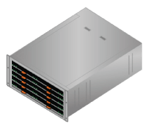
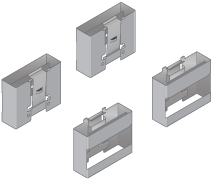
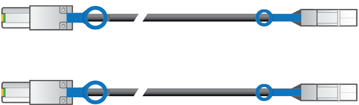

= Caixas de embalagem (SG5600)
:allow-uri-read: 
:icons: font
:imagesdir: ../media/

[role="lead"]
Antes de instalar o dispositivo StorageGRID, desembale todas as caixas e compare o conteúdo com os itens no saco de embalagem.

* * SG5660 gabinete, um chassi de 4UU com 60 unidades*
+

* * SG5612 gabinete, um chassi de 2UU com 12 unidades*
+
image::../media/appliance_enclosure_2u.gif[Chassi de DE1600 2U U.]

* * 4U bisel ou 2U endcaps*
+
image:../media/appliance_bezel.gif["4U moldura"] image:../media/appliance_bezel_2u_endcaps.gif["2U tampas"]

* *Unidades NL-SAS*
+
image::../media/appliance_drive.gif[Condução]

+
Os acionamentos são pré-instalados no 2U SG5612, mas não no 4U SG5660 para segurança de envio.

* *Controlador E5600SG*
+
image::../media/sga_controller_5600_diagram.gif[Controlador E5600]

* *Controlador E2700*
+
image::../media/sga_controller_2700_diagram.gif[Controlador E2700]

* * Trilhos de montagem e parafusos*
+
image::../media/appliance_mounting_rail_kit.png[Kit de calha de montagem]

* * Alças de gabinete (apenas 4U gabinetes)*
+

== Cabos e conetores

O envio para o dispositivo StorageGRID inclui os seguintes cabos e conetores:

* * Cabos de alimentação para o seu país*
+
image::../media/appliance_power_cords.gif[Cabos de energia]

+
O aparelho é fornecido com dois cabos de alimentação CA para ligação a uma fonte de alimentação externa, como uma ficha de parede. O gabinete pode ter cabos de alimentação especiais que você usa em vez dos cabos de alimentação fornecidos com o aparelho.

* *Cabos de interconexão SAS*
+

+
Dois cabos de interconexão SAS de 0,5 metros com conetores mini-SAS-HD e mini-SAS.

+
O conetor quadrado se coneta ao controlador E2700 e o conetor retangular se coneta ao controlador E5600SG.

