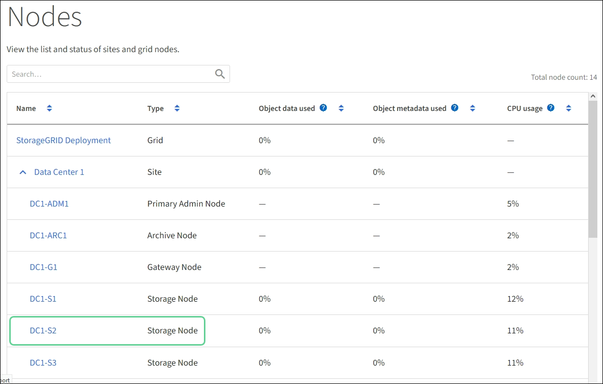

= Atualize o firmware da unidade usando o SANtricity Storage Manager
:allow-uri-read: 
:icons: font
:imagesdir: ../media/

[role="lead"]
Você atualiza o firmware da sua unidade para garantir que você tenha todos os recursos mais recentes e correções de bugs.

.O que você vai precisar
* O dispositivo de armazenamento tem um status ideal.
* Todas as unidades têm um status ideal.
* Você tem a versão mais recente do SANtricity Storage Manager instalada que é compatível com sua versão do StorageGRID.
+
xref:upgrading-santricity-os-on-storage-controllers-using-grid-manager-sg5600.adoc[Atualize o SANtricity os em controladores de storage usando o Gerenciador de Grade]

+
xref:upgrading-santricity-os-on-e2700-controller-using-maintenance-mode.adoc[Atualize o SANtricity os na controladora E2700 usando o modo de manutenção]

* Você xref:placing-appliance-into-maintenance-mode.adoc[Coloque o aparelho StorageGRID no modo de manutenção]tem .
+

NOTE: O modo de manutenção interrompe a conexão com o controlador de storage, interrompendo todas as atividades de e/S e colocando todas as unidades offline.

IMPORTANT: Não atualize o firmware da unidade em mais de um dispositivo StorageGRID de cada vez. Isso pode causar indisponibilidade de dados, dependendo do modelo de implantação e das políticas de ILM.

.Passos
. Confirme se o aparelho está na xref:placing-appliance-into-maintenance-mode.adoc[modo de manutenção].
. Abra um navegador da Web e insira o endereço IP como o URL do SANtricity Storage Manager
`*https://_E2700_Controller_IP_*`
. Introduza o nome de utilizador e a palavra-passe do administrador do SANtricity Storage Manager, se necessário.
. No Gerenciamento Empresarial do SANtricity, selecione a guia *dispositivos*.
+
A janela Gerenciamento de matrizes SANtricity é aberta.

. No gerenciamento de storage SANtricity, clique duas vezes no storage array com as unidades a serem atualizadas.
. Verifique se o storage de armazenamento e as unidades têm um status ideal.
. Verifique a versão do firmware da unidade atualmente instalada no dispositivo de armazenamento:
+
.. Em Gerenciamento Empresarial SANtricity, selecione *Upgrade* *Drive firmware*.
+
A janela Download Drive firmware - Add Packages (Transferir firmware da unidade - Adicionar pacotes) apresenta os ficheiros de firmware da unidade atualmente em utilização.

.. Observe as revisões atuais do firmware da unidade e identificadores de unidade nos pacotes de firmware atuais.
+
image::../media/sg_storagemanager_upgrade_drive_firmware.png[Atualize o firmware da unidade]

+
Neste exemplo:

+
*** A revisão do firmware da unidade é *NE00*.
*** O identificador da unidade é *HUH728080AL5204*.

+
Selecione *Exibir unidades associadas* para exibir onde essas unidades estão instaladas no seu dispositivo de armazenamento.

. Transfira e prepare a atualização de firmware da unidade disponível:
+
.. Abra seu navegador da Web, navegue até o site de suporte da NetApp e faça login usando sua ID e senha.
+
https://mysupport.netapp.com/site/["Suporte à NetApp"^]

.. No site de suporte da NetApp, selecione a guia *Downloads* e, em seguida, selecione *firmware da unidade de disco da série e*.
+
É apresentada a página firmware do disco e-Series.

.. Procure cada *Drive Identifier* instalado no seu dispositivo de armazenamento e verifique se cada identificador de unidade tem a revisão de firmware mais recente.
+
*** Se a revisão do firmware não for um link, esse identificador de unidade terá a revisão de firmware mais recente.
*** Se um ou mais números de peça de unidade forem listados para um identificador de unidade, uma atualização de firmware estará disponível para essas unidades. Pode selecionar qualquer ligação para transferir o ficheiro de firmware.
+
image::../media/sg_storage_mgr_download_drive_firmware.png[Página do firmware do disco da série E.]

.. Se estiver listada uma revisão de firmware posterior, selecione o link na coluna firmware Rev. (Download) para baixar um `.zip` arquivo contendo o arquivo de firmware.
.. Extraia (descompacte) os arquivos de arquivo de firmware da unidade que você baixou do site de suporte.

. Instale a atualização do firmware da unidade:
+
.. Na janela SANtricity Storage Manager Download Drive firmware - Add Packages (Baixar firmware da unidade - Adicionar pacotes), selecione *Add* (Adicionar).
.. Navegue até o diretório que contém os arquivos de firmware e selecione até quatro arquivos de firmware.
+
Os arquivos de firmware da unidade têm um nome de arquivo semelhante a
`D_HUC101212CSS600_30602291_MS01_2800_0002.dlp`

+
Selecionar mais de um ficheiro de firmware para atualizar o firmware da mesma unidade pode resultar num erro de conflito de ficheiros. Se ocorrer um erro de conflito de arquivo, uma caixa de diálogo de erro será exibida. Para resolver esse erro, selecione *OK* e remova todos os outros arquivos de firmware, exceto aquele que você deseja usar para atualizar o firmware da unidade. Para remover um arquivo de firmware, selecione o arquivo de firmware na área de informações Pacotes a serem transferidos e selecione *Remover*. Além disso, você só pode selecionar até quatro pacotes de firmware de unidade de uma só vez.

.. Selecione *OK*.
+
O sistema atualiza a área de informações Pacotes a serem transferidos com os arquivos de firmware selecionados.

.. Selecione *seguinte*.
+
Abre-se a janela Download Drive firmware - Select Drives (Transferir firmware da unidade - Selecionar unidades).

+
*** Todas as unidades do dispositivo são digitalizadas para obter informações de configuração e elegibilidade de atualização.
*** É-lhe apresentada uma seleção (dependendo da variedade de unidades que tem na matriz de armazenamento) de unidades compatíveis que podem ser atualizadas com o firmware selecionado. As unidades capazes de ser atualizadas como uma operação on-line são exibidas por padrão.
*** O firmware selecionado para a unidade aparece na área de informações de firmware proposto. Se for necessário alterar o firmware, selecione *voltar* para retornar à caixa de diálogo anterior.

.. Na capacidade de atualização da unidade, selecione a operação de download *Parallel* ou *All*.
+
Você pode usar qualquer um desses métodos de atualização porque o dispositivo está no modo de manutenção, onde a atividade de e/S é interrompida para todas as unidades e todos os volumes.

.. Em unidades compatíveis, selecione as unidades para as quais pretende atualizar os ficheiros de firmware selecionados.
+
*** Para uma ou mais unidades, selecione cada unidade que deseja atualizar.
*** Para todas as unidades compatíveis, selecione *Selecionar tudo*.
+
A prática recomendada é atualizar todas as unidades do mesmo modelo para a mesma revisão de firmware.

.. Selecione *Finish*; em seguida, digite `yes` e selecione *OK*.
+
*** O download e a atualização do firmware da unidade começam, com Download Drive firmware - progresso indicando o status da transferência de firmware para todas as unidades.
*** O status de cada unidade que participa da atualização é exibido na coluna progresso da transferência de dispositivos atualizados.
+
Uma operação de atualização de firmware de unidade paralela pode levar até 90 segundos para ser concluída se todas as unidades forem atualizadas em um sistema de 24 unidades. Em um sistema maior, o tempo de execução é um pouco mais longo.

.. Durante o processo de atualização do firmware, você pode
+
*** Selecione *Stop* para interromper a atualização de firmware em andamento. Qualquer atualização de firmware atualmente em curso está concluída. Quaisquer unidades que tenham tentado atualizar o firmware mostram seu status individual. Quaisquer unidades restantes são listadas com um estado de não tentativa.
+

IMPORTANT: Parar a atualização do firmware da unidade em processo pode resultar em perda de dados ou unidades indisponíveis.

*** Selecione *Save as* (Guardar como) para guardar um relatório de texto do resumo do progresso da atualização do firmware. O relatório é salvo com uma extensão de arquivo .log padrão. Se você quiser alterar a extensão ou diretório do arquivo, altere os parâmetros em Salvar Registro de download da unidade.

.. Use Download Drive firmware - Progress para monitorar o progresso das atualizações de firmware da unidade. A área unidades atualizadas contém uma lista de unidades agendadas para atualização de firmware e o status de transferência de cada unidade de download e atualização.
+
O progresso e o status de cada unidade que está participando da atualização são exibidos na coluna progresso da transferência. Tome a ação recomendada apropriada se ocorrerem erros durante a atualização.

+
*** *Pendente*
+
Este estado é apresentado para uma operação de transferência de firmware online que foi agendada mas ainda não foi iniciada.

*** *Em andamento*
+
O firmware está a ser transferido para a unidade.

*** *Reconstrução em andamento*
+
Este estado é apresentado se ocorrer uma transferência de volume durante a reconstrução rápida de uma unidade. Isto é normalmente devido a uma reinicialização ou falha do controlador e o proprietário do controlador transfere o volume.

+
O sistema iniciará uma reconstrução completa da unidade.

*** *Falhou - parcial*
+
O firmware só foi parcialmente transferido para a unidade antes de um problema impedir que o resto do arquivo fosse transferido.

*** *Falhou - estado inválido*
+
O firmware não é válido.

*** *Falhou - outro*
+
O firmware não pôde ser baixado, possivelmente por causa de um problema físico com a unidade.

*** * Não tentou*
+
O firmware não foi baixado, o que pode ser devido a vários motivos diferentes, como o download foi interrompido antes que ele pudesse ocorrer, ou a unidade não se qualificou para a atualização, ou o download não pôde ocorrer devido a um erro.

*** * Bem-sucedido *
+
O firmware foi transferido com sucesso.

. Após a conclusão da atualização do firmware da unidade:
+
** Para fechar o Assistente de transferência do firmware da unidade, selecione *Fechar*.
** Para iniciar o assistente novamente, selecione *Transferir mais*.

. Se este procedimento for concluído com êxito e tiver procedimentos adicionais a serem executados enquanto o nó estiver no modo de manutenção, execute-os agora. Quando terminar, ou se tiver alguma falha e quiser recomeçar, selecione *Avançado* *Reiniciar controlador* e, em seguida, selecione uma destas opções:
+
** Selecione *Reboot into StorageGRID*
** Selecione *Reboot into Maintenance Mode* (Reiniciar no modo de manutenção) para reiniciar o controlador com o nó restante no modo de manutenção. Selecione esta opção se tiver alguma avaria durante o procedimento e pretender recomeçar. Depois que o nó terminar de reiniciar para o modo de manutenção, reinicie a partir da etapa apropriada no procedimento que falhou.
+
image::../media/reboot_controller_from_maintenance_mode.png[Reinicie o controlador no modo de manutenção]

+
Pode demorar até 20 minutos para o aparelho reiniciar e voltar a ligar a grelha. Para confirmar que a reinicialização está concluída e que o nó voltou a ingressar na grade, volte ao Gerenciador de Grade. A página *nós* deve exibir um status normal (sem ícones à esquerda do nome do nó) para o nó do dispositivo, indicando que não há alertas ativos e o nó está conetado à grade.

+

