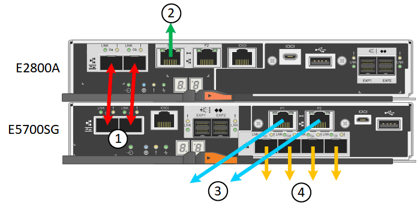

= Revisão de conexões de rede de dispositivos (SG5700)
:allow-uri-read: 
:icons: font
:imagesdir: ../media/

[role="lead"]
Antes de instalar o dispositivo StorageGRID, você deve entender quais redes podem ser conetadas ao dispositivo e como as portas em cada controlador são usadas.

== Redes de dispositivos StorageGRID

Ao implantar um dispositivo StorageGRID como nó de storage em uma grade StorageGRID, você pode conectá-lo às seguintes redes:

* *Rede de grade para StorageGRID*: A rede de grade é usada para todo o tráfego interno de StorageGRID. Ele fornece conetividade entre todos os nós na grade, em todos os sites e sub-redes. A rede de Grade é necessária.
* *Rede de administração para StorageGRID*: A rede de administração é uma rede fechada usada para administração e manutenção do sistema. A rede Admin é normalmente uma rede privada e não precisa ser roteável entre sites. A rede de administração é opcional.
* *Rede de clientes para StorageGRID:* a rede de clientes é uma rede aberta usada para fornecer acesso a aplicativos clientes, incluindo S3 e Swift. A rede do cliente fornece acesso ao protocolo do cliente à grade, de modo que a rede da grade possa ser isolada e protegida. A rede do cliente é opcional.
* *Rede de gerenciamento para o Gerenciador de sistema SANtricity* (opcional): Esta rede fornece acesso ao Gerenciador de sistema SANtricity no controlador E2800, permitindo que você monitore e gerencie os componentes de hardware no dispositivo. Essa rede de gerenciamento pode ser a mesma rede de administração para StorageGRID ou pode ser uma rede de gerenciamento independente.
+
Se a rede opcional do Gerenciador de sistema do SANtricity não estiver conetada, talvez você não consiga usar alguns recursos do SANtricity.

NOTE: Para obter informações detalhadas sobre redes StorageGRID, consulte _Primer_.

== Conexões de dispositivos StorageGRID

Ao instalar um dispositivo StorageGRID, você deve conetar os dois controladores entre si e às redes necessárias. A figura mostra os dois controladores no SG5760, com o controlador E2800 na parte superior e o controlador E5700SG na parte inferior. No SG5712, o controlador E2800 está à esquerda do controlador E5700SG.

|===
|  | Porta | Tipo de porta | Função 

 a| 
1
 a| 
Duas portas de interconexão em cada controlador
 a| 
SFP ótico FC de 16GB GB/s.
 a| 
Conete os dois controladores um ao outro.

 a| 
2
 a| 
Porta de gerenciamento 1 no controlador E2800
 a| 
1 GbE (RJ-45)
 a| 
Liga-se à rede onde acede ao Gestor de sistema SANtricity. Pode utilizar a rede de administração para StorageGRID ou uma rede de gestão independente.

 a| 
2
 a| 
Porta de gerenciamento 2 no controlador E2800
 a| 
1 GbE (RJ-45)
 a| 
Reservado para suporte técnico.

 a| 
3
 a| 
Porta de gerenciamento 1 no controlador E5700SG
 a| 
1 GbE (RJ-45)
 a| 
Liga o controlador E5700SG à rede de administração para StorageGRID.

 a| 
3
 a| 
Porta de gerenciamento 2 no controlador E5700SG
 a| 
1 GbE (RJ-45)
 a| 
* Pode ser ligado com a porta de gerenciamento 1 se você quiser uma conexão redundante com a rede de administração.
* Pode ser deixado sem fios e disponível para acesso local temporário (IP 169.254.0.1).
* Durante a instalação, pode ser utilizado para ligar o controlador E5700SG a um computador portátil de serviço se os endereços IP atribuídos por DHCP não estiverem disponíveis.

 a| 
4
 a| 
Portas 10/25-GbE 1-4 na controladora E5700SG
 a| 
10-GbE ou 25-GbE

*Observação:* os transcetores SFP incluídos com o dispositivo suportam velocidades de link de 10 GbE. Se você quiser usar velocidades de link de 25 GbE para as quatro portas de rede, você deve fornecer transcetores de SFP28 GbE.
 a| 
Conete-se à rede de grade e à rede de cliente para StorageGRID. Consulte ""conexões de porta 10/25-GbE para o controlador E5700SG".

|===
.Informações relacionadas
xref:gathering-installation-information-sg5700.adoc[Reunir informações de instalação (SG5700)]

xref:cabling-appliance-sg5700.adoc[Aparelho de cabo (SG5700)]

xref:port-bond-modes-for-e5700sg-controller-ports.adoc[Modos de ligação de porta para E5700SG portas de controlador]

xref:../network/index.adoc[Diretrizes de rede]

xref:../vmware/index.adoc[Instale o VMware]

xref:../rhel/index.adoc[Instale o Red Hat Enterprise Linux ou CentOS]

xref:../ubuntu/index.adoc[Instale Ubuntu ou Debian]
