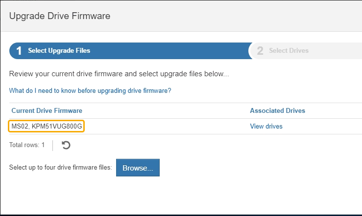

= Atualize o firmware da unidade usando o Gerenciador de sistema do SANtricity
:allow-uri-read: 
:icons: font
:imagesdir: ../media/

[role="lead"]
Você atualiza o firmware da sua unidade para garantir que você tenha todos os recursos mais recentes e correções de bugs.

.O que você vai precisar
* O dispositivo de armazenamento tem um status ideal.
* Todas as unidades têm um status ideal.
* Você tem a versão mais recente do Gerenciador de sistema do SANtricity instalada que é compatível com sua versão do StorageGRID.
* Você xref:placing-appliance-into-maintenance-mode.adoc[Coloque o aparelho StorageGRID no modo de manutenção]tem .
+

NOTE: O modo de manutenção interrompe a conexão com o controlador de storage, interrompendo todas as atividades de e/S e colocando todas as unidades offline.

+

IMPORTANT: Não atualize o firmware da unidade em mais de um dispositivo StorageGRID de cada vez. Isso pode causar indisponibilidade de dados, dependendo do modelo de implantação e das políticas de ILM.

.Passos
. Confirme se o aparelho está na xref:placing-appliance-into-maintenance-mode.adoc[modo de manutenção].
. Acesse o Gerenciador de sistemas do SANtricity usando um destes métodos:
+
** Use o Instalador do StorageGRID Appliance e selecione *Avançado* *Gerenciador do sistema SANtricity*
** Use o Gerenciador do sistema SANtricity navegando até o IP do controlador de armazenamento
`*https://_Storage_Controller_IP_*`

. Introduza o nome de utilizador e a palavra-passe do administrador do Gestor do sistema SANtricity, se necessário.
. Verifique a versão do firmware da unidade atualmente instalada no dispositivo de armazenamento:
+
.. No Gerenciador do sistema SANtricity, selecione *SUPORTE* *Centro de Atualização*.
.. Em Drive firmware upgrade, selecione *Begin Upgrade* (Iniciar atualização).
+
O firmware da unidade de atualização exibe os arquivos de firmware da unidade atualmente instalados.

.. Observe as revisões atuais do firmware da unidade e os identificadores da unidade na coluna firmware da unidade atual.
+

+
Neste exemplo:

+
*** A revisão do firmware da unidade é *MS02*.
*** O identificador da unidade é *KPM51VUG800G*.

+
Selecione *Exibir unidades* na coluna unidades associadas para exibir onde essas unidades estão instaladas no seu dispositivo de armazenamento.

.. Feche a janela Upgrade Drive firmware (Atualizar firmware da unidade).

. Transfira e prepare a atualização de firmware da unidade disponível:
+
.. Em Atualização do firmware da unidade, selecione *suporte NetApp*.
.. No site de suporte da NetApp, selecione a guia *Downloads* e, em seguida, selecione *firmware da unidade de disco da série e*.
+
É apresentada a página firmware do disco e-Series.

.. Procure cada *Drive Identifier* instalado no seu dispositivo de armazenamento e verifique se cada identificador de unidade tem a revisão de firmware mais recente.
+
*** Se a revisão do firmware não for um link, esse identificador de unidade terá a revisão de firmware mais recente.
*** Se um ou mais números de peça de unidade forem listados para um identificador de unidade, uma atualização de firmware estará disponível para essas unidades. Pode selecionar qualquer ligação para transferir o ficheiro de firmware.
+
image::../media/storagegrid_drive_firmware_download.png[Página do firmware do disco da série E.]

.. Se estiver listada uma revisão de firmware posterior, selecione o link na coluna firmware Rev. (Download) para baixar um `.zip` arquivo contendo o arquivo de firmware.
.. Extraia (descompacte) os arquivos de arquivo de firmware da unidade que você baixou do site de suporte.

. Instale a atualização do firmware da unidade:
+
.. No Gerenciador de sistema do SANtricity, em Atualização do firmware da unidade, selecione *Begin Upgrade*.
.. Selecione *Procurar* e selecione os novos arquivos de firmware da unidade que você baixou no site de suporte.
+
Os arquivos de firmware da unidade têm um nome de arquivo semelhante a `D_HUC101212CSS600_30602291_MS01_2800_0002.dlp`

+
Você pode selecionar até quatro arquivos de firmware da unidade, um de cada vez. Se mais de um arquivo de firmware de unidade for compatível com a mesma unidade, você receberá um erro de conflito de arquivo. Decida qual arquivo de firmware da unidade você deseja usar para a atualização e remova o outro.

.. Selecione *seguinte*.
+
*Selecionar unidades* lista as unidades que você pode atualizar com os arquivos de firmware selecionados.

+
Apenas as unidades compatíveis aparecem.

+
O firmware selecionado para a unidade aparece em *firmware proposto*. Se tiver de alterar este firmware, selecione *voltar*.

.. Selecione *Offline (paralelo)* upgrade.
+
Você pode usar o método de atualização off-line porque o dispositivo está no modo de manutenção, onde a atividade de e/S é interrompida para todas as unidades e todos os volumes.

+

CAUTION: Não prossiga a menos que tenha a certeza de que o aparelho está no modo de manutenção. A falha em colocar o dispositivo no modo de manutenção antes de iniciar uma atualização de firmware da unidade offline pode causar perda de dados.

.. Na primeira coluna da tabela, selecione a unidade ou unidades que deseja atualizar.
+
A prática recomendada é atualizar todas as unidades do mesmo modelo para a mesma revisão de firmware.

.. Selecione *Iniciar* e confirme que deseja executar a atualização.
+
Se você precisar parar a atualização, selecione *Stop*. Todas as transferências de firmware atualmente em curso são concluídas. Quaisquer downloads de firmware que não tenham sido iniciados são cancelados.

+

IMPORTANT: Parar a atualização do firmware da unidade pode resultar em perda de dados ou unidades indisponíveis.

.. (Opcional) para ver uma lista do que foi atualizado, selecione *Save Log*.
+
O arquivo de log é salvo na pasta de downloads do navegador com o `latest-upgrade-log-timestamp.txt` nome .

+
Se ocorrer algum dos seguintes erros durante o procedimento de atualização, tome a ação recomendada apropriada.

+
*** *Unidades atribuídas com falha*
+
Um motivo para a falha pode ser que a unidade não tenha a assinatura apropriada. Certifique-se de que a unidade afetada é uma unidade autorizada. Entre em Contato com o suporte técnico para obter mais informações.

+
Ao substituir uma unidade, certifique-se de que a unidade de substituição tem uma capacidade igual ou superior à unidade com falha que está a substituir.

+
Você pode substituir a unidade com falha enquanto a matriz de armazenamento está recebendo e/S

*** *Verifique a matriz de armazenamento*
+
**** Certifique-se de que foi atribuído um endereço IP a cada controlador.
**** Certifique-se de que todos os cabos ligados ao controlador não estão danificados.
**** Certifique-se de que todos os cabos estão bem ligados.

*** *Unidades hot spare integradas*
+
Esta condição de erro tem de ser corrigida antes de poder atualizar o firmware.

*** *Grupos de volumes incompletos*
+
Se um ou mais grupos de volumes ou pools de discos estiverem incompletos, você deverá corrigir essa condição de erro antes de atualizar o firmware.

*** * Operações exclusivas (exceto Mídia em segundo plano/varredura de paridade) atualmente em execução em qualquer grupo de volume*
+
Se uma ou mais operações exclusivas estiverem em andamento, as operações devem ser concluídas antes que o firmware possa ser atualizado. Use o System Manager para monitorar o andamento das operações.

*** *Volumes em falta*
+
Você deve corrigir a condição de volume ausente antes que o firmware possa ser atualizado.

*** * Qualquer controlador em um estado diferente do ideal*
+
Um dos controladores de storage array precisa de atenção. Esta condição deve ser corrigida antes que o firmware possa ser atualizado.

*** *Informações de partição de armazenamento incompatíveis entre gráficos de objetos do controlador*
+
Ocorreu um erro ao validar os dados nos controladores. Contacte o suporte técnico para resolver este problema.

*** *SPM verificar falha na verificação do controlador de banco de dados*
+
Ocorreu um erro de banco de dados de mapeamento de partições de armazenamento em um controlador. Contacte o suporte técnico para resolver este problema.

*** *Validação da base de dados de configuração (se suportada pela versão do controlador da matriz de armazenamento)*
+
Ocorreu um erro de banco de dados de configuração em um controlador. Contacte o suporte técnico para resolver este problema.

*** *Verificações relacionadas ao mel*
+
Contacte o suporte técnico para resolver este problema.

*** *Mais de 10 eventos informativos ou críticos de mel foram relatados nos últimos 7 dias*
+
Contacte o suporte técnico para resolver este problema.

*** *Mais de 2 Página 2C Eventos críticos de mel foram relatados nos últimos 7 dias*
+
Contacte o suporte técnico para resolver este problema.

*** *Mais de 2 eventos de mel críticos de canal de unidade degradada foram relatados nos últimos 7 dias*
+
Contacte o suporte técnico para resolver este problema.

*** *Mais de 4 entradas críticas de mel nos últimos 7 dias*
+
Contacte o suporte técnico para resolver este problema.

. . Se este procedimento for concluído com êxito e tiver procedimentos adicionais a serem executados enquanto o nó estiver no modo de manutenção, execute-os agora. Quando terminar, ou se tiver alguma falha e quiser recomeçar, selecione *Avançado* *Reiniciar controlador* e, em seguida, selecione uma destas opções:
+
** Selecione *Reboot into StorageGRID*
** Selecione *Reboot into Maintenance Mode* (Reiniciar no modo de manutenção) para reiniciar o controlador com o nó restante no modo de manutenção. Selecione esta opção se tiver alguma avaria durante o procedimento e pretender recomeçar. Depois que o nó terminar de reiniciar para o modo de manutenção, reinicie a partir da etapa apropriada no procedimento que falhou.
+
image::../media/reboot_controller_from_maintenance_mode.png[Reinicie o controlador no modo de manutenção]

+
Pode demorar até 20 minutos para o aparelho reiniciar e voltar a ligar a grelha. Para confirmar que a reinicialização está concluída e que o nó voltou a ingressar na grade, volte ao Gerenciador de Grade. A página de nós deve exibir um status normal (sem ícones à esquerda do nome do nó) para o nó do dispositivo, indicando que não há alertas ativos e o nó está conetado à grade.

+
image::../media/node_rejoin_grid_confirmation.png[Nó do dispositivo voltou a unir a grade]

.Informações relacionadas
xref:upgrading-santricity-os-on-storage-controller.adoc[Atualizar o SANtricity os no controlador de storage]
