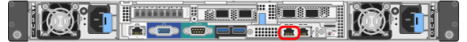

= Acesse o Instalador de dispositivos StorageGRID
:allow-uri-read: 
:icons: font
:imagesdir: ../media/

[role="lead"]
Você deve acessar o Instalador do StorageGRID Appliance para verificar a versão do instalador e configurar as conexões entre o appliance e as três redes StorageGRID: A rede de grade, a rede de administração (opcional) e a rede de cliente (opcional).

.O que você vai precisar
* Você está usando qualquer cliente de gerenciamento que possa se conetar à rede de administração do StorageGRID ou tem um laptop de serviço.
* O cliente ou laptop de serviço tem um navegador da Web suportado.
* O controlador SG6000-CN está ligado a todas as redes StorageGRID que pretende utilizar.
* Você conhece o endereço IP, o gateway e a sub-rede do controlador SG6000-CN nessas redes.
* Configurou os comutadores de rede que pretende utilizar.

.Sobre esta tarefa
Para acessar inicialmente o Instalador de dispositivos StorageGRID, você pode usar o endereço IP atribuído pelo DHCP para a porta de rede Admin no controlador SG6000-CN (assumindo que o controlador esteja conetado à rede Admin) ou conetar um laptop de serviço diretamente ao controlador SG6000-CN.

.Passos
. Se possível, use o endereço DHCP para a porta de rede de administração no controlador SG6000-CN para acessar o Instalador de dispositivos StorageGRID.
+

+
.. Localize a etiqueta de endereço MAC na parte frontal do controlador SG6000-CN e determine o endereço MAC da porta Admin Network.
+
O rótulo de endereço MAC lista o endereço MAC da porta de gerenciamento BMC.

+
Para determinar o endereço MAC da porta Admin Network, você deve adicionar *2* ao número hexadecimal na etiqueta. Por exemplo, se o endereço MAC na etiqueta terminar em *09*, o endereço MAC da porta Admin terminaria em *0B*. Se o endereço MAC na etiqueta terminar em *(_y_)FF*, o endereço MAC da porta Admin terminaria em *(_y_(1)01*. Você pode facilmente fazer esse cálculo abrindo o Calculator no Windows, definindo-o para o modo Programador, selecionando Hex, digitando o endereço MAC e, em seguida, digitando * 2 *.

.. Forneça o endereço MAC ao administrador da rede para que ele possa procurar o endereço DHCP do dispositivo na rede Admin.
.. No cliente, insira esta URL para o instalador do StorageGRID Appliance
`*https://_Appliance_Controller_IP_:8443*`
+
Para `_SG6000-CN_Controller_IP_`, utilize o endereço DHCP.

.. Se for solicitado um alerta de segurança, exiba e instale o certificado usando o assistente de instalação do navegador.
+
O alerta não aparecerá na próxima vez que você acessar este URL.

+
A página inicial do instalador do dispositivo StorageGRID é exibida. As informações e as mensagens mostradas quando você acessa esta página pela primeira vez dependem de como o dispositivo está conetado atualmente às redes StorageGRID. Podem aparecer mensagens de erro que serão resolvidas em etapas posteriores.

+
image::../media/appliance_installer_home_5700_5600.png[Captura de ecrã da parte superior da página inicial do instalador de dispositivos StorageGRID Webscale]

. Se não conseguir obter um endereço IP utilizando DHCP, pode utilizar uma ligação local.
+
.. Conete um laptop de serviço diretamente à porta RJ-45 mais à direita do controlador SG6000-CN, usando um cabo Ethernet.
+
image::../media/sg6000_cn_link_local_port.gif[Localização do porto de gestão para SG6000-CN]

.. Abra um navegador da Web no laptop de serviço.
.. Digite este URL para o instalador do StorageGRID Appliance
`*\https://169.254.0.1:8443*`
+
A página inicial do instalador do dispositivo StorageGRID é exibida. As informações e as mensagens apresentadas quando acede pela primeira vez a esta página dependem da forma como o seu aparelho está atualmente ligado.

+

NOTE: Se não conseguir aceder à página inicial através de uma ligação local, configure o endereço IP do computador portátil de serviço como `169.254.0.2`, e tente novamente.

.Depois de terminar
Depois de acessar o Instalador de dispositivos StorageGRID:

* Verifique se a versão do Instalador de dispositivos StorageGRID no dispositivo corresponde à versão de software instalada no sistema StorageGRID. Atualize o Instalador de dispositivos StorageGRID, se necessário.
+
xref:verifying-and-upgrading-storagegrid-appliance-installer-version.adoc[Verifique e atualize a versão do instalador do StorageGRID Appliance]

* Revise todas as mensagens exibidas na página inicial do Instalador do StorageGRID Appliance e configure a configuração do link e a configuração do IP, conforme necessário.

.Informações relacionadas
xref:../admin/web-browser-requirements.adoc[Requisitos do navegador da Web]
