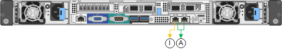

= Modos de ligação de rede para portas de gerenciamento de 1 GbE
:allow-uri-read: 
:icons: font
:imagesdir: ../media/

[role="lead"]
Para as duas portas de gerenciamento de 1 GbE no controlador SG6000-CN, você pode escolher o modo de ligação de rede independente ou o modo de ligação de rede ative-Backup para se conetar à rede Admin opcional.

No modo independente, apenas a porta de gerenciamento à esquerda está conetada à rede de administração. Este modo não fornece um caminho redundante. A porta de gerenciamento à direita está desconetada e disponível para conexões locais temporárias (usa o endereço IP 169.254.0.1)

No modo ative-Backup, ambas as portas de gerenciamento estão conetadas à rede Admin. Apenas uma porta está ativa de cada vez. Se a porta ativa falhar, sua porta de backup fornecerá automaticamente uma conexão de failover. A ligação dessas duas portas físicas em uma porta de gerenciamento lógico fornece um caminho redundante para a rede de administração.

NOTE: Se você precisar fazer uma conexão local temporária com o controlador SG6000-CN quando as portas de gerenciamento de 1 GbE estiverem configuradas para o modo ative-Backup, remova os cabos de ambas as portas de gerenciamento, conete o cabo temporário à porta de gerenciamento à direita e acesse o dispositivo usando o endereço IP 169.254.0.1.

|===
| Legenda | Modo de ligação de rede 

 a| 
A
 a| 
Ambas as portas de gerenciamento são ligadas a uma porta de gerenciamento lógico conetada à rede de administração.

 a| 
I
 a| 
A porta à esquerda está ligada à rede de administração. A porta à direita está disponível para conexões locais temporárias (endereço IP 169.254.0.1).

|===