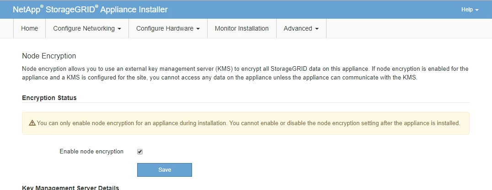

= Opcional: Ative a criptografia de nó
:allow-uri-read: 
:icons: font
:imagesdir: ../media/

[role="lead"]
Se você ativar a criptografia de nó, os discos do seu dispositivo podem ser protegidos pela criptografia de servidor de gerenciamento de chaves (KMS) seguro contra perda física ou remoção do site. Você deve selecionar e ativar a criptografia de nó durante a instalação do dispositivo e não pode desmarcar a criptografia de nó depois que o processo de criptografia KMS for iniciado.

.O que você vai precisar
Consulte as informações sobre o KMS nas instruções de administração do StorageGRID.

.Sobre esta tarefa
Um dispositivo com criptografia de nó ativada se coneta ao servidor de gerenciamento de chaves externas (KMS) configurado para o site StorageGRID. Cada cluster KMS (ou KMS) gerencia as chaves de criptografia para todos os nós de dispositivo no local. Essas chaves criptografam e descriptografam os dados em cada disco em um dispositivo que tem criptografia de nó ativada.

Um KMS pode ser configurado no Gerenciador de Grade antes ou depois que o dispositivo é instalado no StorageGRID. Consulte as informações sobre a configuração do KMS e do appliance nas instruções de administração do StorageGRID para obter detalhes adicionais.

* Se um KMS for configurado antes de instalar o dispositivo, a criptografia controlada pelo KMS será iniciada quando você ativar a criptografia de nó no dispositivo e adicioná-la a um site do StorageGRID onde o KMS está configurado.
* Se um KMS não for configurado antes de instalar o dispositivo, a criptografia controlada por KMS é executada em cada dispositivo que tem criptografia de nó ativada assim que um KMS é configurado e disponível para o site que contém o nó do dispositivo.

IMPORTANT: Os dados que existem antes de se conetar ao KMS em um dispositivo com criptografia de nó ativada são criptografados com uma chave temporária que não é segura. O aparelho não está protegido contra remoção ou roubo até que a chave esteja definida para um valor fornecido pelo KMS.

Sem a chave KMS necessária para descriptografar o disco, os dados no dispositivo não podem ser recuperados e são efetivamente perdidos. Este é o caso sempre que a chave de descriptografia não pode ser recuperada do KMS. A chave fica inacessível se você limpar a configuração do KMS, uma chave KMS expira, a conexão com o KMS é perdida ou o dispositivo é removido do sistema StorageGRID onde suas chaves KMS são instaladas.

.Passos
. Abra um navegador e insira um dos endereços IP do controlador de computação do dispositivo.
+
`*https://_Controller_IP_:8443*`

+
`_Controller_IP_` É o endereço IP do controlador de computação (não o controlador de storage) em qualquer uma das três redes StorageGRID.

+
A página inicial do instalador do dispositivo StorageGRID é exibida.

+

IMPORTANT: Depois que o dispositivo tiver sido criptografado com uma chave KMS, os discos do appliance não podem ser descriptografados sem usar a mesma chave KMS.

. Selecione *Configure hardware* *Node Encryption*.
+

. Selecione *Ativar criptografia de nó*.
+
Antes da instalação do dispositivo, você pode desmarcar *Ativar criptografia de nó* sem risco de perda de dados. Quando a instalação começa, o nó do dispositivo acessa as chaves de criptografia KMS no sistema StorageGRID e inicia a criptografia de disco. Não é possível desativar a criptografia de nó após a instalação do dispositivo.

+

IMPORTANT: Depois de adicionar um dispositivo que tenha a criptografia de nó ativada a um site do StorageGRID que tenha um KMS, você não poderá parar de usar a criptografia KMS para o nó.

. Selecione *Guardar*.
. Implante o dispositivo como um nó no sistema StorageGRID.
+
A encriptação controlada POR KMS começa quando o dispositivo acede às chaves KMS configuradas para o seu site StorageGRID. O instalador exibe mensagens de progresso durante o processo de criptografia KMS, o que pode levar alguns minutos, dependendo do número de volumes de disco no dispositivo.

+

NOTE: Os dispositivos são configurados inicialmente com uma chave de criptografia aleatória não KMS atribuída a cada volume de disco. Os discos são criptografados usando essa chave de criptografia temporária, que não é segura, até que o dispositivo que tem criptografia de nó habilitada acesse as chaves KMS configuradas para o site do StorageGRID.

.Depois de terminar
Você pode exibir o status da criptografia do nó, os detalhes do KMS e os certificados em uso quando o nó do dispositivo está no modo de manutenção.

.Informações relacionadas
xref:../admin/index.adoc[Administrar o StorageGRID]

xref:monitoring-node-encryption-in-maintenance-mode.adoc[Monitorar criptografia de nó no modo de manutenção (SG6000)]
