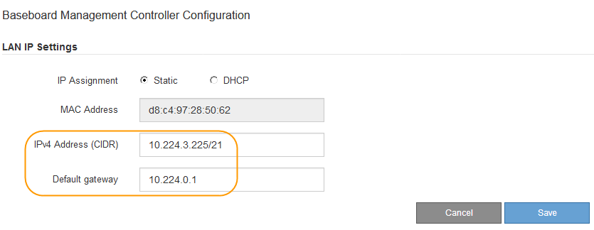

= Definir endereço IP para a porta de gerenciamento BMC
:allow-uri-read: 
:icons: font
:imagesdir: ../media/

[role="lead"]
Antes de poder aceder à interface BMC, tem de configurar o endereço IP para a porta de gestão BMC no controlador SG6000-CN.

.O que você vai precisar
* O cliente de gerenciamento está usando um xref:../admin/web-browser-requirements.adoc[navegador da web suportado].
* Você está usando qualquer cliente de gerenciamento que possa se conetar a uma rede StorageGRID.
* A porta de gerenciamento do BMC está conetada à rede de gerenciamento que você planeja usar.
+
image::../media/sg6000_cn_bmc_management_port.gif[Porta de gerenciamento BMC no controlador SG6000-CN]

.Sobre esta tarefa
Para fins de suporte, a porta de gerenciamento do BMC permite acesso a hardware de baixo nível.

IMPORTANT: Só deve ligar esta porta a uma rede de gestão interna segura, fidedigna. Se nenhuma rede estiver disponível, deixe a porta BMC desconetada ou bloqueada, a menos que uma conexão BMC seja solicitada pelo suporte técnico.

.Passos
. No cliente, insira o URL para o instalador do StorageGRID Appliance
`*https://_SG6000-CN_Controller_IP_:8443*`
+
Para `SG6000-CN_Controller_IP`, use o endereço IP do dispositivo em qualquer rede StorageGRID.

+
A página inicial do instalador do dispositivo StorageGRID é exibida.

. Selecione *Configurar hardware* *Configuração do BMC*.
+
image::../media/bmc_configuration_page.gif[Captura de tela mostrando a opção Configuração Avançada do BMC]

+
É apresentada a página Baseboard Management Controller Configuration (Configuração do controlador de gestão de base).

. Anote o endereço IPv4 que é exibido automaticamente.
+
DHCP é o método padrão para atribuir um endereço IP a esta porta.

+

NOTE: Pode demorar alguns minutos para que os valores DHCP apareçam.

+
image::../media/bmc_configuration_dhcp_address.gif[Página de Configuração do controlador de Gestão do porão que mostra o endereço DHCP]

. Opcionalmente, defina um endereço IP estático para a porta de gerenciamento BMC.
+

NOTE: Você deve atribuir um IP estático para a porta de gerenciamento do BMC ou atribuir uma concessão permanente para o endereço no servidor DHCP.

+
.. Selecione *estático*.
.. Introduza o endereço IPv4, utilizando a notação CIDR.
.. Introduza o gateway predefinido.
+

.. Clique em *Salvar*.
+
Pode levar alguns minutos para que suas alterações sejam aplicadas.

