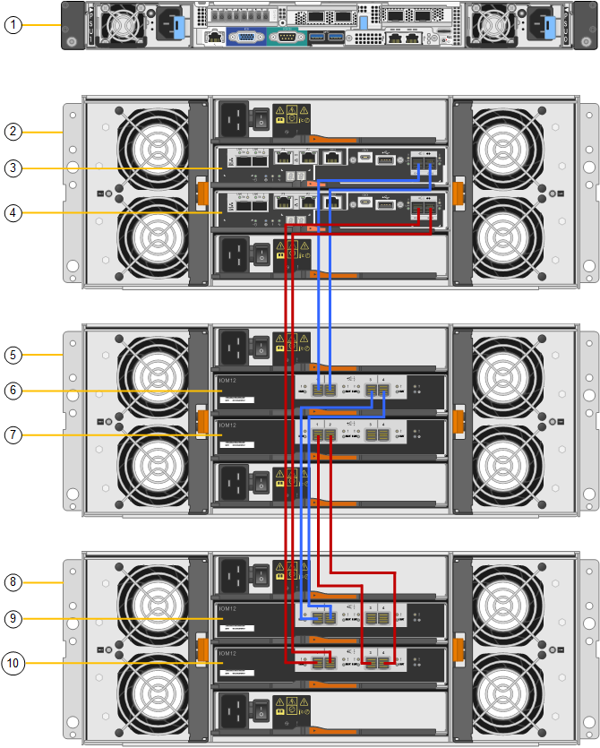

= SG6060 e SG6060X: Cabeamento de compartimentos de expansão opcionais
:allow-uri-read: 
:icons: font
:imagesdir: ../media/

[role="lead"]
Se você estiver usando gavetas de expansão, será necessário conectá-los ao compartimento de controladora E2860. Você pode ter no máximo duas gavetas de expansão para cada dispositivo SG6060 ou SG6060X.

.O que você vai precisar
* Você tem os dois cabos SAS fornecidos com cada compartimento de expansão.
* Você instalou as gavetas de expansão no gabinete ou rack que contém o compartimento de controladora E2860.
+
xref:sg6060-installing-60-drive-shelves-into-cabinet-or-rack.adoc[SG6060 e SG6060X: Instale as gavetas de 60 unidades no gabinete ou rack]

.Passo
Conete cada compartimento de expansão ao compartimento de controladora E2860, conforme mostrado no diagrama.

Este desenho mostra o cabeamento de duas gavetas de expansão em um SG6060 (o cabeamento de expansão do SG6060X é o mesmo). Se você tiver apenas um compartimento de expansão, conete o IOM A à controladora A e conete o IOM B à controladora B.

[cols="1a,2a"]
|===
| Legenda | Descrição 

 a| 
1
 a| 
SG6000-CN

 a| 
2
 a| 
Compartimento do controlador de E2860 TB

 a| 
3
 a| 
Controlador A

 a| 
4
 a| 
Controlador B

 a| 
5
 a| 
Compartimento de expansão 1

 a| 
6
 a| 
IOM A para compartimento de expansão 1

 a| 
7
 a| 
IOM B para compartimento de expansão 1

 a| 
8
 a| 
Compartimento de expansão 2

 a| 
9
 a| 
IOM A para compartimento de expansão 2

 a| 
10
 a| 
IOM B para compartimento de expansão 2

|===