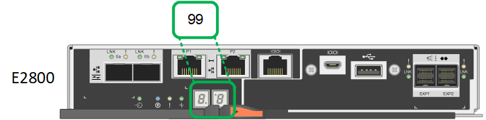

= Exibir códigos de status de inicialização para controladores de storage SG6000
:allow-uri-read: 
:icons: font
:imagesdir: ../media/

[role="lead"]
Cada controlador de storage tem uma tela de sete segmentos que fornece códigos de status à medida que o controlador liga. Os códigos de status são os mesmos para o controlador E2800 e o controlador EF570.

.Sobre esta tarefa
Para obter descrições desses códigos, consulte as informações de monitoramento do sistema e-Series para o tipo de controlador de storage.

.Passos
. Durante a inicialização, monitore o progresso visualizando os códigos mostrados no visor de sete segmentos para cada controlador de armazenamento.
+
A exibição de sete segmentos em cada controlador de armazenamento mostra a sequência repetida *os*, *SD*, `*_blank_*` para indicar que o controlador está executando o processamento de início do dia.

. Após a inicialização dos controladores, confirme se cada controlador de armazenamento mostra 99, que é o ID padrão para um compartimento de controladora e-Series.
+
Certifique-se de que esse valor seja exibido em ambos os controladores de storage, como mostrado neste exemplo E2800 controlador.

+

. Se um ou ambos os controladores mostrarem outros valores, consulte xref:troubleshooting-hardware-installation.adoc[Solução de problemas de instalação de hardware (SG6000)] e confirme que concluiu corretamente as etapas de instalação. Se não conseguir resolver o problema, contacte o suporte técnico.

.Informações relacionadas
https://library.netapp.com/ecmdocs/ECMLP2588751/html/frameset.html["Guia de monitorização do sistema E5700 e E2800"^]

https://mysupport.netapp.com/site/global/dashboard["Suporte à NetApp"^]

xref:powering-on-sg6000-cn-controller-and-verifying-operation.adoc[Ligue o controlador SG6000-CN e verifique a operação]
