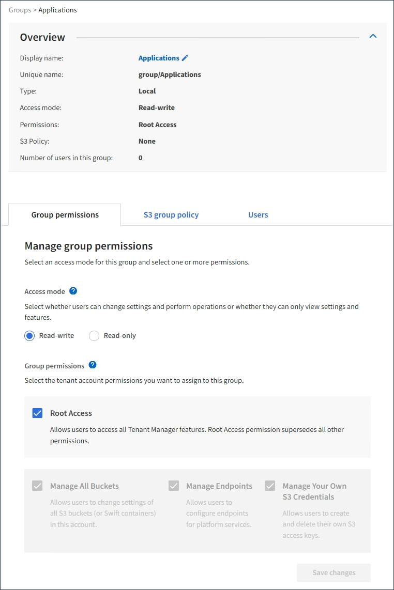

= Adicione usuários a um grupo local
:allow-uri-read: 
:icons: font
:imagesdir: ../media/

[role="lead"]
Você pode adicionar usuários a um grupo local conforme necessário.

.O que você vai precisar
* Você deve estar conetado ao Gerenciador do Locatário usando um xref:../admin/web-browser-requirements.adoc[navegador da web suportado].
* Você deve pertencer a um grupo de usuários que tenha a permissão de acesso root.

.Passos
. Selecione *GERENCIAMENTO DE ACESSO* *grupos*.
. Selecione o nome do grupo local ao qual deseja adicionar usuários.
+
Alternativamente, você pode selecionar *ações* *Exibir detalhes do grupo*.

+
A página de detalhes do grupo é exibida.

+

. Selecione *Users* e, em seguida, selecione *Add Users*.
+
image::../media/manage_users.png[Gerenciar usuários]

. Selecione os usuários que deseja adicionar ao grupo e selecione *Adicionar usuários*.
+
image::../media/add_users_to_group.png[Adicionar usuários ao grupo]

+
Uma mensagem de confirmação aparece no canto superior direito da página. As alterações podem levar até 15 minutos para entrar em vigor devido ao armazenamento em cache.

