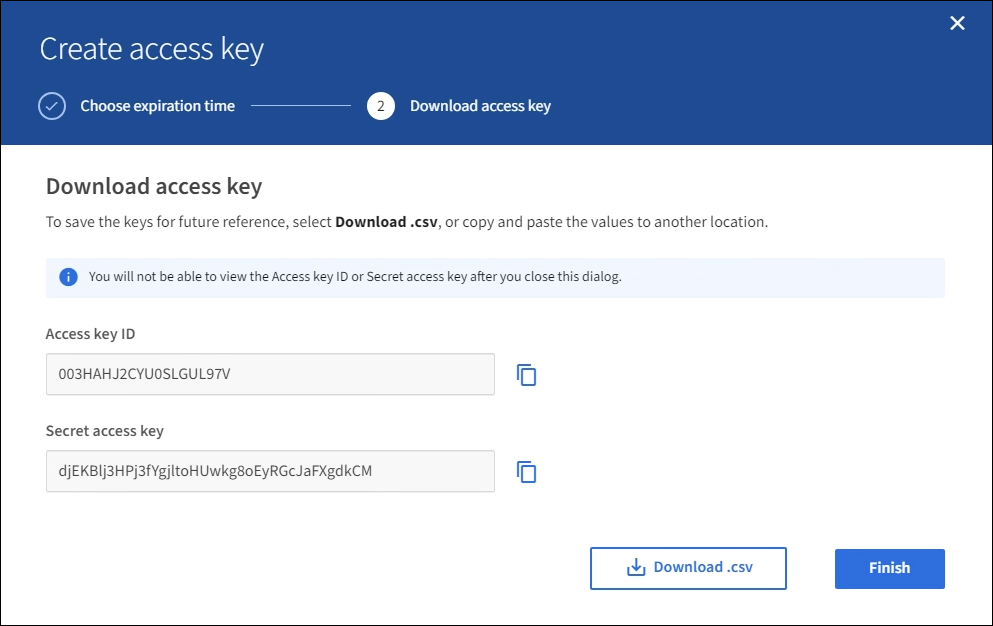

= Crie suas próprias chaves de acesso S3
:allow-uri-read: 
:icons: font
:imagesdir: ../media/

[role="lead"]
Se você estiver usando um locatário do S3 e tiver a permissão apropriada, você poderá criar suas próprias chaves de acesso do S3. Você precisa ter uma chave de acesso para acessar seus buckets e objetos na conta de locatário do S3.

.O que você vai precisar
* Você deve estar conetado ao Gerenciador do Locatário usando um xref:../admin/web-browser-requirements.adoc[navegador da web suportado].
* Você deve ter a permissão Gerenciar suas próprias credenciais do S3. xref:tenant-management-permissions.adoc[Permissões de gerenciamento do locatário]Consulte .

.Sobre esta tarefa
Você pode criar uma ou mais chaves de acesso S3 que permitem criar e gerenciar buckets para sua conta de locatário. Depois de criar uma nova chave de acesso, atualize a aplicação com a sua nova ID de chave de acesso e chave de acesso secreta. Para segurança, não crie mais chaves do que você precisa e exclua as chaves que você não está usando. Se você tiver apenas uma chave e ela estiver prestes a expirar, crie uma nova chave antes que a antiga expire e, em seguida, exclua a antiga.

Cada chave pode ter um tempo de expiração específico ou nenhuma expiração. Siga estas diretrizes para o tempo de expiração:

* Defina um tempo de expiração para que suas chaves limitem seu acesso a um determinado período de tempo. Definir um tempo de expiração curto pode ajudar a reduzir o risco se o ID da chave de acesso e a chave de acesso secreta forem acidentalmente expostos. As chaves expiradas são removidas automaticamente.
* Se o risco de segurança em seu ambiente for baixo e você não precisar criar novas chaves periodicamente, não será necessário definir um tempo de expiração para suas chaves. Se você decidir mais tarde criar novas chaves, exclua as chaves antigas manualmente.

IMPORTANT: Os buckets e objetos do S3 pertencentes à sua conta podem ser acessados usando o ID da chave de acesso e a chave de acesso secreta exibidos para a sua conta no Gerenciador do Locatário. Por esse motivo, proteja as chaves de acesso como faria com uma senha. Gire as chaves de acesso regularmente, remova quaisquer chaves não utilizadas da sua conta e nunca as compartilhe com outros usuários.

.Passos
. Selecione *ARMAZENAMENTO (S3)* > *as minhas chaves de acesso*.
+
A página Minhas chaves de acesso é exibida e lista todas as chaves de acesso existentes.

. Selecione *criar chave*.
. Execute um dos seguintes procedimentos:
+
** Selecione *não defina um tempo de expiração* para criar uma chave que não expirará. (Predefinição)
** Selecione *defina um tempo de expiração* e defina a data e a hora de expiração.
+
image::../media/tenant_s3_access_key_create_save.png[Captura de tela da caixa de diálogo criar chave de acesso]

. Selecione *criar chave de acesso*.
+
A caixa de diálogo Download Access Key (Transferir chave de acesso) é exibida, listando o ID da chave de acesso e a chave de acesso secreta.

. Copie o ID da chave de acesso e a chave de acesso secreta para um local seguro ou selecione *Transferir .csv* para guardar um ficheiro de folha de cálculo que contenha a ID da chave de acesso e a chave de acesso secreta.
+

IMPORTANT: Não feche esta caixa de diálogo até que você tenha copiado ou baixado essas informações. Não é possível copiar ou transferir chaves depois de a caixa de diálogo ter sido fechada.

+

. Selecione *Finish*.
+
A nova chave está listada na página Minhas chaves de acesso. As alterações podem levar até 15 minutos para entrar em vigor devido ao armazenamento em cache.

