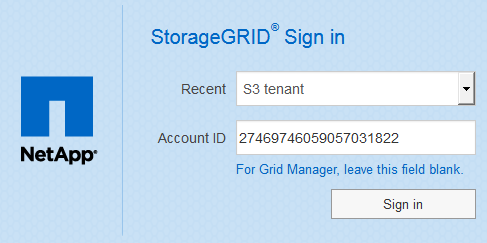

= Inicie sessão no Tenant Manager
:allow-uri-read: 
:icons: font
:imagesdir: ../media/

[role="lead"]
Você acessa o Gerenciador do Locatário inserindo o URL do locatário na barra de endereços de um xref:../admin/web-browser-requirements.adoc[navegador da web suportado].

.O que você vai precisar
* Tem de ter as suas credenciais de início de sessão.
* Você deve ter um URL para acessar o Gerenciador do Locatário, conforme fornecido pelo administrador da grade. O URL será parecido com um destes exemplos:
+
[listing]
----
https://FQDN_or_Admin_Node_IP/
----
+
[listing]
----
https://FQDN_or_Admin_Node_IP:port/
----
+
[listing]
----
https://FQDN_or_Admin_Node_IP/?accountId=20-digit-account-id
----
+
[listing]
----
https://FQDN_or_Admin_Node_IP:port/?accountId=20-digit-account-id
----
+
O URL sempre contém o nome de domínio totalmente qualificado (FQDN) ou o endereço IP usado para acessar um nó de administração e, opcionalmente, também pode incluir um número de porta, o ID da conta de locatário de 20 dígitos ou ambos.

* Se o URL não incluir o ID de conta de 20 dígitos do locatário, você deve ter esse ID de conta.
* Você deve estar usando um xref:../admin/web-browser-requirements.adoc[navegador da web suportado].
* Os cookies devem estar ativados no seu navegador.
* Você deve ter permissões de acesso específicas.

.Passos
. Inicie um xref:../admin/web-browser-requirements.adoc[navegador da web suportado].
. Na barra de endereços do navegador, insira o URL para acessar o Gerenciador de locatários.
. Se for solicitado um alerta de segurança, instale o certificado usando o assistente de instalação do navegador.
. Inicie sessão no Gestor do Locatário.
+
A tela de login que você vê depende do URL digitado e se sua organização está usando o logon único (SSO). Você verá uma das seguintes telas:

+
** A página de login do Gerenciador de Grade. Clique no link *Login do locatário* no canto superior direito.
+
image::../media/tenant_login_link.gif[Link de login do locatário na página de login do Grid Manager]

** A página de início de sessão do Tenant Manager. O campo *ID da conta* pode já estar concluído, como mostrado abaixo.
+
image::../media/tenant_user_sign_in.gif[Página de login do Gerenciador do locatário]

+
... Se o ID da conta de 20 dígitos do locatário não for exibido, selecione o nome da conta do locatário se ele aparecer na lista de contas recentes ou insira o ID da conta.
... Introduza o seu nome de utilizador e palavra-passe.
... Clique em *entrar*.
+
É apresentado o Painel do Gestor do Locatário.

** A página SSO da sua organização, se o SSO estiver ativado na grade. Por exemplo:
+
image::../media/sso_organization_page.gif[Exemplo de organização Página de login para SSO]

+
Insira suas credenciais SSO padrão e clique em *entrar*.

** A página de login SSO do Tenant Manager.
+

+
... Se o ID da conta de 20 dígitos do locatário não for exibido, selecione o nome da conta do locatário se ele aparecer na lista de contas recentes ou insira o ID da conta.
... Clique em *entrar*.
... Inicie sessão com as suas credenciais SSO padrão na página de início de sessão SSO da sua organização.
+
É apresentado o Painel do Gestor do Locatário.

. Se você recebeu uma senha inicial de outra pessoa, altere sua senha para proteger sua conta. Selecione *_username_* *alterar senha*.
+

NOTE: Se o SSO estiver ativado para o sistema StorageGRID, você não poderá alterar sua senha do Gerenciador do Locatário.

