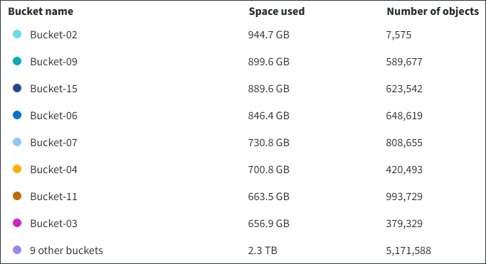

= Entenda o Painel do Tenant Manager
:allow-uri-read: 
:icons: font
:imagesdir: ../media/

[role="lead"]
O Painel do Gerenciador do Tenant fornece uma visão geral da configuração de uma conta de locatário e da quantidade de espaço usada por objetos nos buckets do locatário (S3) ou em contentores (Swift). Se o locatário tiver uma cota, o Dashboard mostrará quanto da cota é usada e quanto resta. Se houver algum erro relacionado à conta de locatário, os erros serão exibidos no Painel de Controle.

IMPORTANT: Os valores espaço utilizado são estimativas. Essas estimativas são afetadas pelo timing de inests, conetividade de rede e status de nó.

Quando os objetos tiverem sido carregados, o Painel de Controle se parece com o seguinte exemplo:

image::../media/tenant_dashboard_with_buckets.png[Painel de instrumentos - Lista de baldes]

== Resumo da conta do locatário

A parte superior do Painel contém as seguintes informações:

* O número de buckets ou contêineres configurados, grupos e usuários
* O número de endpoints de serviços de plataforma, se algum tiver sido configurado

Pode selecionar as ligações para ver os detalhes.

O lado direito do painel contém as seguintes informações:

* O número total de objetos para o locatário.
+
Para uma conta do S3, se nenhum objeto tiver sido ingerido e você tiver a permissão de acesso root, as diretrizes de introdução aparecerão em vez do número total de objetos.

* Detalhes do locatário, incluindo o nome e a ID da conta do locatário e se o locatário pode usar xref:what-platform-services-are.adoc[serviços de plataforma], xref:../admin/using-identity-federation.adoc[sua própria fonte de identidade]ou xref:../admin/manage-s3-select-for-tenant-accounts.adoc[S3 Selecione] (somente as permissões habilitadas são listadas).

== Uso de storage e cota

O painel uso do armazenamento contém as seguintes informações:

* A quantidade de dados de objeto para o locatário.
+

IMPORTANT: Esse valor indica a quantidade total de dados de objeto carregados e não representa o espaço usado para armazenar cópias desses objetos e seus metadados.

* Se uma cota for definida, a quantidade total de espaço disponível para os dados do objeto e a quantidade e porcentagem de espaço restante. A cota limita a quantidade de dados de objetos que podem ser ingeridos.
+

IMPORTANT: A utilização de quotas baseia-se em estimativas internas e pode ser ultrapassada em alguns casos. Por exemplo, o StorageGRID verifica a cota quando um locatário começa a carregar objetos e rejeita novos ingere se o locatário tiver excedido a cota. No entanto, o StorageGRID não leva em conta o tamanho do upload atual ao determinar se a cota foi excedida. Se os objetos forem excluídos, um locatário poderá ser temporariamente impedido de carregar novos objetos até que a utilização da cota seja recalculada. Os cálculos de utilização de cotas podem levar 10 minutos ou mais.

* Um gráfico de barras que representa os tamanhos relativos dos maiores baldes ou contentores.
+
Você pode colocar o cursor sobre qualquer um dos segmentos do gráfico para visualizar o espaço total consumido por esse intervalo ou contentor.

+
image::../media/tenant_dashboard_storage_usage_segment.png[Segmento de gráfico de barras]

* Para corresponder ao gráfico de barras, uma lista dos maiores buckets ou contentores, incluindo a quantidade total de dados do objeto e o número de objetos para cada bucket ou contentor.
+

+
Se o locatário tiver mais de nove buckets ou contêineres, todos os outros buckets ou contêineres serão combinados em uma única entrada na parte inferior da lista.

== Alertas de uso de cota

Se os alertas de uso de cota tiverem sido ativados no Gerenciador de Grade, eles aparecerão no Gerenciador de Locatário quando a cota for baixa ou excedida, da seguinte forma:

Se 90% ou mais da cota de um locatário tiver sido usada, o alerta *uso de cota de locatário alto* será acionado. Para obter mais informações, consulte a referência de alertas nas instruções para monitoramento e solução de problemas do StorageGRID.

image::../media/tenant_dashboard_quota_remaining.png[Cota restante do painel do locatário]

Se você exceder sua cota, não poderá carregar novos objetos.

image::../media/tenant_dashboard_quota_used.png[Cota do Painel de locatário usada]

NOTE: Para exibir detalhes adicionais e gerenciar regras e notificações para alertas, consulte as instruções para monitoramento e solução de problemas do StorageGRID.

== Erros de endpoint

Se você usou o Gerenciador de Grade para configurar um ou mais endpoints para uso com serviços de plataforma, o Painel do Gerenciador do locatário exibirá um alerta se algum erro de endpoint tiver ocorrido nos últimos sete dias.

image::../media/tenant_dashboard_endpoint_error.png[Painel mostrando a mensagem de endpoint]

Para ver detalhes sobre um erro de endpoint, selecione Endpoints para exibir a página Endpoints.

.Informações relacionadas
xref:troubleshooting-platform-services-endpoint-errors.adoc[Solucionar erros de endpoint dos serviços da plataforma]

xref:../monitor/index.adoc[Monitorar e solucionar problemas]
